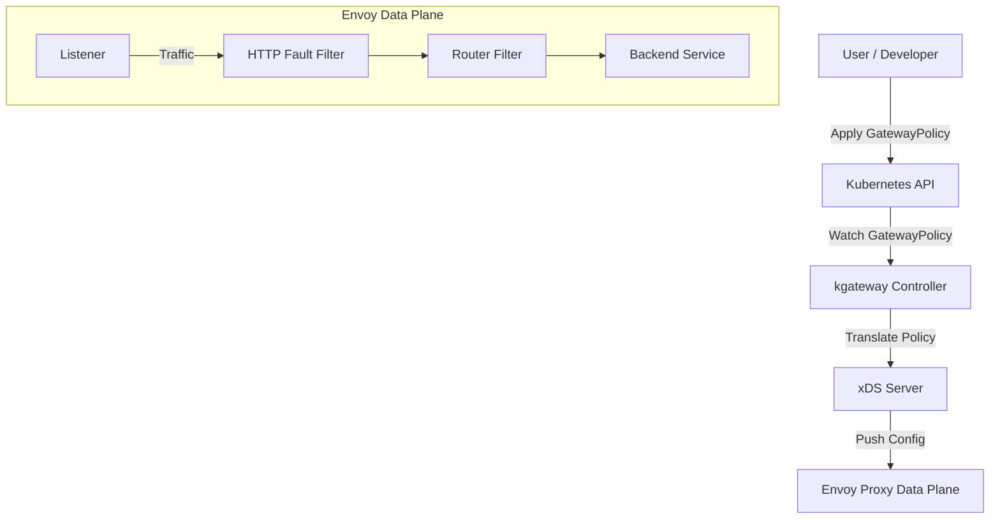
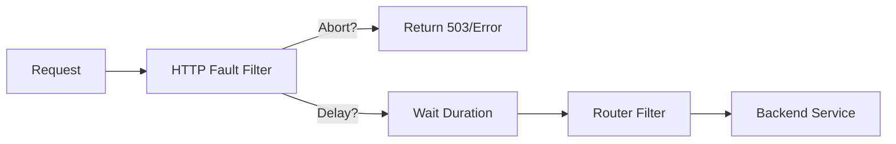

# Cover Letter

## LFX '26 | CNCF Kgateway

**Project:** Add Chaos Engineering / Fault Injection Support to KGateway

**Name:** Aarav Anand
**Primary Email:** aaravanand5749@gmail.com
**Institute Email:** aarav.p25@medhaviskillsuniversity.edu.in
**GitHub:** [Aaravanand00](https://github.com/Aaravanand00)
**Slack:** Aarav Anand

**Mentors:**

- Primary Mentor: Omar Hammami
- Secondary Mentor: Tim Flannagan

**Organization:** CNCF - KGateway
**Mentorship Program:** Linux Foundation Mentorship (LFX)
**Term:** Term 1, 2026

---

I am applying for the **Add Chaos Engineering / Fault Injection Support to KGateway** mentorship under the CNCF LFX program.

Building reliable distributed systems requires not just implementing features but validating behavior under failure. While working on cloud-native projects, I realized that designing systems that remain resilient during latency spikes, partial outages, or degraded conditions is critical. This project allows me to explore resilience and failure handling at the gateway level—a powerful but under-explored layer for chaos engineering.

Through this mentorship, I aim to contribute a production-grade fault injection capability to kgateway, leveraging my experience with Kubernetes controllers and Envoy Proxy configurations. My goal is to deliver a solution that enables users to validate service resilience declaratively without modifying application code.

— Aarav Anand

# Table of Contents

1. [LFX Mentorship Application Questions](#1-lfx-mentorship-application-questions)
2. [Project Overview: Chaos Engineering for KGateway](#2-project-overview-chaos-engineering-for-kgateway)
3. [Problem Analysis](#3-problem-analysis)
4. [Proposed Solution & Design Overview](#4-proposed-solution--design-overview)
5. [Technical Architecture & Implementation](#5-technical-architecture--implementation)
6. [Validation & Testing Strategy](#6-validation--testing-strategy)
7. [Timeline & Deliverables](#7-timeline--deliverables)
8. [Open Source Contributions](#8-open-source-contributions)
9. [About Me](#9-about-me)

# 1. LFX Mentorship Application Questions

### 1.1 How did you find out about the LFX mentorship program?

I first learned about this project through my college mentor, who actively encourages us to explore open-source and industry-relevant programs. He introduced me to the LFX Mentorship program and specifically pointed me to the CNCF mentoring repositories as a place where real-world, production-focused open-source work happens.

After that discussion, I personally explored the LFX Mentorship portal, went through past and ongoing CNCF projects, and spent time reading project descriptions, expected outcomes, and mentor expectations. While exploring these repositories, the **kgateway fault injection project** immediately stood out to me because of its strong focus on reliability, system design, and practical cloud-native challenges.

### 1.2 Why are you interested in this mentorship program?

I am interested in this program because it aligns strongly with my curiosity about how real-world, large-scale systems behave under failure. While working on open-source and cloud-native projects, I realized that building features is only one part of engineering; designing systems that remain reliable during latency spikes, partial outages, or degraded conditions is equally important. This project allows me to explore resilience and failure handling at the gateway level, which is a critical but often under-explored layer in distributed systems.

What excites me most is the opportunity to work on these problems within a structured mentorship environment. Contributing to a CNCF project like **kgateway**, while receiving direct feedback from experienced maintainers, will help me deepen my understanding of system design, traffic management, and production readiness. This mentorship feels like the right place to turn my curiosity into practical, high-impact learning.

### 1.3 What experience and skills do you have applicable to this program?

I have hands-on experience working with cloud-native and open-source projects, particularly around Kubernetes, Docker, and DevOps workflows. Through my CNCF-related contributions and personal projects, I have worked on designing APIs, understanding controller-based architectures, and documenting complex systems.

Specifically relevant to this project:

- **Kubernetes Controllers**: Understanding of reconciliation loops and CRD design.
- **Envoy Proxy**: Familiarity with Envoy's filter chain and xDS configuration model.
- **Go & Testing**: Experience writing collaborative Go code and unit tests.

### 1.4 What do you hope to gain from this mentorship experience?

I want to gain real-world experience in designing and implementing a production-grade feature within a CNCF project. I am particularly interested in understanding how design decisions evolve into reliable implementations and how trade-offs are evaluated in real systems.

I also hope to grow as an open-source contributor by learning directly from experienced mentors—both technically and regarding collaboration, review culture, and long-term project ownership.

# 2. Project Overview: Chaos Engineering for KGateway

## 2.1 Project Introduction

### What is kgateway?

`kgateway` is a Kubernetes-native API gateway built on **Envoy Proxy**, designed to provide advanced traffic management, security, and observability for cloud-native applications. It implements the Kubernetes Gateway API standard, offering a vendor-neutral, declarative approach to configuring ingress and routing behavior.

### Why Gateway-Level Traffic Controls Matter?

Modern distributed systems must be designed for failure. The ability to test system resilience under adverse conditions—network delays, service unavailability, partial failures—is critical for building confidence in production deployments.

Gateway-level traffic controls provide a unique vantage point:

- **Centralized control:** Apply resilience testing policies without modifying individual services.
- **Environment parity:** Test the same traffic patterns across dev, staging, and production.
- **Blast radius control:** Inject faults at ingress to simulate real-world failures.
- **Zero application impact:** No code changes required in backend services.

### Chaos Engineering Principles

Chaos Engineering is the practice of proactively testing a system by introducing controlled failures to identify reliability issues before they occur in production. Instead of waiting for real outages, teams intentionally simulate adverse conditions such as latency and service errors to validate system behavior, resilience mechanisms, and operational readiness.

# 3. Problem Analysis

## 3.1 Current Limitations in kgateway

Currently, `kgateway` does not provide native fault injection capabilities. Developers who want to test service resilience must resort to:

1.  **Application-level modifications:** Adding fault injection logic directly into service code.
2.  **External tools:** Deploying separate chaos engineering platforms (e.g., Chaos Mesh, Litmus).
3.  **Manual intervention:** Using proxies or network manipulation tools during testing.

## 3.2 User Pain Points

Through community feedback and observations from similar API gateway ecosystems, the following pain points have been identified:

1.  **No standardized way to test resilience:** Teams have no consistent, declarative method to inject faults for testing retry logic, timeouts, or circuit breakers.
2.  **Difficult to validate production-readiness:** Without controlled fault injection, teams cannot confidently validate that services will behave correctly under real-world failure scenarios.
3.  **High toil for testing:** Setting up fault injection requires significant manual effort, reducing the frequency and coverage of resilience testing.
4.  **Risk of production incidents:** Without proper testing infrastructure, the first encounter with network failures often occurs in production.

# 4. Proposed Solution & Design Overview

## 4.1 Conceptual Approach

The proposed solution introduces a new `GatewayPolicy` that allows users to declaratively specify fault injection rules. These policies are reconciled by the kgateway controller, which translates them into Envoy HTTP filter configurations and applies them via the xDS protocol.

### Architecture Diagram



## 4.2 GatewayPolicy Architecture

The solution leverages the standard **Gateway API Policy Attachment** pattern:

- **Gateway-level attachment:** Affects all routes under a Gateway.
- **Route-level attachment:** Affects only traffic matching a specific HTTPRoute.

### Request Flow with Fault Injection

1.  Developer creates a `GatewayPolicy` with fault injection configuration (delay, abort, percentage).
2.  kgateway controller watches the policy, validates it, and translates it to Envoy's `HTTPFault` filter configuration.
3.  Envoy applies the filter to matching HTTP traffic.
4.  **For each incoming request:**
    - Envoy evaluates whether the request should be affected (based on percentage).
    - **Delay:** If selected, Envoy pauses for the specified duration.
    - **Abort:** If selected, Envoy returns the specified HTTP status immediately.
    - **Normal:** Otherwise, the request proceeds to the backend.

## 4.3 Configuration Examples

### Delay Injection

Inject a 5-second delay into 50% of requests to test timeout handling.

```yaml
apiVersion: gateway.networking.k8s.io/v1beta1
kind: GatewayPolicy
metadata:
  name: simulate-slow-network
  namespace: staging
spec:
  targetRef:
    group: gateway.networking.k8s.io
    kind: HTTPRoute
    name: orders-route
  faultInjection:
    delay:
      fixedDelay: 5s
      percentage: 50.0
```

### Abort Injection

Inject HTTP 503 errors into 10% of requests to test circuit breakers.

```yaml
apiVersion: gateway.networking.k8s.io/v1beta1
kind: GatewayPolicy
metadata:
  name: simulate-service-outage
  namespace: staging
spec:
  targetRef:
    group: gateway.networking.k8s.io
    kind: HTTPRoute
    name: payments-route
  faultInjection:
    abort:
      httpStatus: 503
      percentage: 10.0
```

# 5. Technical Architecture & Implementation

## 5.1 Architecture Deep Dive

The architecture consists of four main layers:

1.  **User Configuration:** `GatewayPolicy` CRD (Kubernetes API).
2.  **Control Plane:** `kgateway` controller reconciles policies and translates them into Envoy configuration.
3.  **Discovery Service (xDS):** Pushes configuration to Envoy instances.
4.  **Data Plane:** Envoy Proxy executes the fault injection logic.

### Envoy Filter Placement

The HTTP fault filter must be placed **before** the router filter in Envoy's filter chain.



**Rationale:**

- **Faults before routing:** Ensures faults simulate network/service failures effectively.
- **Abort short-circuits:** Aborted requests never reach the backend, saving resources.
- **Latency observability:** Delays are observed by the client as part of the total request time.

## 5.2 Envoy Integration Strategy

The translation from `GatewayPolicy` to Envoy configuration is deterministic:

| GatewayPolicy Field               | Envoy Config Field  | Formatting Rule                          |
| :-------------------------------- | :------------------ | :--------------------------------------- |
| `faultInjection.delay.fixedDelay` | `delay.fixed_delay` | String (e.g., "5s") to Duration Protobuf |
| `faultInjection.abort.httpStatus` | `abort.http_status` | Integer (200-599)                        |
| `percentage`                      | `percentage`        | Float (0.0-100.0) to FractionalPercent   |

## 5.3 Safety & Isolation

To prevent accidental production outages, the design includes strict safety mechanisms:

1.  **Namespace Scoping:** Policies are namespace-scoped. A policy in `staging` cannot affect resources in `production`.
2.  **RBAC & Access Control:** Restrict `GatewayPolicy` creation to authorized platform engineers.
3.  **Percentage-Based Rollout:** Support for granular percentages (e.g., 1%) allows safe, gradual introduction of faults.

# 6. Validation & Testing Strategy

A comprehensive testing strategy ensures the feature is robust and safe.

## 6.1 Validation Scenarios

| Scenario              | Configuration   | Expected Behavior                              | Validation Metric                       |
| :-------------------- | :-------------- | :--------------------------------------------- | :-------------------------------------- |
| **Baseline**          | No Policy       | Normal latency (5-50ms), 100% success.         | p99 latency < 100ms                     |
| **Latency Injection** | 50% delay (5s)  | 50% requests take >5s. 100% success.           | `http.fault.delays_injected` increments |
| **Abort Injection**   | 10% abort (503) | 10% requests return 503 immediately.           | `http.fault.aborts_injected` increments |
| **Compound Failure**  | Delay + Abort   | Some requests delayed, some failed, some both. | Client observability & logs             |

## 6.2 Observability

Envoy exposes metrics that will be used for validation:

- `http.fault.delays_injected`: Total count of delayed requests.
- `http.fault.aborts_injected`: Total count of aborted requests.
- `http.fault.faults_overflow`: Requests that exceeded configured limits.

# 7. Timeline & Deliverables

## 7.1 Weekly Schedule (12-Week Plan)

| Week           | Phase                                   | Key Activities                                                                                                                                           |
| :------------- | :-------------------------------------- | :------------------------------------------------------------------------------------------------------------------------------------------------------- |
| **Week 1-2**   | **Community Bonding & Design**          | • Deep dive into kgateway codebase.<br>• Finalize API design and CRD structure.<br>• Setup development environment.                                      |
| **Week 3-4**   | **Core Implementation (Gateway-Level)** | • Implement `GatewayPolicy` API changes.<br>• Implement basic controller reconciliation loop.<br>• Generate valid Envoy `HTTPFault` config.              |
| **Week 5-6**   | **Route-Level Support**                 | • Extend support for attaching policies to `HTTPRoute`.<br>• Handle conflict resolution (e.g., conflicting policies on same route).                      |
| **Week 7-8**   | **Safety & Edge Cases**                 | • Implement validation webhooks (percentage bounds, status codes).<br>• Add unit tests for translation logic.<br>• Implement namespace isolation checks. |
| **Week 9-10**  | **Testing & Documentation**             | • Create integration tests (e2e) using Kind.<br>• Write user documentation and examples.<br>• Add metrics and observability guides.                      |
| **Week 11-12** | **Final Polish & Submission**           | • Code cleanup and final PR reviews.<br>• Create demo video/blog post.<br>• Final mentorship evaluation.                                                 |

# 8. Open Source Contributions

I have actively contributed to the CNCF ecosystem, focusing on reliability, automation, and infrastructure tooling.

| Organization        | Repository               | PR / Issue                                                    | Type              | Description                                                                                                             |
| :------------------ | :----------------------- | :------------------------------------------------------------ | :---------------- | :---------------------------------------------------------------------------------------------------------------------- |
| **CNCF – kgateway** | `kgateway`               | [#13378](https://github.com/kgateway-dev/kgateway/pull/13378) | Code Fix          | Aligned image registry usage using `IMAGE_REGISTRY`, improving consistency and configurability (resolved issue #11359). |
| **CNCF – kgateway** | `kgateway`               | [#13398](https://github.com/kgateway-dev/kgateway/pull/13398) | Code Review       | Reviewed changes related to image registry alignment and configuration consistency.                                     |
| **CNCF – kgateway** | `kgateway`               | [#13377](https://github.com/kgateway-dev/kgateway/pull/13377) | Feature / Infra   | Contributed to inference dependency resolution using ListenerSet ParentRefs.                                            |
| **CNCF – kgateway** | `kgateway`               | [#13407](https://github.com/kgateway-dev/kgateway/pull/13407) | Design Discussion | Provided technical feedback and clarification on issue discussion related to gateway behavior.                          |
| **CNCF Automation** | `automation`             | #131                                                          | Automation / CI   | Contributed improvements to CNCF automation workflows.                                                                  |
| **JdeRobot**        | `RoboticsInfrastructure` | #639                                                          | Code Contribution | Contributed fixes and improvements to robotics infrastructure tooling.                                                  |

# 9. About Me

**My name is Aarav Anand**, and I am an engineering student with a strong interest in cloud-native systems, distributed architectures, and robotics. I am particularly drawn to projects that operate close to real-world systems, where software correctness, reliability, and design decisions have a direct impact on system behavior.

I have contributed to the JdeRobot organization (part of GSoC), where I engaged with robotics-focused open-source development. This experience strengthened my understanding of how complex systems behave under constraints, how components interact across layers, and why robust design and testing are essential.

## Relevant Projects

### 1. Edge Device Metrics Dashboard (Flask/Prometheus)

**Overview:** A comprehensive monitoring solution built using Flask, Prometheus, and Grafana to simulate and visualize edge device metrics.

- **Tech Stack:** Python (Flask), Prometheus, Grafana, Docker.
- **Key Features:** Real-time CPU/RAM monitoring, anomaly detection, and containerized deployment.
- **Relevance:** Demonstrates deep understanding of observability, metrics collection, and cloud-native monitoring stacks similar to those used in Kubernetes.

### 2. Flight Booking Android App (Airbnb Virtual Internship)

**Overview:** A native Android application focusing on modern UI/UX and clean architecture.

- **Tech Stack:** Kotlin, Jetpack Compose, Material Design 3.
- **Relevance:** proper handling of client-side state, user experience, and robust frontend design, which complements my backend systems knowledge.

## Why I am a Good Fit

I believe I am a strong fit for this project because my background combines:

1.  **Hands-on Systems Knowledge:** Experience with Docker, Kubernetes, and Observability stacks.
2.  **Proven Contribution Record:** Active PRs and reviews in the `kgateway` repository specifically.
3.  **Design-First Mindset:** The ability to analyze problems (like fault injection) and propose structured, architectural solutions before writing code.

I do not see this mentorship as a short-term task, but as a step toward becoming a reliable chaos engineering and cloud-native contributor.
