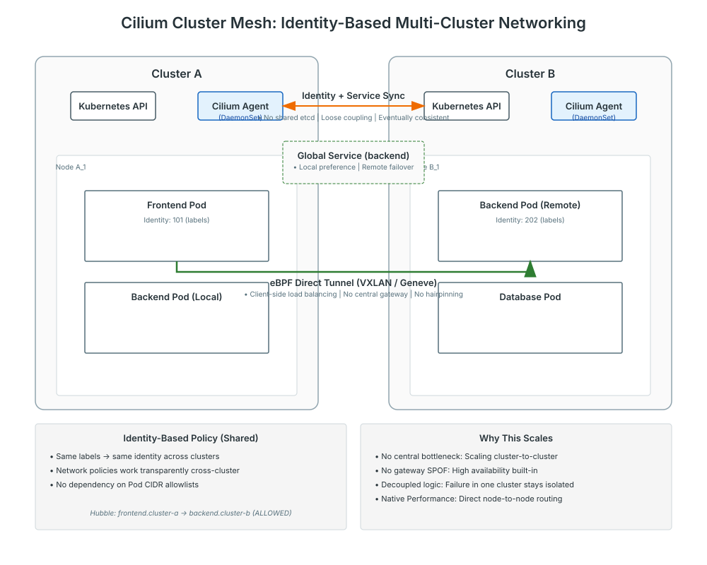
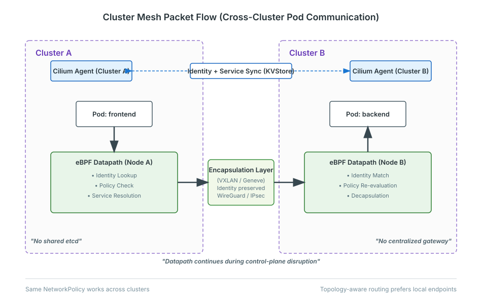
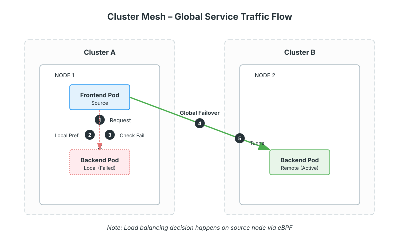

# Multi-Cluster Networking with Cilium (Cluster Mesh)

## Introduction

As Kubernetes adoption matures, organizations rarely operate a single isolated cluster. The standard deployment model now involves multiple clusters distributed across availability zones, regions, or hybrid cloud environments. This shift is driven by requirements for high availability, fault isolation (blast radius reduction), regulatory compliance, and tenancy management.

However, operating multiple clusters introduces significant networking complexity. The challenge lies in enabling seamless communication between services residing in different clusters without compromising security or operational independence.

## Why Multi-Cluster Networking Is Hard

Native Kubernetes networking is designed with the assumption of a single cluster boundary. Extending this boundary creates several friction points:

- **Network Isolation**: By default, Pod IP addresses are internal to the cluster. Pods in Cluster A cannot route to Pods in Cluster B without gateways, VPNs, or complex NAT rules.
- **Identity Mismatch**: Security identities are local. A "frontend" service in Cluster A has no inherent relationship to a "backend" service in Cluster B. Traditional firewalls see only IP addresses, losing the rich context of Kubernetes application identity.
- **Service Discovery Challenges**: Standard DNS (`coredns`) resolves services locally. Discovering an endpoint in a remote cluster typically requires external load balancers or service mesh federation, adding latency and management overhead.
- **Security Policy Duplication**: Security teams must maintain synchronized IP allow-lists across multiple environments, which is error-prone and operationally expensive.
- **Observability Gaps**: Tracing a request as it leaves one cluster and enters another often breaks observability context, creating "black holes" in performance monitoring.

## What Is Cilium Cluster Mesh

Cilium Cluster Mesh allows multiple Kubernetes clusters to be connected into a single, logical connectivity mesh. It enables Pod-to-Pod connectivity across clusters using the same efficiency and security principles as intra-cluster communication.

Conceptually, Cluster Mesh extends the datapath. It does not require a single global control plane or a shared `etcd` state, which safeguards the isolation of individual clusters. Traffic flows directly from the source Pod in one cluster to the destination Pod in another, bypassing centralized gateways or distinct load balancers.

Crucially, Cluster Mesh does not rigidly require a flat Layer 2 network. It can utilize encapsulation (VXLAN or Geneve) to create an overlay network that spans underlying infrastructure boundaries, provided there is basic IP connectivity between the nodes of the clusters.

## Cluster Mesh Architecture

The architecture relies on a decentralized, agent-based model:

- **Per-Cluster Agents**: The Cilium Agent runs on every node in each cluster.
- **Shared Identity Model**: Cilium synchronizes security identities across the mesh. A workload labeled `app=frontend` shares the same numeric security identity across all connected clusters.
- **Cross-Cluster Service Discovery**: A lightweight control plane synchronizes specific Service endpoints across clusters, allowing standard Kubernetes Services to reference remote Pods.
- **Datapath-to-Datapath Communication**: eBPF programs on the source node encapsulate traffic and send it directly to the node hosting the destination Pod in the remote cluster.

**Figure 1: Cilium Cluster Mesh: Internal Architecture and Data Flow Overview**

The diagram illustrates the decentralized nature of the connection. The control plane handles strict identity synchronization, while the data plane handles efficient packet tunneling directly between Pods.

The diagram illustrates the direct nature of the connection. The control plane handles strict identity synchronization, while the data plane handles efficient packet tunneling.

## Global Services and Traffic Flow

Cluster Mesh enables the concept of **Global Services**. A Kubernetes Service defined in multiple clusters can be annotated to include endpoints from all clusters in the mesh.

For example, a `frontend` service can connect to a `backend` service. If the `backend` service exists in both Cluster A (local) and Cluster B (remote), Cilium can load balance traffic across both.

- **Topology Awareness**: By default, Cilium prefers local endpoints to minimize latency and egress costs.
- **Automatic Failover**: If the local endpoints in Cluster A become unhealthy, traffic is automatically transparently redirected to the healthy endpoints in Cluster B.
- **Client-Side Load Balancing**: The decision of where to send the packet is made at the source node using eBPF, avoiding the bottleneck of a centralized load balancer.

## Security Across Clusters

Maintaining security posture across clusters is often the most difficult aspect of federation. Cilium simplifies this by extending its identity-aware policy model.

- **Consistent Identity**: Because identities are synchronized, a NetworkPolicy allowing `frontend` to talk to `backend` works regardless of where the Pods are running.
- **IP Independence**: Policies do not rely on static IP ranges or cluster CIDRs. If a remote cluster scales up and acquires new Pod IPs, the local policies remain effective without modification.
- **Encryption**: Cluster Mesh supports Transparent Encryption. Traffic spanning the insecure network between clusters can be automatically encrypted (using WireGuard or IPsec), securing data in transit over the internet or untrusted WANs.

## Observability in a Multi-Cluster World

Hubble, Cilium’s observability plane, recognizes Cluster Mesh traffic. When viewing service maps or flow logs:

- Traffic flow is clearly identified as remote (e.g., `cluster-b/backend`).
- Drop reasons (Policy Denied, etc.) are visible even for cross-cluster traffic.
- Metrics are tagged with the source and destination cluster names, enabling accurate latency monitoring and troubleshooting across boundaries.

## Operational Characteristics

Cluster Mesh is designed for loose coupling and high resilience:

- **Failure Isolation**: If Cluster B suffers a control plane failure (e.g., API server down), Cluster A is unaffected. The networking datapath continues to function based on the last known state.
- **Lifecycle Independence**: Clusters can be upgraded or scaled independently. Cilium Agents handle version compatibility across the mesh.
- **Flexible Topology**: You can configure a full mesh (all connected to all) or a partial mesh (central hub connected to spokes), depending on organizational requirements.

## When Cluster Mesh Makes Sense

Consider implementing Cluster Mesh in the following scenarios:

- **High Availability**: Active-Active deployments where services run in multiple regions for redundancy.
- **Migration**: Blue/Green cluster upgrades where traffic acts as a unified pool while workloads are migrated from an old cluster to a new one.
- **Shared Services**: A central "shared services" cluster (logging, monitoring, vault) that needs to be accessed by tenant clusters without exposing them to the public internet.
- **Hybrid Cloud**: Spanning workloads between on-premise data centers and public cloud providers while maintaining a unified network policy model.

**Figure 2: Cross-Cluster Packet Journey (Maintainer Grade)**

## Next Learning Steps

To deepen your understanding, investigate the following topics:

- **Cluster Mesh Documentation**: Detailed setup guides for various cloud providers.
- **Multi-Cluster Service Examples**: Configuring Global Services with topology-aware routing.
- **Observability Guides**: Using Hubble to trace flows across cluster boundaries.

**Figure 3: Global Service Failover Traffic Flow**
