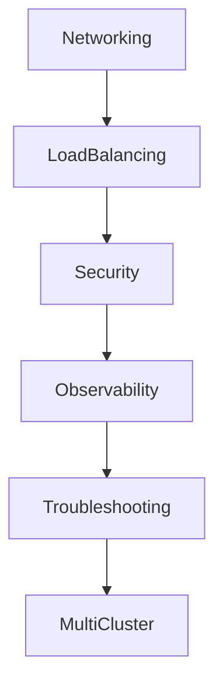
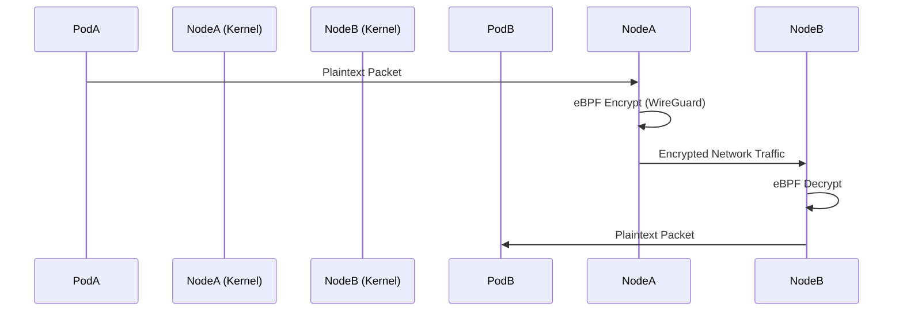
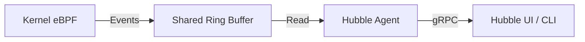
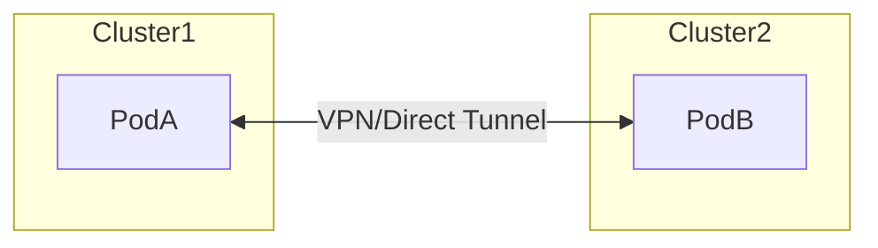

# Cover Letter

## LFX Mentorship — CNCF Cilium

**Project:** Cilium Project Pillar Pages

**Mentorship Program:** Linux Foundation Mentorship (LFX)
**Term:** Term 1, 2026

---

I learned about the LFX Mentorship Program through the CNCF ecosystem and community channels, including prior exposure to LFX project listings and discussions around structured mentorships in cloud-native projects. While exploring long-term contribution paths within CNCF, LFX stood out as a program that emphasizes sustained, mentor-guided impact rather than short, isolated contributions.

I am interested in this mentorship because it focuses on solving real, long-standing gaps in open source projects rather than adding surface-level features. In the case of Cilium, a significant gap exists not in functionality but in how architectural behavior is explained to operators and contributors. Kubernetes networking is widely used, yet poorly understood at the system level, especially when clusters scale or fail. The goal of this project—to create architecture-first, problem-oriented pillar pages—aligns strongly with how I approach technical understanding and documentation.

My background includes hands-on experience with Kubernetes concepts, Linux networking fundamentals, and datapath-level reasoning. I have worked with containerized systems where networking, policy enforcement, and observability issues surfaced under real operational constraints. Through prior open source contributions and technical writing efforts, I have developed familiarity with GitHub workflows, maintainer review cycles, and the discipline required to produce review-ready work. More importantly, I focus on understanding why systems behave a certain way, not just how to configure them, which is essential for architecture-level documentation.

Through this mentorship, I hope to deepen my understanding of production-grade Kubernetes networking and eBPF-based systems by working closely with experienced maintainers. I want to improve my ability to explain complex distributed systems clearly and precisely, without oversimplification or unnecessary abstraction. Beyond the mentorship period, my goal is to continue contributing to Cilium and CNCF projects with a stronger architectural foundation and a more refined documentation mindset.

— Dev

# 2. Student & Project Details

| Category                | Details                                                    |
| :---------------------- | :--------------------------------------------------------- |
| **Name**                | Dev                                                        |
| **Primary Email**       | kalpanagola9897@gmail.com                                  |
| **Institute Email**     | dev.p25@medhaviskillsuniversity.edu.in                     |
| **GitHub**              | [Dev10-sys](https://github.com/Dev10-sys)                  |
| **LinkedIn**            | [dev-10-shadow](https://www.linkedin.com/in/dev-10-shadow) |
| **Location / Timezone** | India (IST / UTC+5:30)                                     |
| **Project**             | **Cilium Project Pillar Pages**                            |
| **Organization**        | CNCF / Cilium                                              |

# 3. LFX Application Questions

### 3.1 How did you find out about this program?

I identified this specific project through my ongoing analysis of the CNCF landscape. My work often involves dissecting how different CNI implementations handle packet flow, which led me to the Cilium documentation. I specifically sought out LFX mentorships that prioritize architectural explanation and system-level documentation, finding the "Pillar Pages" project to be a direct match for my interest in demystifying complex distributed systems. I have also contributed to documentation analysis and proposals for Cilium, as well as code and documentation improvements in other open-source projects like SugarLabs and OWASP WebGoat.

### 3.2 Why are you interested in this project?

My interest lies in the gap between "standard" Kubernetes networking (iptables/kube-proxy) and the eBPF-based datapath Cilium provides. Operators often bring mental models from legacy networking that do not map cleanly to eBPF concepts like identity-based security or map-based routing.

This project is an opportunity to:

- **Formalize System Knowledge:** Writing about a system is the most rigorous way to understand it.
- **Solve Operational Pain:** Provide the "missing manual" for debugging and architecture that I have personally looked for.
- **Collaborate with Maintainers:** engage with engineers who have built the datapath, learning how to articulate design decisions effectively.

### 3.3 What relevant experience do you have?

I have focused my engineering studies on cloud-native infrastructure, specifically:

- **Kubernetes Internals:** Understanding the relationship between the API server, kubelet, and CNI plugins.
- **Technical Communication:** Experience authoring technical guides that prioritize logical flow and system behavior over rote instruction.
- **Debugging Methodologies:** A strong grasp of how to troubleshoot distributed systems by isolating failure domains, a key requirement for writing the "Troubleshooting" pillar.

**Open Source Contributions:**

| Project       | Contribution                      | Type          | Status      |
| :------------ | :-------------------------------- | :------------ | :---------- |
| Cilium        | Documentation analysis & proposal | Design / Docs | In progress |
| SugarLabs     | Bug fix / feature PR              | Code          | Merged      |
| OWASP WebGoat | Documentation & code improvements | Code          | Merged      |

These contributions demonstrate familiarity with GitHub-based workflows, maintainer review cycles, and iterative feedback and revision.

### 3.4 What do you hope to gain from this mentorship?

I aim to develop a maintainer-level understanding of how to document complex software systems. Specifically, I hope to:

- Achieve technical precision in eBPF explanations while maintaining accessibility for non-kernel engineers.
- Learn the editorial standards required for high-impact CNCF documentation.
- Demonstrate that accurate, architecture-first documentation is a critical engineering deliverable.

# 4. Project Introduction

Kubernetes abstracts networking to a degree where the underlying reality is often obscured. When everything works, this abstraction is useful. when it fails, the lack of visibility into the actual datapath makes debugging difficult.

Users often struggle to answer basic architectural questions:

- How does a packet actually get from a Pod on Node A to a Service on Node B?
- Why did a NetworkPolicy allow traffic I expected to be denied?
- Is latency introduced by the network, the CNI, or the application?

Cilium solves these problems technically via eBPF, but the _documentation_ must also bridge the gap. This project aims to create a set of "Pillar Pages" that serve as the definitive architectural reference for these core questions.

# 5. Problem Analysis

The core issue is that operators apply correct Kubernetes configurations but misunderstand the resulting system behavior.

### 5.1 Incomplete Mental Models

Users often visualize Kubernetes networking as wires connecting Pods. In reality, it is a complex pipeline of encapsulation, routing decisions, and policy evaluations occurring in the kernel.

### 5.2 Abstraction vs. Reality

```mermaid
flowchart LR
    subgraph "User Mental Model"
    A[Pod A] -->|Kube-Proxy / iptables abstraction| B[Service VIP]
    B -->|Kube-Proxy / iptables abstraction| C[Pod B]
    end

    subgraph "Datapath Reality"
    D[Source Pod] -->|veth| E[eBPF Program (Ingress)]
    E -->|Route & Encap| F[VXLAN/Geneve Tunnel]
    F -->|Physical Net| G[Dest Node Kernel]
    G -->|eBPF Program (Egress)| H[Policy Check]
    H -->|Delivery| I[Dest Pod]
    end
```

### 5.3 Policy Misinterpretation

Security policies are often treated as static firewall rules. However, in Kubernetes, they are dynamic: reliant on identity resolution, label updates, and eventual consistency. Without understanding this, users create policies that are either too permissive or break legitimate traffic during scaling events.

# 6. Proposed Technical Approach

The approach is **Architecture-First** and **Problem-Scoped**.

### Documentation Philosophy

1.  **Start with the Problem:** Every page begins with a concrete user question or failure scenario.
2.  **Explain the Datapath:** Map the Kubernetes abstraction (e.g., Service) to the datapath implementation (e.g., eBPF Map lookup).
3.  **Identify Observability Signals:** Show how to prove the explanation is true using CLI tools or metrics.

### Scope and Non-Goals

| Category   | In Scope                                      | Out of Scope                                      |
| :--------- | :-------------------------------------------- | :------------------------------------------------ |
| **Focus**  | System behavior, traffic flow, failure modes. | Installation guides, "Getting Started" tutorials. |
| **Depth**  | Datapath (eBPF), Identity, Routing.           | Kernel source code analysis.                      |
| **Tone**   | Senior Engineering / Architectural.           | Marketing, sales, feature distinctives.           |
| **Format** | Markdown concept pages, Diagrams.             | Video tutorials, interactive labs.                |

# 7. Detailed Pillar Breakdown (The Core Proposal)

The pillar pages form the core deliverable of this mentorship. Each page provides an exhaustive architectural deep-dive into a specific domain.



---

## 7.1 Pillar 01: Networking Fundamentals (Deep Dive)

**Core Question:** "How does a packet traverse the cluster?"

### Architectural Concept

In Kubernetes, Pods are ephemeral, but they require a unique IP. The challenge is connecting these IPs across nodes without NAT (Network Address Translation).

### Datapath Implementation

Cilium uses eBPF to attach programs to the network interface (tc-ingress/egress hooks). When a packet leaves a Pod:

1.  **Ingress:** The veth interface receives the packet.
2.  **eBPF Classification:** The program checks if the destination is local or remote.
3.  **Encapsulation:** If remote, the packet is encapsulated (VXLAN/Geneve) with the Identity code embedded in the header.

### Failure Scenarios Covered

- **MTU Mismatches:** When the overlay header pushes the packet size beyond the physical network MTU, causing fragmentation or drops.
- **Veth Pair Errors:** When the virtual cable disconnects or enters a confused state.

### Observability Signals

- **`cilium status --verbose`**: Inspecting datapath mode.
- **`ip -d link show`**: Verifying VXLAN interface properties.


---

## 7.2 Pillar 02: Load Balancing & High Performance

**Core Question:** "Why is traffic not evenly distributed?"

### Architectural Concept

Kubernetes Services provide a stable VIP for a set of backends. Standard kube-proxy uses random selection or round-robin via iptables, which degrades as the number of services grows (O(N) lookup).

### Datapath Implementation (Maglev & XDP)

Cilium implements load balancing using eBPF Maps (Hash Tables).

- **O(1) Lookup:** Finding a backend takes constant time, regardless of cluster size.
- **Maglev Hashing:** Consistent hashing ensures that if a backend fails, only a tiny fraction of flow mappings change, preventing connection resets for unrelated clients.
- **XDP Acceleration:** For extreme performance, XDP programs run directly in the network driver, processing packets before the OS kernel even sees them.

### Failure Scenarios Covered

- **Connection Stickiness:** Why long-lived connections don't rebalance after scaling.
- **Backend Churn:** How rapid Pod creation/deletion affects the service map.

```mermaid
graph TD
    Client -->|Packet| XDP[XDP Hook (Driver)]
    XDP -->|Hash Lookup| BackendMap{Cilium Backend Map}
    BackendMap -->|Backend 1| Pod1
    BackendMap -->|Backend 2| Pod2
    BackendMap -->|Backend 3| Pod3
```

---

## 7.3 Pillar 03: Microsegmentation & Identity

**Core Question:** "Why is my policy not blocking this traffic?"

### Architectural Concept

The "IP Allow-list" model fails in Kubernetes because IPs change constantly. Cilium replaces IPs with **Identities**. An identity is a numeric representation of a set of labels (e.g., `app=frontend` -> ID `105`).

### Datapath Implementation

Security policies are compiled into an eBPF Policy Map.

1.  **Identity Derivation:** When a packet arrives, eBPF extracts the source Identity from the encapsulation header (or looks it up).
2.  **Policy Verdict:** The kernel checks: `Can ID 105 talk to ID 200 on Port 80?`
3.  **Action:** `Allow` (forward) or `Deny` (drop immediately).

### Observability Signals

- **`cilium identity list`**: Viewing the mapping of Labels to IDs.
- **`cilium monitor -t policy`**: Watching real-time verdicts.

---

## 7.4 Pillar 04: Network Security & Encryption

**Core Question:** "Is my traffic encrypted and authenticated?"

### Architectural Concept

Zero Trust requires assuming the network is hostile. Encryption (Node-to-Node) protects data in transit.

### Datapath Implementation (WireGuard/IPsec)

Cilium integrates Transparent Encryption directly into the datapath.

- **WireGuard:** Uses a specific network interface (`cilium_wg0`). Traffic routed through this interface is automatically encrypted before leaving the node.
- **Key Management:** Keys are rotated automatically by the Cilium Agent, transparent to the application.

### Failure Scenarios Covered

- **Handshake Failures:** When nodes cannot agree on encryption keys.
- **MTU Overhead:** Encryption adds headers; packets must fit within the physical MTU.



---

## 7.5 Pillar 05: Observability (Hubble)

**Core Question:** "Where did this packet drop?"

### Architectural Concept

Traditional tools (`tcpdump`) are blind to Kubernetes context. Hubble extracts visibility directly from the kernel.

### Datapath Implementation

- **Ring Buffers:** eBPF programs write flow events (L3/L4 headers, L7 Info) to a shared memory ring buffer.
- **Asynchronous Processing:** The userspace Hubble Agent reads this buffer, ensuring that logging never blocks network traffic (non-blocking IO).

### Visualization

Hubble reconstructs the Service Map by aggregating flow data, showing who is talking to whom and the health of those connections (Green/Red success rates).



---

## 7.6 Pillar 06: Troubleshooting

**Core Question:** "Is it the network, DNS, or the app?"

### Architectural Concept

Structured debugging reduces MTTR (Mean Time To Repair). The pillar defines a decision tree for isolation.

### The Decision Tree

1.  **Pod Level:** Is the application listening? (`kubectl get pod`)
2.  **Node Level:** Is the route present? (`ip route`)
3.  **Network Level:** Is segmentation blocking it? (`cilium policy get`)
4.  **DNS Level:** Is name resolution working? (`nslookup`)

---

## 7.7 Pillar 07: Multi-Cluster Networking (Cluster Mesh)

**Core Question:** "How does Service discovery work across clusters?"

### Architectural Concept

Cluster Mesh connects multiple clusters into a single logical network without a centralized gateway bottleneck.

### Datapath Implementation

- **Remote Identities:** Identities are synchronized across clusters. ID 105 in Cluster A means `app=frontend`, and ID 105 in Cluster B means the same.
- **Direct Routing:** Pod A (Cluster 1) sends packets directly to Pod B (Cluster 2) via a tunnel, preserving the source IP and Identity.



(Note: No central gateway is required for the path).

---

## 7.8 Pillar 08: Runtime Security integration

**Core Question:** "Is this process execution normal?"

### Architectural Concept

Network security is only one layer. Runtime security detects compromised processes.

### Datapath Implementation

- **Process Ancestry:** eBPF tracks `execve` syscalls.
- **Correlation:** Cilium correlates "Process X launched Shell Y and opened Network Connection Z". This prevents "Living off the Land" attacks where legitimate tools (like `curl`) are used maliciously.

# 9. Deliverables

1.  **Eight (8) Pillars:** Comprehensive, version-agnostic Markdown documents.
2.  **Architecture Diagrams:** SVG/Mermaid visuals for traffic flows and logical components.
3.  **Review Responses:** Documented updates based on maintainer feedback cycles.

# 10. Timeline (12 Weeks)

| Phase                 | Weeks | Focus                                                                                                            |
| :-------------------- | :---- | :--------------------------------------------------------------------------------------------------------------- |
| Community & Context   | 1     | Deep review of existing Cilium docs, maintainer feedback patterns, and open issues related to documentation gaps |
| Architecture Baseline | 2     | Finalize common conceptual model, diagram language, and pillar structure consistency                             |
| Drafting Phase I      | 3–4   | Pillar 01 (Networking Fundamentals) and Pillar 02 (Load Balancing) — first complete drafts                       |
| Drafting Phase II     | 5–6   | Pillar 03 (Microsegmentation) and Pillar 04 (Network Security) — first complete drafts                           |
| Drafting Phase III    | 7–8   | Pillar 05 (Observability) and Pillar 06 (Troubleshooting) — first complete drafts                                |
| Drafting Phase IV     | 9     | Pillar 07 (Multi-Cluster) and Pillar 08 (Runtime Security) — scoped drafts                                       |
| Review & Refinement   | 10–11 | Maintainer review cycles, diagram corrections, tightening explanations                                           |
| Final Integration     | 12    | Cross-linking pillars, final edits, merge-ready submission                                                       |

**Note:** Drafting phases explicitly represent _first-pass architectural drafts_. Refinement and maintainer feedback are expected and planned.

# 11. Validation & Success Criteria

The success of this project is evaluated through tangible and reviewable outcomes.

### Qualitative Signals

- A reader can explain packet flow, policy enforcement, and failure behavior without referencing configuration.
- Operators can distinguish between policy, routing, and service failures using documentation alone.

### Quantitative Signals

- Review feedback from at least two Cilium maintainers per pillar.
- Acceptance and merge of at least 6 pillar pages into the official documentation structure.
- Reduction in recurring conceptual questions across Slack/GitHub issues referencing covered topics.
- Cross-linking of pillar pages from existing Cilium documentation entry points.

The goal is durability and correctness, not volume.

# 12. Prior Preparation

I have invested significant time preparing for this role:

- **Documentation Audit:** Analyzed existing Cilium docs to identify architectural explanation gaps.
- **eBPF Study:** Detailed review of eBPF datapath hooks and limitations.
- **Diagramming:** Prototyped architectural diagrams to test visual explanation strategies.

# 13. Availability & Commitment

- **Commitment:** Full duration of the mentorship term.
- **Availability:** 20-30 hours per week.
- **Communication:** Available for weekly syncs and asynchronous Slack/GitHub collaboration.
- **Timezone:** IST (UTC+5:30)

# 14. Conclusion

This mentorship is not just about writing documentation; it is about translating complex system behavior into accessible reliable knowledge. By focusing on architectural reasoning over rote configuration, I aim to create a set of resources that empower Kubernetes operators to build and debug with confidence. I look forward to the opportunity to contribute to the CNCF and the Cilium community.
