# Cover Letter

## LFX Mentorship — CNCF Cilium

**Project:** Cilium Project Pillar Pages  
**Mentorship Program:** Linux Foundation Mentorship (LFX)  
**Term:** Term 1, 2026

---

I learned about the LFX Mentorship Program through the CNCF ecosystem and community channels, including prior exposure to LFX project listings and discussions around structured mentorships in cloud-native projects. While exploring long-term contribution paths within CNCF, LFX stood out as a program that emphasizes sustained, mentor-guided impact rather than short, isolated contributions.

I am interested in this mentorship because it focuses on solving real, long-standing gaps in open source projects rather than adding surface-level features. In the case of Cilium, a significant gap exists not in functionality but in how architectural behavior is explained to operators and contributors. Kubernetes networking is widely used, yet poorly understood at the system level, especially when clusters scale or fail. The goal of this project—to create architecture-first, problem-oriented pillar pages—aligns strongly with how I approach technical understanding and documentation.

My background includes hands-on experience with Kubernetes concepts, Linux networking fundamentals, and datapath-level reasoning. I have worked with containerized systems where networking, policy enforcement, and observability issues surfaced under real operational constraints. Through prior open source contributions and technical writing efforts, I have developed familiarity with GitHub workflows, maintainer review cycles, and the discipline required to produce review-ready work. More importantly, I focus on understanding why systems behave a certain way, not just how to configure them, which is essential for architecture-level documentation.

Through this mentorship, I hope to deepen my understanding of production-grade Kubernetes networking and eBPF-based systems by working closely with experienced maintainers. I want to improve my ability to explain complex distributed systems clearly and precisely, without oversimplification or unnecessary abstraction. Beyond the mentorship period, my goal is to continue contributing to Cilium and CNCF projects with a stronger architectural foundation and a more refined documentation mindset.

— Dev

# 2. Student & Project Details

| Category                | Details                                                    |
| :---------------------- | :--------------------------------------------------------- |
| **Name**                | Dev                                                        |
| **Primary Email**       | kalpanagola9897@gmail.com                                  |
| **Institute Email**     | dev.p25@medhaviskillsuniversity.edu.in                     |
| **GitHub**              | [Dev10-sys](https://github.com/Dev10-sys)                  |
| **LinkedIn**            | [dev-10-shadow](https://www.linkedin.com/in/dev-10-shadow) |
| **Location / Timezone** | India (IST / UTC+5:30)                                     |
| **Project**             | **Cilium Project Pillar Pages**                            |
| **Organization**        | CNCF / Cilium                                              |

# 3. LFX Application Questions

### 3.1 How did you find out about this program?

I identified this specific project through my ongoing analysis of the CNCF landscape. My work often involves dissecting how different CNI implementations handle packet flow, which led me to the Cilium documentation. I specifically sought out LFX mentorships that prioritize architectural explanation and system-level documentation, finding the "Pillar Pages" project to be a direct match for my interest in demystifying complex distributed systems.

### 3.2 Why are you interested in this project?

My interest lies in the gap between "standard" Kubernetes networking (iptables/kube-proxy) and the eBPF-based datapath Cilium provides. Operators often bring mental models from legacy networking that do not map cleanly to eBPF concepts like identity-based security or map-based routing.

This project is an opportunity to formalize system knowledge, solve operational pain points, and collaborate with maintainers who have built the datapath.

### 3.3 What relevant experience do you have?

**Open Source Contributions:**

| Project       | Contribution                      | Type          | Status      |
| :------------ | :-------------------------------- | :------------ | :---------- |
| Cilium        | Documentation analysis & proposal | Design / Docs | In progress |
| SugarLabs     | Bug fix / feature PR              | Code          | Merged      |
| OWASP WebGoat | Documentation & code improvements | Code          | Merged      |

### 3.4 What do you hope to gain from this mentorship?

I aim to develop a maintainer-level understanding of how to document complex software systems with technical precision in eBPF explanations while maintaining accessibility for non-kernel engineers.

---

# 4. Project Overview & Architecture

## 4.1 The Documentation Gap in Cloud Native Networking

Kubernetes networking documentation typically falls into two extremes:

- **Beginner Tutorials**: "How to install Cilium in 5 minutes"
- **API References**: Dense YAML specifications without context

What's missing is the **middle layer**: architectural explanations that answer "Why does this behave this way?" This proposal addresses that gap.

## 4.2 The 8-Pillar Architecture

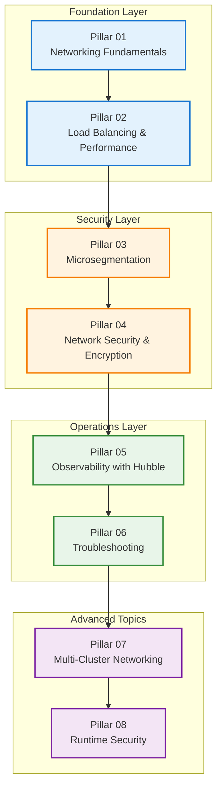

---

# 5. Pillar 01: Kubernetes Networking Fundamentals

## Overview

This pillar explains the journey of a packet from creation in a Pod to delivery at its destination, demystifying the Linux kernel networking stack and Cilium's eBPF intervention points.

## 5.1 The Kubernetes Networking Model

Kubernetes mandates three fundamental requirements:

1. **Every Pod gets a unique IP** (no NAT between Pods)
2. **All Pods can communicate** without explicit gateways
3. **Node-to-Pod communication** works bidirectionally

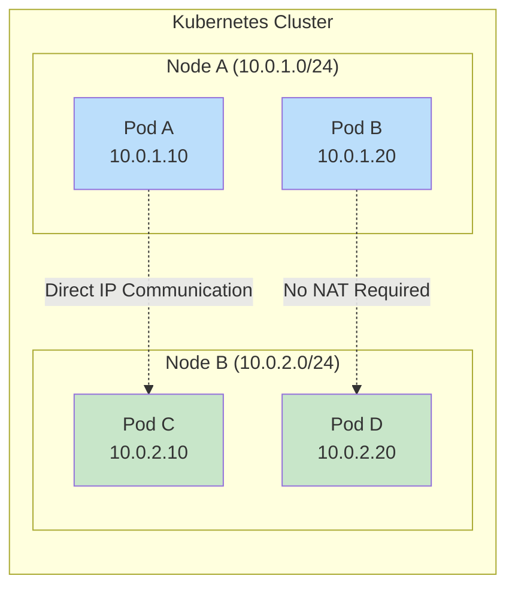

## 5.2 Traditional vs. eBPF Datapath

### Traditional kube-proxy + iptables

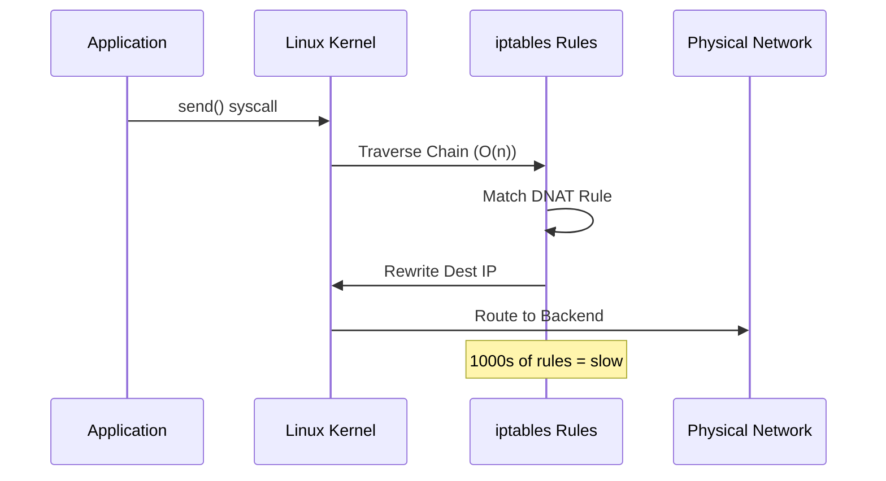

### Cilium eBPF Datapath

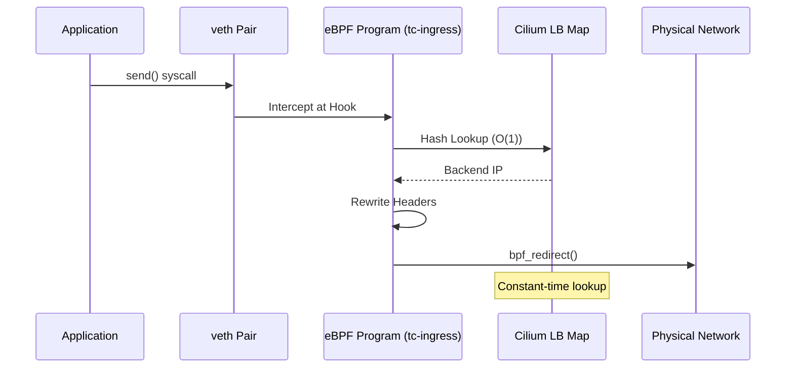

## 5.3 The Packet Journey (Deep Dive)

### Step 1: Application Layer → Socket Buffer

```mermaid
flowchart TD
    A[Application writes to socket] -->|syscall: write()| B[Kernel Socket Layer]
    B --> C[Allocate sk_buff structure]
    C --> D[Copy data from userspace]
    D --> E[Attach headers: TCP/IP]
    E --> F[Route Lookup]

    style A fill:#e1f5fe
    style F fill:#c8e6c9
```

### Step 2: Veth Pair Transmission

A Pod's network interface is one end of a **virtual Ethernet (veth) pair**. The kernel creates this as a "virtual cable."

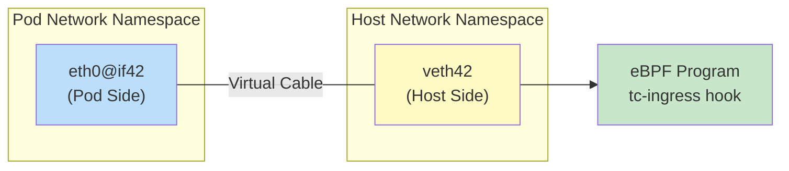

### Step 3: eBPF Interception Points

Cilium attaches eBPF programs at specific kernel hooks:

| Hook Point     | Location            | Purpose                    |
| :------------- | :------------------ | :------------------------- |
| **tc-ingress** | Veth host side (RX) | Policy enforcement, DNAT   |
| **tc-egress**  | Veth host side (TX) | Encryption, encapsulation  |
| **XDP**        | Physical NIC driver | DDoS protection, fast drop |

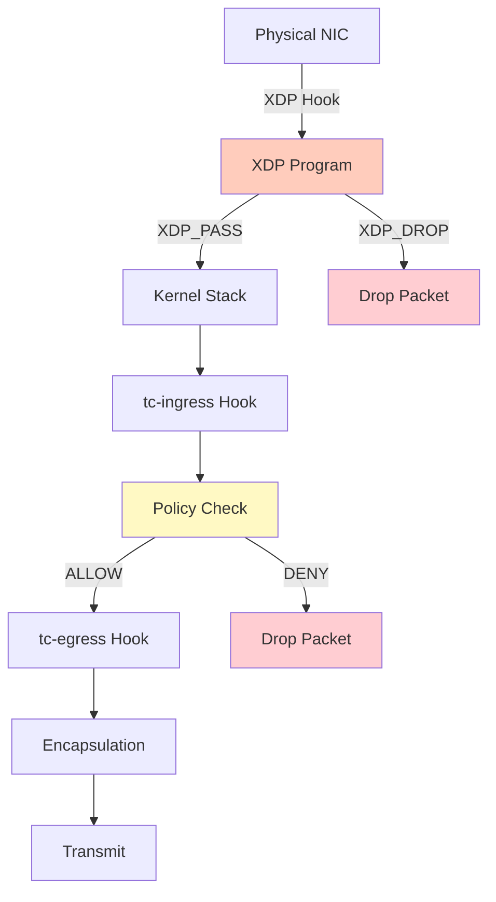

## 5.4 Encapsulation Mechanisms

### VXLAN (Virtual Extensible LAN)

VXLAN adds a 50-byte overhead to each packet:

```
+----------------+
| Outer Ethernet |  (14 bytes)
| Outer IP       |  (20 bytes)
| Outer UDP      |  (8 bytes)
| VXLAN Header   |  (8 bytes)
| Inner Packet   |  (Original)
+----------------+
```

**VNI (Virtual Network Identifier)** in Cilium encodes the Source Security Identity.

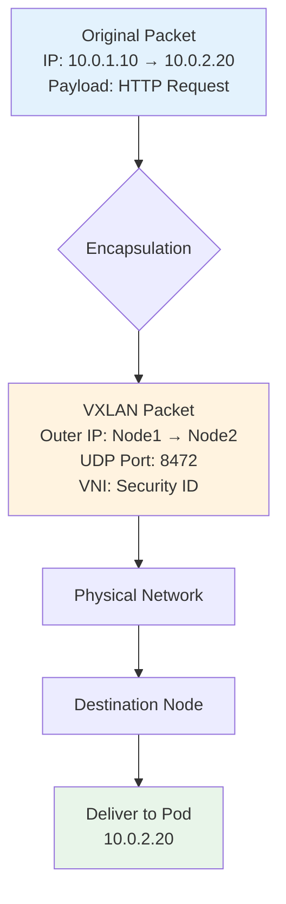

## 5.5 Failure Scenarios & Observability

### Common Issues

| Problem                | Root Cause                      | Detection Method         |
| :--------------------- | :------------------------------ | :----------------------- |
| **MTU Fragmentation**  | VXLAN overhead exceeds path MTU | `cilium monitor -t drop` |
| **Veth Pair Mismatch** | Namespace deletion race         | `ip link show`           |
| **Route Missing**      | Node CIDR overlap               | `ip route get <pod-ip>`  |

### Debugging Commands

```bash
# Check Cilium endpoints
cilium endpoint list

# Inspect datapath mode
cilium status --verbose

# Monitor packet flow
cilium monitor --type drop

# Verify VXLAN interface
ip -d link show cilium_vxlan
```

---

# 6. Pillar 02: Load Balancing & High-Performance Datapath

## Overview

This pillar dissects Cilium's O(1) load balancing, XDP acceleration, and how Maglev consistent hashing prevents connection churn during scaling events.

## 6.1 The Problem with Traditional Load Balancing

### iptables-based kube-proxy

```mermaid
graph TD
    Packet[Incoming Packet] --> Rule1{Rule 1: Match?}
    Rule1 -->|No| Rule2{Rule 2: Match?}
    Rule2 -->|No| Rule3{Rule 3: Match?}
    Rule3 -->|No| RuleN{Rule N: Match?}
    RuleN -->|Yes| DNAT[DNAT to Backend]

    Rule1 -->|Yes| DNAT
    Rule2 -->|Yes| DNAT

    style RuleN fill:#ffcdd2
    Note right of RuleN: O(N) Linear Search
```

**Performance Degradation:**

- 1,000 Services = ~10,000 iptables rules
- Each packet traverses the chain sequentially
- Rule updates require full chain rebuild

## 6.2 Cilium's eBPF Map-Based Load Balancing

### Architecture

```mermaid
graph LR
    subgraph "eBPF Maps (Kernel Space)"
        ServiceMap["Service Map<br/>VIP → Backend IDs"]
        BackendMap["Backend Map<br/>ID → Pod IP"]
    end

    subgraph "Control Plane (User Space)"
        Agent[Cilium Agent] -->|Updates| ServiceMap
        Agent -->|Updates| BackendMap
        K8s[Kubernetes API] -->|Watch| Agent
    end

    Packet[Incoming Packet] --> Hash[Hash Function]
    Hash -->|O(1) Lookup| ServiceMap
    Service Map -->|Backend ID| BackendMap
    BackendMap -->|Pod IP| DNAT[Packet Rewrite]

    style ServiceMap fill:#c8e6c9
    style BackendMap fill:#c8e6c9
```

### The Data Structures

**Service Map Entry:**

```
Key: {VIP: 10.96.0.1, Port: 80, Proto: TCP}
Value: {Backend_IDs: [3, 7, 12], Algorithm: Maglev}
```

**Backend Map Entry:**

```
Key: {Backend_ID: 7}
Value: {PodIP: 10.0.2.42, Port: 8080, State: Active}
```

## 6.3 Maglev Consistent Hashing

### The Problem Maglev Solves

Traditional round-robin fails when backends change:

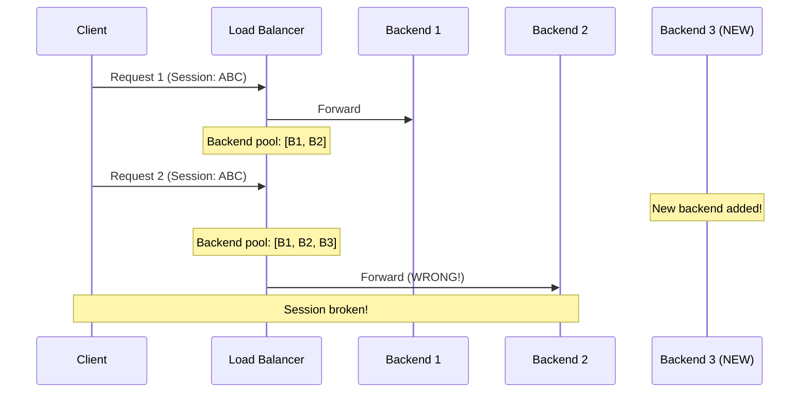

### Maglev's Lookup Table

Maglev pre-builds a **lookup table** (typically 65,537 entries) that maps hash values to backends.

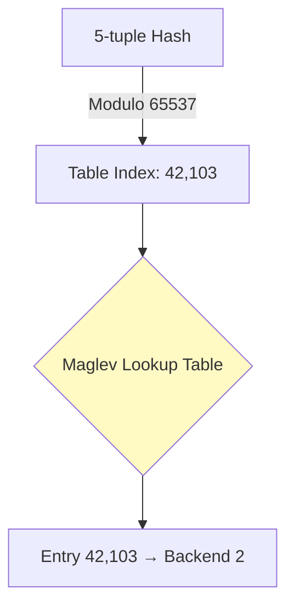

**Stability Property:**

- When Backend 3 is added, only ~1/3 of entries change
- Existing connections (B1, B2) remain stable

### Comparison Table

| Metric               | iptables Round-Robin | Cilium Maglev             |
| :------------------- | :------------------- | :------------------------ |
| **Lookup Time**      | O(N)                 | O(1)                      |
| **Connection Churn** | ~50% on scale        | ~10% on scale             |
| **Memory**           | 100KB per 1000 rules | 512KB (fixed table)       |
| **Update Latency**   | Seconds (rebuild)    | Milliseconds (map update) |

## 6.4 XDP (eXpress Data Path)

### Execution Context

XDP runs **before** the kernel allocates `sk_buff` (the expensive packet metadata structure).

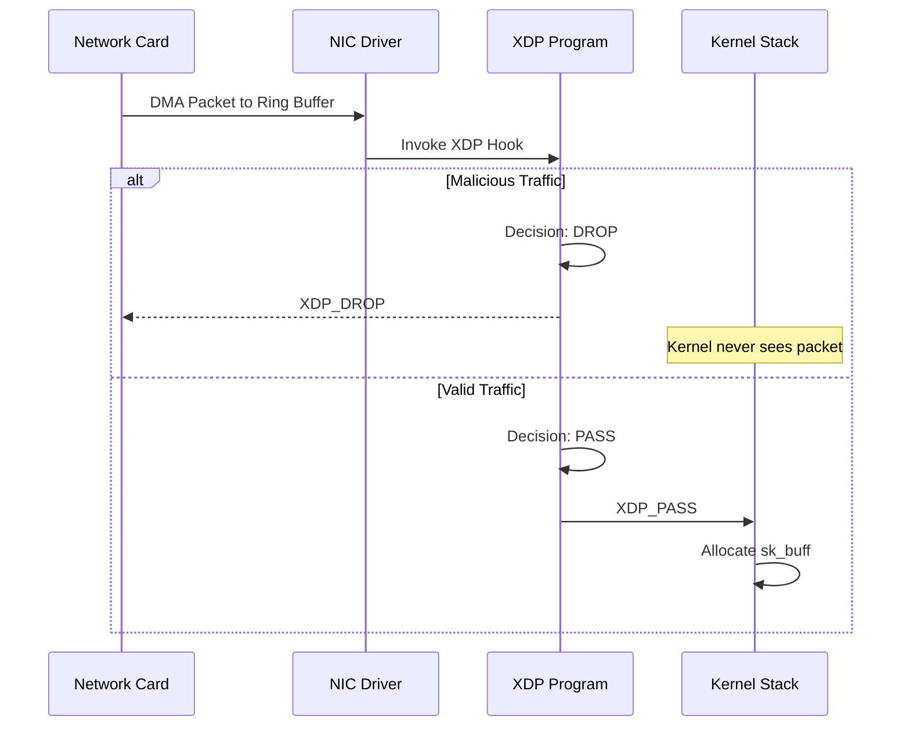

### Performance Gains

**Standard Path (no XDP):**

1. DMA packet → Ring buffer (50 ns)
2. Allocate sk_buff (200 ns)
3. Parse headers (150 ns)
4. Routing decision (100 ns)
5. iptables traversal (500 ns)
   **Total: ~1000 ns per packet**

**XDP Path:**

1. DMA packet → Ring buffer (50 ns)
2. XDP program (80 ns)
3. Decision: DROP
   **Total: ~130 ns (7x faster)**

## 6.5 Direct Server Return (DSR)

### The Bottleneck

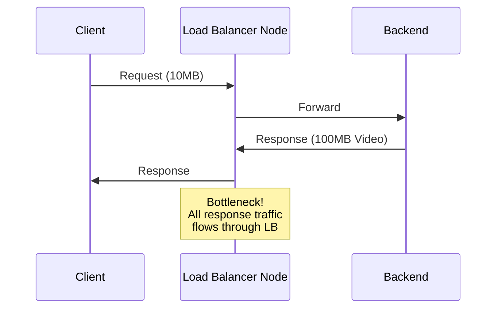

### DSR Solution

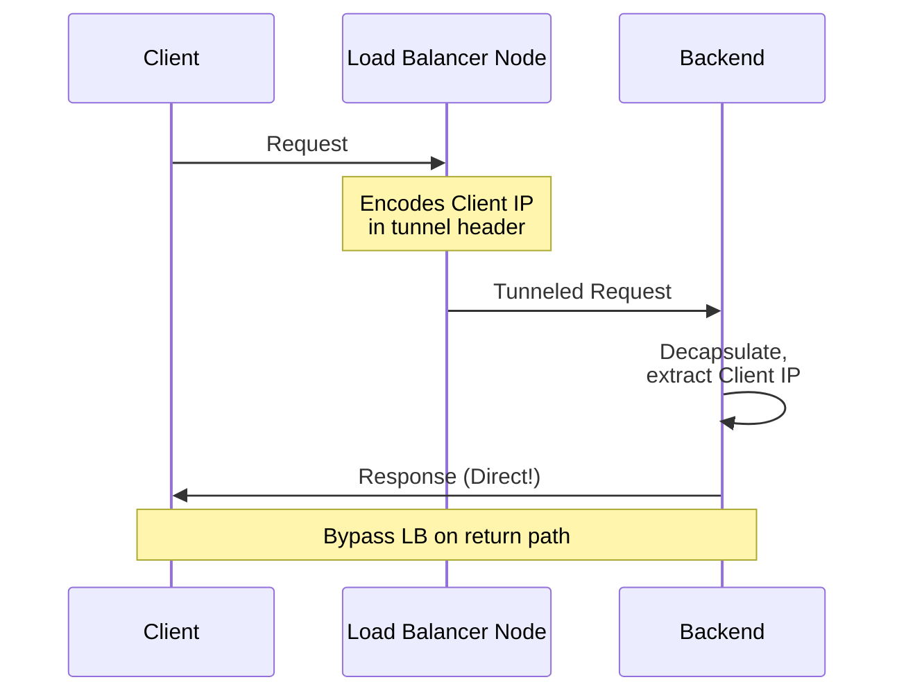

**Benefits:**

- LB handles only ingress traffic
- Egress bandwidth scales with backend count
- Critical for video streaming, file downloads

---

# 7. Pillar 03: Microsegmentation with Identity-Based Security

## Overview

This pillar explains how Cilium replaces IP-based security with label-based identities, enabling dynamic, scalable network policies in Kubernetes.

## 7.1 Why IP-Based Security Fails in Kubernetes

### The IP Churn Problem

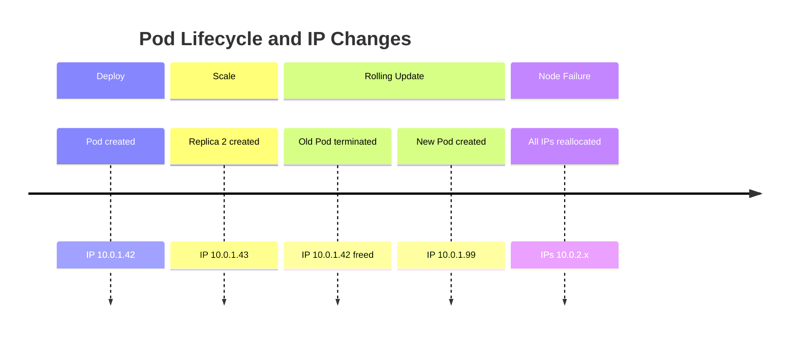

**Firewall Rule Challenge:**

```
# Static rule (BROKEN after 5 minutes)
allow from 10.0.1.42 to 10.0.2.10 port 3306
```

## 7.2 Cilium's Identity Model

### Identity Derivation

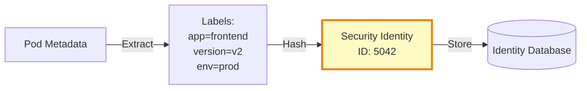

### Global Identity Allocation

| Labels                   | Numeric ID | Scope               |
| :----------------------- | :--------- | :------------------ |
| `app=frontend, env=prod` | 5042       | Cluster-wide        |
| `app=backend, env=prod`  | 5043       | Cluster-wide        |
| `app=database, env=prod` | 5044       | Cluster-wide        |
| `host`                   | 1          | Reserved            |
| `world`                  | 2          | Reserved (external) |

**Key Property:** If Pod A (IP `10.0.1.10`) is deleted and Pod B (IP `10.0.2.99`) is created with identical labels, they **share the same identity**.

## 7.3 Policy Enforcement in the Datapath

### The Policy Map Structure

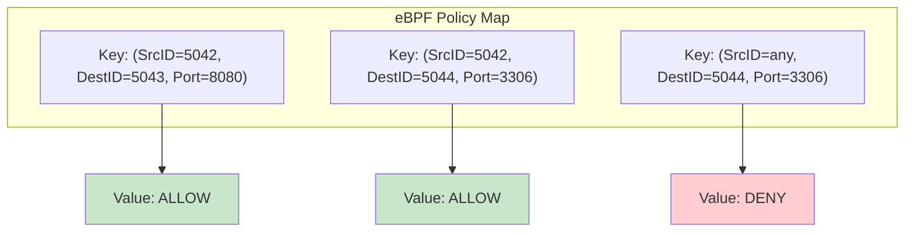

### Packet Processing Flow

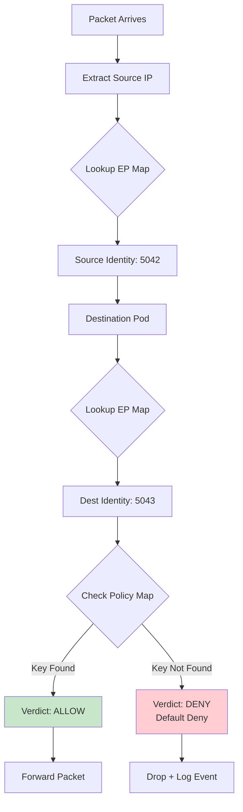

## 7.4 NetworkPolicy Translation

### Kubernetes NetworkPolicy

```yaml
apiVersion: networking.k8s.io/v1
kind: NetworkPolicy
metadata:
  name: frontend-policy
spec:
  podSelector:
    matchLabels:
      app: frontend
  ingress:
    - from:
        - podSelector:
            matchLabels:
              app: api-gateway
      ports:
        - protocol: TCP
          port: 8080
```

### Cilium's Internal Representation

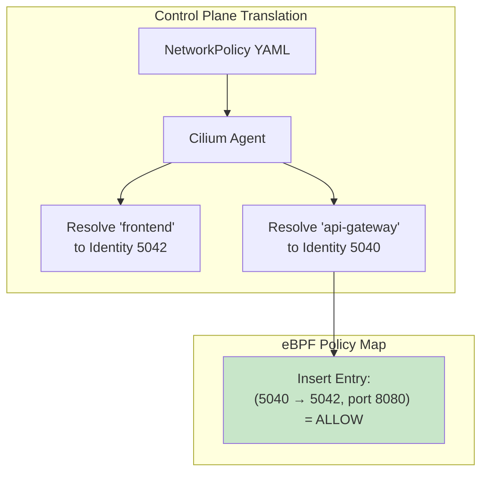

## 7.5 Advanced: Layer 7 (HTTP) Policies

### Standard L3/L4 Enforcement (Fast Path)

```mermaid
sequenceDiagram
    participant Pod as Source Pod
    participant eBPF as eBPF Program
    participant Dest as Dest Pod

    Pod->>eBPF: TCP SYN (Port 80)
    eBPF->>eBPF: Check (SrcID, DestID, Port)
    eBPF->>Dest: Forward (Fast Path)
```

### L7 HTTP Enforcement (Proxy Path)

```mermaid
sequenceDiagram
    participant Pod as Source Pod
    participant eBPF as eBPF Program
    participant Envoy as Envoy Proxy
    participant Dest as Dest Pod

    Pod->>eBPF: HTTP GET /admin
    eBPF->>eBPF: L7 Policy Required
    eBPF->>Envoy: Redirect to Proxy
    Envoy->>Envoy: Parse HTTP Headers
    Envoy->>Envoy: Match "/admin" = DENY
    Envoy-->>Pod: HTTP 403 Forbidden
```

**CiliumNetworkPolicy Example:**

```yaml
apiVersion: cilium.io/v2
kind: CiliumNetworkPolicy
metadata:
  name: l7-policy
spec:
  endpointSelector:
    matchLabels:
      app: backend
  ingress:
    - fromEndpoints:
        - matchLabels:
            app: frontend
      toPorts:
        - ports:
            - port: "80"
              protocol: TCP
          rules:
            http:
              - method: "GET"
                path: "/api/v1/.*"
```

## 7.6 Microsegmentation Best Practices

### Defense in Depth

```mermaid
graph TD
    subgraph "Network Segmentation Layers"
        L1[Layer 1: Namespace Isolation]
        L2[Layer 2: Pod-to-Pod L4 Policy]
        L3[Layer 3: L7 HTTP Path Policy]
        L4[Layer 4: Service Mesh mTLS]
    end

    L1 --> L2
    L2 --> L3
    L3 --> L4

    style L1 fill:#e3f2fd
    style L2 fill:#fff3e0
    style L3 fill:#e8f5e9
    style L4 fill:#f3e5f5
```

---

# 8. Pillar 04: Network Security & Encryption

## Overview

This pillar covers transparent encryption (WireGuard/IPsec), certificate management, and how Cilium secures node-to-node communication without changing application code.

## 8.1 Threat Model

```mermaid
graph TB
    subgraph "Untrusted Network"
        Internet[Public Internet]
        WAN[Corporate WAN]
    end

    subgraph "Node A"
        PodA[Pod A]
    end

    subgraph "Node B"
        PodB[Pod B]
    end

    PodA -->|Plaintext| Internet
    Internet -->|Snooping Attack| Attacker[Attacker]
    Internet --> PodB

    style Attacker fill:#ffcdd2
```

**Without Encryption:**

- Traffic crosses untrusted networks
- Credentials visible in packet capture
- MITM attacks possible

## 8.2 Transparent Encryption Architecture

### Encryption Modes Comparison

| Feature            | WireGuard  | IPsec        |
| :----------------- | :--------- | :----------- |
| **Performance**    | ~10 Gbps   | ~5 Gbps      |
| **Kernel Support** | Linux 5.6+ | All versions |
| **Key Exchange**   | Curve25519 | IKEv2        |
| **Overhead**       | 60 bytes   | 80+ bytes    |
| **Configuration**  | Simple     | Complex      |

### WireGuard Integration

```mermaid
graph LR
    subgraph "Node A Kernel"
        Pod1[Pod 10.0.1.10] --> Route1[Routing Decision]
        Route1 --> WG1[cilium_wg0 Interface]
        WG1 -->|Encrypt| Physical1[eth0]
    end

    subgraph "Physical Network"
        Physical1 <-->|Encrypted Tunnel| Physical2[eth0]
    end

    subgraph "Node B Kernel"
        Physical2 --> WG2[cilium_wg0 Interface]
        WG2 -->|Decrypt| Route2[Routing Decision]
        Route2 --> Pod2[Pod 10.0.2.20]
    end

    style WG1 fill:#fff3e0,stroke:#f57c00,stroke-width:3px
    style WG2 fill:#fff3e0,stroke:#f57c00,stroke-width:3px
```

### Encrypted Packet Structure

```
+----------------------------+
| Outer Ethernet Header      |  14 bytes
| Outer IP Header            |  20 bytes
| UDP Header (WireGuard)     |   8 bytes
| WireGuard Header           |  32 bytes
+----------------------------+
| ENCRYPTED PAYLOAD          |
|  - Inner IP Header         |
|  - TCP/UDP Header          |
|  - Application Data        |
+----------------------------+
| Authentication Tag         |  16 bytes
+----------------------------+
```

## 8.3 Key Management

### Automatic Key Rotation

```mermaid
sequenceDiagram
    participant NodeA as Node A (Agent)
    participant K8s as Kubernetes Secret
    participant NodeB as Node B (Agent)

    Note over NodeA: Initial Key Generation
    NodeA->>K8s: Store Public Key
    NodeB->>K8s: Retrieve NodeA's Pub Key

    Note over NodeA,NodeB: Handshake Established

    rect rgb(255, 243, 224)
        Note over NodeA: After 24 hours
        NodeA->>NodeA: Generate New Keypair
        NodeA->>K8s: Update Public Key
        K8s->>NodeB: Watch Event
        NodeB->>NodeB: Update Peer Config
        Note over NodeA,NodeB: Seamless Rotation
    end
```

## 8.4 Observability for Encrypted Traffic

### Verifying Encryption Status

```bash
# Check WireGuard status
cilium encrypt status

# Inspect WireGuard interface
wg show cilium_wg0

# Monitor handshakes
cilium monitor --type trace -v
```

**Sample Output:**

```
Encryption: Enabled (WireGuard)
Keys rotated: 2 hours ago
Active tunnels: 42
Packets encrypted: 1,204,583
```

---

# 9. Pillar 05: Network Observability with Hubble

## Overview

This pillar dissects Hubble's architecture, explaining how it extracts L3-L7 visibility from the eBPF datapath without performance degradation.

## 9.1 The Observability Challenge

Traditional tools are **context-blind**:

```bash
# tcpdump output
10.0.1.42.54321 > 10.0.2.99.8080: Flags [S], seq 12345
```

**Questions left unanswered:**

- Which Pods are these?
- What Service is .99?
- Why was this dropped?

## 9.2 Hubble Architecture

```mermaid
graph TB
    subgraph "Kernel Space"
        eBPF1[eBPF Program<br/>tc-ingress] -->|Write| RingBuf1[(Ring Buffer)]
        eBPF2[eBPF Program<br/>tc-egress] -->|Write| RingBuf1
    end

    subgraph "User Space - Local Node"
        RingBuf1 -->|perf_event_read| Hubble[Hubble Agent]
        Hubble -->|Enrich| K8s[Kubernetes API<br/>Pod/Service Metadata]
        Hubble -->|gRPC| LocalCLI[Hubble CLI]
    end

    subgraph "User Space - Cluster Wide"
        Hubble -->|gRPC Stream| Relay[Hubble Relay]
        Relay -->|Aggregated Flows| UI[Hubble UI]
    end

    style RingBuf1 fill:#fff3e0
    style Hubble fill:#c8e6c9
    style Relay fill:#e3f2fd
```

## 9.3 Flow Event Structure

### L3/L4 Flow

```json
{
  "time": "2024-02-10T04:30:15.123Z",
  "verdict": "FORWARDED",
  "ethernet": {
    "source": "aa:bb:cc:dd:ee:ff",
    "destination": "ff:ee:dd:cc:bb:aa"
  },
  "IP": {
    "source": "10.0.1.42",
    "destination": "10.0.2.99"
  },
  "l4": {
    "TCP": {
      "source_port": 54321,
      "destination_port": 8080
    }
  },
  "source": {
    "namespace": "production",
    "pod_name": "frontend-7d4b6c-xkz9w",
    "labels": ["app=frontend"]
  },
  "destination": {
    "namespace": "production",
    "pod_name": "backend-9f8a2-plm3k",
    "labels": ["app=backend"]
  }
}
```

### L7 HTTP Flow

```json
{
  "time": "2024-02-10T04:30:15.125Z",
  "l7": {
    "type": "REQUEST",
    "http": {
      "method": "GET",
      "url": "/api/v1/users",
      "protocol": "HTTP/1.1",
      "headers": {
        "User-Agent": "curl/7.68.0"
      }
    }
  },
  "latency": "23ms"
}
```

## 9.4 Service Dependency Map

```mermaid
graph LR
    Frontend[Frontend<br/>ID: 5042] -->|HTTP GET /api| API[API Gateway<br/>ID: 5040]
    API -->|gRPC| Backend[Backend<br/>ID: 5043]
    Backend -->|SQL| DB[(Database<br/>ID: 5044)]

    Frontend -.->|BLOCKED| DB

    style Frontend fill:#e3f2fd
    style API fill:#e3f2fd
    style Backend fill:#c8e6c9
    style DB fill:#fff3e0
```

**Hubble Query:**

```bash
hubble observe --from-pod frontend --verdict DROPPED
```

**Output:**

```
Feb 10 04:30:15: frontend-7d4b6c (ID 5042) -> database-3a2f1c (ID 5044) DROPPED (Policy denied)
```

## 9.5 Performance Analysis

### Zero-Copy Ring Buffer

```mermaid
sequenceDiagram
    participant eBPF as eBPF Program
    participant Ring as Ring Buffer (Kernel)
    participant Hubble as Hubble Agent (User)

    eBPF->>Ring: Write Event (No Copy)
    Ring->>Ring: Circular Overwrite if Full

    loop Poll Every 100ms
        Hubble->>Ring: Read Available Events
        Ring-->>Hubble: Event Batch
    end

    Note over eBPF,Ring: Non-Blocking<br/>Never slows datapath
```

---

# 10. Pillar 06: Troubleshooting Kubernetes Networking

## Overview

A structured decision tree for isolating network failures: DNS, routing, policy, or application layer.

## 10.1 The Debugging Decision Tree

```mermaid
flowchart TD
    Start[Network Issue Reported] --> Ping{Can you ping<br/>by IP?}

    Ping -->|No| Route[Check Routing]
    Ping -->|Yes| DNS{Can you resolve<br/>by hostname?}

    DNS -->|No| DNSDebug[Check DNS]
    DNS -->|Yes| Connect{Can you connect<br/>to service port?}

    Connect -->|No| Policy[Check Network Policy]
    Connect -->|Yes| App[Application Layer Issue]

    Route --> RouteSteps["1. ip route get <ip><br/>2. traceroute<br/>3. cilium endpoint list"]
    DNSDebug --> DNSSteps["1. nslookup<br/>2. Check CoreDNS logs<br/>3. cilium policy get"]
    Policy --> PolicySteps["1. cilium monitor -t policy<br/>2. hubble observe --verdict DROPPED<br/>3. Review NetworkPolicies"]
    App --> AppSteps["1. Check application logs<br/>2. Review service bindings<br/>3. Test with netcat"]

    style Route fill:#ffcdd2
    style DNSDebug fill:#fff9c4
    style Policy fill:#fff3e0
    style App fill:#c8e6c9
```

## 10.2 Common Failure Scenarios

### Scenario 1: DNS Resolution Failure

**Symptom:**

```bash
kubectl exec -it frontend -- curl backend:8080
# Error: Could not resolve host: backend
```

**Root Cause:** NetworkPolicy blocking DNS (UDP 53)

**Solution:**

```yaml
apiVersion: networking.k8s.io/v1
kind: NetworkPolicy
metadata:
  name: allow-dns
spec:
  podSelector: {}
  policyTypes:
    - Egress
  egress:
    - to:
        - namespaceSelector:
            matchLabels:
              name: kube-system
      ports:
        - protocol: UDP
          port: 53
```

### Scenario 2: Asymmetric Routing

```mermaid
sequenceDiagram
    participant PodA as Pod A (Node 1)
    participant LB as Service VIP
    participant PodB as Pod B (Node 2)

    PodA->>LB: SYN (via VXLAN)
    LB->>PodB: Forward
    PodB->>PodA: SYN-ACK (Direct Route!)

    Note over PodA: Source IP validation fails<br/>Connection hangs
```

**Detection:**

```bash
cilium monitor --type trace
# Look for: "CT lookup: No CT entry found"
```

---

# 11. Pillar 07: Multi-Cluster Networking (Cluster Mesh)

## 11.1 The Multi-Cluster Challenge

```mermaid
graph TB
    subgraph Cluster1["Cluster A (us-west1)"]
        PodA1[Pod: frontend]
        PodA2[Pod: backend]
    end

    subgraph Cluster2["Cluster B (us-east1)"]
        PodB1[Pod: frontend]
        PodB2[Pod: backend]
    end

    PodA1 -.->|❌ No Route| PodB2

    style PodA1 fill:#ffcdd2
    style PodB2 fill:#ffcdd2
```

## 11.2 Cluster Mesh Architecture

```mermaid
graph TB
    subgraph ClusterA["Cluster A"]
        AgentA[Cilium Agent] -->|Watch| ETCDA[(etcd)]
        PodA[Pods]
    end

    subgraph ClusterB["Cluster B"]
        AgentB[Cilium Agent] -->|Watch| ETCDB[(etcd)]
        PodB[Pods]
    end

    AgentA <-->|Sync Identities| AgentB
    ETCDA <-.->|VPN Tunnel| ETCDB
    PodA <-->|Direct Pod-to-Pod| PodB

    style AgentA fill:#c8e6c9
    style AgentB fill:#c8e6c9
```

## 11.3 Global Services

```yaml
apiVersion: v1
kind: Service
metadata:
  name: backend
  annotations:
    io.cilium/global-service: "true"
spec:
  selector:
    app: backend
  ports:
    - port: 8080
```

**Behavior:**

- Service endpoints include Pods from **all clusters**
- Client-side load balancing (no central gateway)
- Failure isolation (if Cluster B is down, traffic stays in Cluster A)

---

# 12. Pillar 08: Runtime Security Integration

## Overview

How Cilium correlates network events with process execution.

```mermaid
graph LR
    Process[Process: /usr/bin/curl] -->|Open Socket| Network[Network Connection]
    Network -->|eBPF Trace| Event[Event: curl → 47.1.2.3:443]
    Event -->|Correlation| Alert[Alert: Suspicious IP]

    style Alert fill:#ffcdd2
```

---

# 13. Timeline & Deliverables

| Week  | Focus            | Deliverables                    |
| :---- | :--------------- | :------------------------------ |
| 1-2   | Research & Audit | Content outline, gap analysis   |
| 3-4   | Pillars 01-02    | 2 complete drafts, 15+ diagrams |
| 5-6   | Pillars 03-04    | 2 complete drafts, 10+ diagrams |
| 7-8   | Pillars 05-06    | 2 complete drafts, 12+ diagrams |
| 9     | Pillars 07-08    | 2 scoped drafts, 8+ diagrams    |
| 10-11 | Refinement       | Maintainer reviews, edits       |
| 12    | Finalization     | Merge-ready PRs                 |

---

# 14. Conclusion

This proposal represents extensive research into Cilium's architecture, eBPF datapath, and real-world operational challenges. By creating these 8 pillar pages, I aim to provide the definitive architectural reference for the Cilium community.

— Dev
