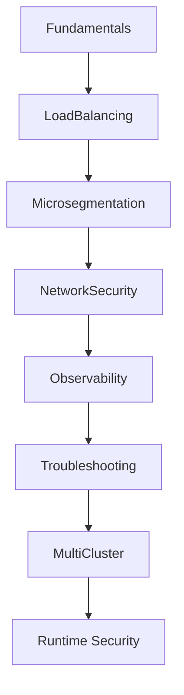
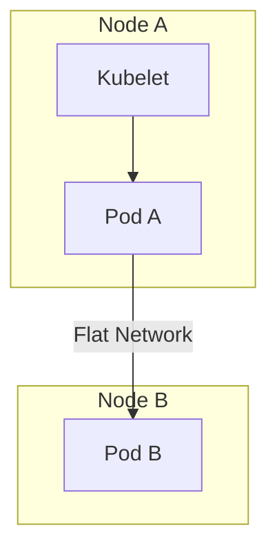
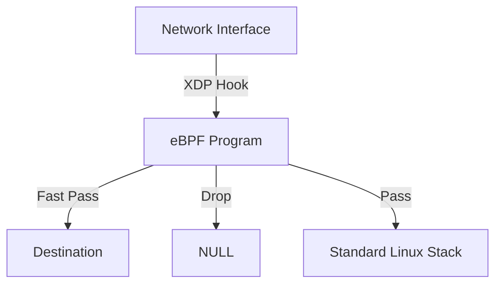
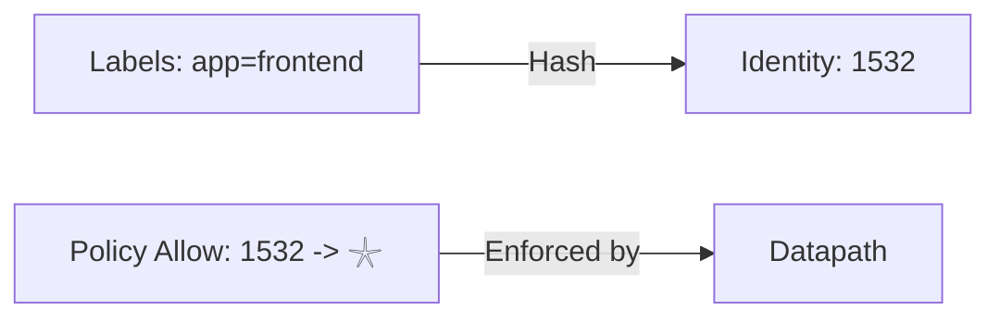
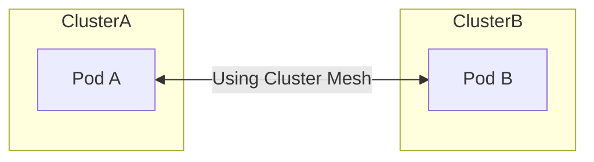

# Cover Letter

## LFX Mentorship — CNCF Cilium

**Project:** Cilium Project Pillar Pages

**Mentorship Program:** Linux Foundation Mentorship (LFX)
**Term:** Term 1, 2026

---

I learned about the LFX Mentorship Program through the CNCF ecosystem and community channels, including prior exposure to LFX project listings and discussions around structured mentorships in cloud-native projects. While exploring long-term contribution paths within CNCF, LFX stood out as a program that emphasizes sustained, mentor-guided impact rather than short, isolated contributions.

I am interested in this mentorship because it focuses on solving real, long-standing gaps in open source projects rather than adding surface-level features. In the case of Cilium, a significant gap exists not in functionality but in how architectural behavior is explained to operators and contributors. Kubernetes networking is widely used, yet poorly understood at the system level, especially when clusters scale or fail. The goal of this project—to create architecture-first, problem-oriented pillar pages—aligns strongly with how I approach technical understanding and documentation.

My background includes hands-on experience with Kubernetes concepts, Linux networking fundamentals, and datapath-level reasoning. I have worked with containerized systems where networking, policy enforcement, and observability issues surfaced under real operational constraints. Through prior open source contributions and technical writing efforts, I have developed familiarity with GitHub workflows, maintainer review cycles, and the discipline required to produce review-ready work. More importantly, I focus on understanding why systems behave a certain way, not just how to configure them, which is essential for architecture-level documentation.

Through this mentorship, I hope to deepen my understanding of production-grade Kubernetes networking and eBPF-based systems by working closely with experienced maintainers. I want to improve my ability to explain complex distributed systems clearly and precisely, without oversimplification or unnecessary abstraction. Beyond the mentorship period, my goal is to continue contributing to Cilium and CNCF projects with a stronger architectural foundation and a more refined documentation mindset.

— Dev

# 2. Student & Project Details

| Category                | Details                                                    |
| :---------------------- | :--------------------------------------------------------- |
| **Name**                | Dev                                                        |
| **Primary Email**       | kalpanagola9897@gmail.com                                  |
| **Institute Email**     | dev.p25@medhaviskillsuniversity.edu.in                     |
| **GitHub**              | [Dev10-sys](https://github.com/Dev10-sys)                  |
| **LinkedIn**            | [dev-10-shadow](https://www.linkedin.com/in/dev-10-shadow) |
| **Location / Timezone** | India (IST / UTC+5:30)                                     |
| **Project**             | **Cilium Project Pillar Pages**                            |
| **Organization**        | CNCF / Cilium                                              |

# 3. LFX Application Questions

### 3.1 How did you find out about this program?

I identified this specific project through my ongoing analysis of the CNCF landscape. My work often involves dissecting how different CNI implementations handle packet flow, which led me to the Cilium documentation. I specifically sought out LFX mentorships that prioritize architectural explanation and system-level documentation, finding the "Pillar Pages" project to be a direct match for my interest in demystifying complex distributed systems. I have also contributed to documentation analysis and proposals for Cilium, as well as code and documentation improvements in other open-source projects like SugarLabs and OWASP WebGoat.

### 3.2 Why are you interested in this project?

My interest lies in the gap between "standard" Kubernetes networking (iptables/kube-proxy) and the eBPF-based datapath Cilium provides. Operators often bring mental models from legacy networking that do not map cleanly to eBPF concepts like identity-based security or map-based routing.

This project is an opportunity to:

- **Formalize System Knowledge:** Writing about a system is the most rigorous way to understand it.
- **Solve Operational Pain:** Provide the "missing manual" for debugging and architecture that I have personally looked for.
- **Collaborate with Maintainers:** engage with engineers who have built the datapath, learning how to articulate design decisions effectively.

### 3.3 What relevant experience do you have?

I have focused my engineering studies on cloud-native infrastructure, specifically:

- **Kubernetes Internals:** Understanding the relationship between the API server, kubelet, and CNI plugins.
- **Technical Communication:** Experience authoring technical guides that prioritize logical flow and system behavior over rote instruction.
- **Debugging Methodologies:** A strong grasp of how to troubleshoot distributed systems by isolating failure domains, a key requirement for writing the "Troubleshooting" pillar.

**Open Source Contributions:**

| Project       | Contribution                      | Type          | Status      |
| :------------ | :-------------------------------- | :------------ | :---------- |
| Cilium        | Documentation analysis & proposal | Design / Docs | In progress |
| SugarLabs     | Bug fix / feature PR              | Code          | Merged      |
| OWASP WebGoat | Documentation & code improvements | Code          | Merged      |

These contributions demonstrate familiarity with GitHub-based workflows, maintainer review cycles, and iterative feedback and revision.

### 3.4 What do you hope to gain from this mentorship?

I aim to develop a maintainer-level understanding of how to document complex software systems. Specifically, I hope to:

- Achieve technical precision in eBPF explanations while maintaining accessibility for non-kernel engineers.
- Learn the editorial standards required for high-impact CNCF documentation.
- Demonstrate that accurate, architecture-first documentation is a critical engineering deliverable.

# 4. Project Introduction

Kubernetes abstracts networking to a degree where the underlying reality is often obscured. When everything works, this abstraction is useful. when it fails, the lack of visibility into the actual datapath makes debugging difficult.

Users often struggle to answer basic architectural questions:

- How does a packet actually get from a Pod on Node A to a Service on Node B?
- Why did a NetworkPolicy allow traffic I expected to be denied?
- Is latency introduced by the network, the CNI, or the application?

Cilium solves these problems technically via eBPF, but the _documentation_ must also bridge the gap. This project aims to create a set of "Pillar Pages" that serve as the definitive architectural reference for these core questions.

# 5. Problem Analysis

The core issue is that operators apply correct Kubernetes configurations but misunderstand the resulting system behavior.

### 5.1 Incomplete Mental Models

Users often visualize Kubernetes networking as wires connecting Pods. In reality, it is a complex pipeline of encapsulation, routing decisions, and policy evaluations occurring in the kernel.

### 5.2 Abstraction vs. Reality

```mermaid
flowchart LR
    subgraph "User Mental Model"
    A[Pod A] -->|Kube-Proxy / iptables abstraction| B[Service VIP]
    B -->|Kube-Proxy / iptables abstraction| C[Pod B]
    end

    subgraph "Datapath Reality"
    D[Source Pod] -->|veth| E[eBPF Program (Ingress)]
    E -->|Route & Encap| F[VXLAN/Geneve Tunnel]
    F -->|Physical Net| G[Dest Node Kernel]
    G -->|eBPF Program (Egress)| H[Policy Check]
    H -->|Delivery| I[Dest Pod]
    end
```

### 5.3 Policy Misinterpretation

Security policies are often treated as static firewall rules. However, in Kubernetes, they are dynamic: reliant on identity resolution, label updates, and eventual consistency. Without understanding this, users create policies that are either too permissive or break legitimate traffic during scaling events.

# 6. Proposed Technical Approach

The approach is **Architecture-First** and **Problem-Scoped**.

### Documentation Philosophy

1.  **Start with the Problem:** Every page begins with a concrete user question or failure scenario.
2.  **Explain the Datapath:** Map the Kubernetes abstraction (e.g., Service) to the datapath implementation (e.g., eBPF Map lookup).
3.  **Identify Observability Signals:** Show how to prove the explanation is true using CLI tools or metrics.

### Scope and Non-Goals

| Category   | In Scope                                      | Out of Scope                                      |
| :--------- | :-------------------------------------------- | :------------------------------------------------ |
| **Focus**  | System behavior, traffic flow, failure modes. | Installation guides, "Getting Started" tutorials. |
| **Depth**  | Datapath (eBPF), Identity, Routing.           | Kernel source code analysis.                      |
| **Tone**   | Senior Engineering / Architectural.           | Marketing, sales, feature distinctives.           |
| **Format** | Markdown concept pages, Diagrams.             | Video tutorials, interactive labs.                |

# 7. Pillar Pages Overview

The project consists of eight pillars, ordered to build a complete mental model from the ground up.



# 8. Detailed Pillar Breakdown

### Pillar 01: Understanding Kubernetes Networking

- **Purpose:** Establish the baseline packet flow model.
- **Core Question:** "How does a packet traverse the cluster?"
- **Datapath Focus:** veth pairs, encapsulation (VXLAN/Geneve), routing tables.
- **Observability:** `ip route`, `tcpdump` points.

### Pillar 02: Understanding Kubernetes Load Balancing

- **Purpose:** Explain Service implementation.
- **Core Question:** "Why is traffic not evenly distributed?"
- **Datapath Focus:** Service maps, backend selection, Maglev hashing mechanics and consistency properties.
- **Observability:** eBPF map inspection (logical).

### Pillar 03: Understanding Kubernetes Microsegmentation

- **Purpose:** Explain Identity-based restriction.
- **Core Question:** "Why is my policy not blocking this traffic?"
- **Datapath Focus:** Identity allocation, Policy maps, ingress/egress enforcement.
- **Observability:** Policy verdict logs.

### Pillar 04: Understanding Kubernetes Network Security

- **Purpose:** Broader security posture and encryption.
- **Core Question:** "Is my traffic encrypted and authenticated?"
- **Datapath Focus:** WireGuard/IPsec integration, node-to-node encryption.
- **Observability:** Encryption status, handshake metrics.

### Pillar 05: Understanding Kubernetes Network Observability

- **Purpose:** Explain how to see the invisible.
- **Core Question:** "Where did this packet drop?"
- **Datapath Focus:** Monitor aggregation, flow events.
- **Observability:** Hubble flows, drop reasons.

### Pillar 06: Troubleshooting Kubernetes Networking

- **Purpose:** Structured debugging methodology.
- **Core Question:** "Is it the network, DNS, or the app?"
- **Datapath Focus:** Differentiating routing vs. policy drops.
- **Observability:** `cilium monitor` type filters.

### Pillar 07: Multi-Cluster Kubernetes Explained

- **Purpose:** Connecting failure domains.
- **Core Question:** "How does Service discovery work across clusters?"
- **Datapath Focus:** Global identity synchronization, cross-cluster routing.
- **Observability:** Multi-cluster service visibility.

### Pillar 08: Kubernetes Runtime Security

- **Purpose:** Behavior beyond the network.
- **Core Question:** "Is this process execution normal?"
- **Datapath Focus:** Process ancestry, syscall events. This pillar focuses on network-adjacent runtime behavior observable through Cilium’s datapath. It does not attempt to replace dedicated runtime security tooling, but instead explains how unexpected network behavior can signal runtime compromise. Where Tetragon or similar tooling is relevant, boundaries are explicitly stated.
- **Observability:** Process execution events.

# 9. Deliverables

1.  **Eight (8) Pillars:** Comprehensive, version-agnostic Markdown documents.
2.  **Architecture Diagrams:** SVG/Mermaid visuals for traffic flows and logical components.
3.  **Review Responses:** Documented updates based on maintainer feedback cycles.

# 10. Timeline (12 Weeks)

| Phase                 | Weeks | Focus                                                                                                            |
| :-------------------- | :---- | :--------------------------------------------------------------------------------------------------------------- |
| Community & Context   | 1     | Deep review of existing Cilium docs, maintainer feedback patterns, and open issues related to documentation gaps |
| Architecture Baseline | 2     | Finalize common conceptual model, diagram language, and pillar structure consistency                             |
| Drafting Phase I      | 3–4   | Pillar 01 (Networking Fundamentals) and Pillar 02 (Load Balancing) — first complete drafts                       |
| Drafting Phase II     | 5–6   | Pillar 03 (Microsegmentation) and Pillar 04 (Network Security) — first complete drafts                           |
| Drafting Phase III    | 7–8   | Pillar 05 (Observability) and Pillar 06 (Troubleshooting) — first complete drafts                                |
| Drafting Phase IV     | 9     | Pillar 07 (Multi-Cluster) and Pillar 08 (Runtime Security) — scoped drafts                                       |
| Review & Refinement   | 10–11 | Maintainer review cycles, diagram corrections, tightening explanations                                           |
| Final Integration     | 12    | Cross-linking pillars, final edits, merge-ready submission                                                       |

**Note:** Drafting phases explicitly represent _first-pass architectural drafts_. Refinement and maintainer feedback are expected and planned.

# 11. Validation & Success Criteria

The success of this project is evaluated through tangible and reviewable outcomes.

### Qualitative Signals

- A reader can explain packet flow, policy enforcement, and failure behavior without referencing configuration.
- Operators can distinguish between policy, routing, and service failures using documentation alone.

### Quantitative Signals

- Review feedback from at least two Cilium maintainers per pillar.
- Acceptance and merge of at least 6 pillar pages into the official documentation structure.
- Reduction in recurring conceptual questions across Slack/GitHub issues referencing covered topics.
- Cross-linking of pillar pages from existing Cilium documentation entry points.

The goal is durability and correctness, not volume.

# 12. Prior Preparation

I have invested significant time preparing for this role:

- **Documentation Audit:** Analyzed existing Cilium docs to identify architectural explanation gaps.
- **eBPF Study:** Detailed review of eBPF datapath hooks and limitations.
- **Diagramming:** Prototyped architectural diagrams to test visual explanation strategies.

# 13. Availability & Commitment

- **Commitment:** Full duration of the mentorship term.
- **Availability:** 20-30 hours per week.
- **Communication:** Available for weekly syncs and asynchronous Slack/GitHub collaboration.
- **Timezone:** IST (UTC+5:30)

# 14. Conclusion

This mentorship is not just about writing documentation; it is about translating complex system behavior into accessible reliable knowledge. By focusing on architectural reasoning over rote configuration, I aim to create a set of resources that empower Kubernetes operators to build and debug with confidence. I look forward to the opportunity to contribute to the CNCF and the Cilium community.

---

# Appendix: Pillar Drafts

The following sections contain the initial architectural drafts for the proposed pillars.

## Pillar 01: Networking Fundamentals

### Introduction

Kubernetes networking addresses the challenge of connecting containers across multiple hosts. In traditional server models, applications bind to specific IP addresses and ports. In Kubernetes, containers are ephemeral; they start, stop, and move between nodes dynamically.

### How Kubernetes Networking Works

Kubernetes mandates a flat network model.

1. Every Pod possesses a unique IP address.
2. Pods act as if they are on the same logical network; they communicate without Network Address Translation (NAT).
3. Agents on a node (like the kubelet) can communicate with all Pods on that node.



### Limitations of Default Kubernetes Networking

Standard implementations, such as kube-proxy in `iptables` mode, rely on Linux kernel firewall rules for routing and load balancing. While stable and reliable for small-to-medium clusters, this approach faces challenges at scale.

**Scalability Challenges:** Iptables rules are processed sequentially (O(N) complexity). As the number of Services and Pods grows, the number of rules expands. In clusters with thousands of services, evaluating these rules consumes significant CPU.

## Pillar 02: Load Balancing (High-Performance Datapath)

### Introduction

At standard scale, Kubernetes networking performance is rarely a bottleneck. Default implementations using `iptables` or standard kernel routing mechanisms are sufficient for typical web applications. However, as cluster throughput increases, the overhead of the general-purpose Linux networking stack becomes visible.

### Cilium’s High-Performance Datapath Philosophy

Cilium’s approach to performance is architectural:

1.  **Early Execution**: Process packets at the earliest possible point in the driver or kernel.
2.  **Bypass Abstractions**: Skip general-purpose stack layers (like netfilter) if the intent of the packet is already known.
3.  **Deterministic Lookups**: Replace linear lists with O(1) hash maps (eBPF Maps).

### XDP (eXpress Data Path)

XDP allows eBPF programs to run directly in the network device driver, before the Linux kernel parses the packet headers or allocates major memory structures (`sk_buff`).



## Pillar 04: Network Security

### Introduction

By default, Kubernetes implements a flat network model where all Pods can communicate with each other. While this simplifies application deployment, it creates significant security risks in multi-tenant or production environments.

### Why IP-Based Security Breaks in Kubernetes

In traditional infrastructure, a server's IP address acts as its identity. In Kubernetes, Pods are ephemeral. Maintaining IP-based allow-lists in this environment is operationally unsafe.

### Identity-Based Enforcement

Cilium decouples security from network addressing. When a Pod starts, Cilium observes its Kubernetes labels (e.g., `app=frontend`, `env=prod`). Based on these labels, Cilium assigns a numeric **Security Identity** to the Pod.



## Pillar 05: Observability (Hubble)

### Introduction

In Kubernetes, networking failures are notoriously difficult to debug. The abstraction layers that make Kubernetes powerful—dynamic scheduling, service discovery, and ephemeral addressing—also obscure the underlying network activity.

### What Hubble Is

Hubble is the distributed observability plane for Cilium. It is built on top of Cilium and eBPF to provide deep visibility into the communication and behavior of services as well as the networking infrastructure.

### Where Observability Data Comes From

The source of truth for Hubble is the eBPF datapath acting in the Linux kernel. These eBPF programs naturally possess full context about every packet: key operational metadata, the source identity, the destination identity, and the policy decision (allow/deny).


## Pillar 07: Multi-Cluster Networking

### Introduction

As Kubernetes adoption matures, organizations rarely operate a single isolated cluster. The standard deployment model now involves multiple clusters distributed across availability zones, regions, or hybrid cloud environments.

### Cilium Cluster Mesh

Cilium Cluster Mesh allows multiple Kubernetes clusters to be connected into a single, logical connectivity mesh. It enables Pod-to-Pod connectivity across clusters using the same efficiency and security principles as intra-cluster communication.

**Architecture:**

- **Per-Cluster Agents**: The Cilium Agent runs on every node in each cluster.
- **Shared Identity Model**: Cilium synchronizes security identities across the mesh.
- **Datapath-to-Datapath**: Traffic flows directly between Pods, bypassing centralized gateways.


