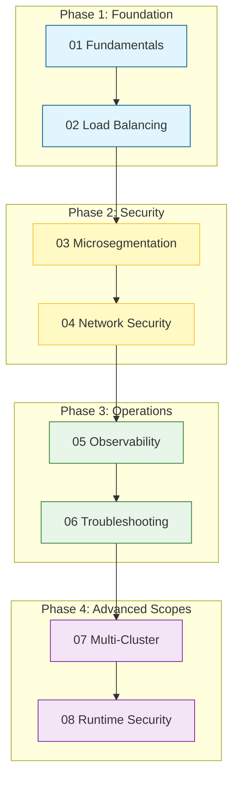
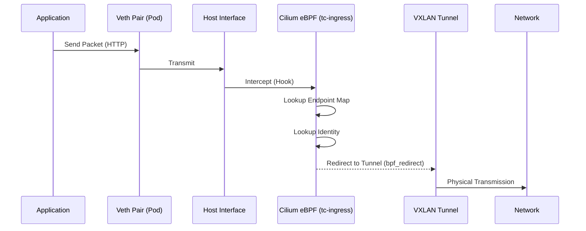
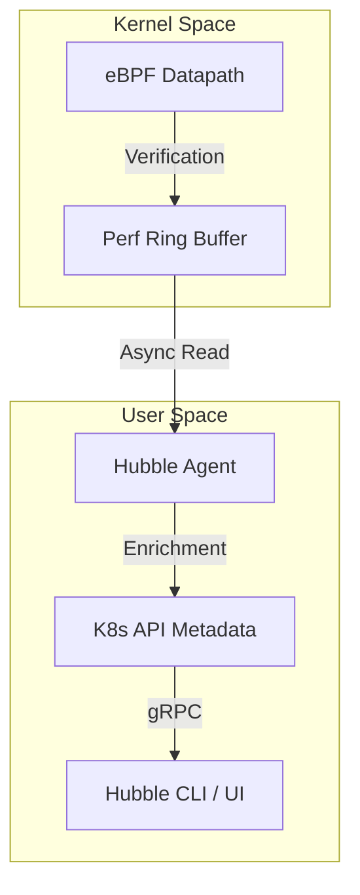

# Cover Letter

## LFX Mentorship — CNCF Cilium

**Project:** Cilium Project Pillar Pages

**Mentorship Program:** Linux Foundation Mentorship (LFX)
**Term:** Term 1, 2026

---

I learned about the LFX Mentorship Program through the CNCF ecosystem and community channels, including prior exposure to LFX project listings and discussions around structured mentorships in cloud-native projects. While exploring long-term contribution paths within CNCF, LFX stood out as a program that emphasizes sustained, mentor-guided impact rather than short, isolated contributions.

I am interested in this mentorship because it focuses on solving real, long-standing gaps in open source projects rather than adding surface-level features. In the case of Cilium, a significant gap exists not in functionality but in how architectural behavior is explained to operators and contributors. Kubernetes networking is widely used, yet poorly understood at the system level, especially when clusters scale or fail. The goal of this project—to create architecture-first, problem-oriented pillar pages—aligns strongly with how I approach technical understanding and documentation.

My background includes hands-on experience with Kubernetes concepts, Linux networking fundamentals, and datapath-level reasoning. I have worked with containerized systems where networking, policy enforcement, and observability issues surfaced under real operational constraints. Through prior open source contributions and technical writing efforts, I have developed familiarity with GitHub workflows, maintainer review cycles, and the discipline required to produce review-ready work. More importantly, I focus on understanding why systems behave a certain way, not just how to configure them, which is essential for architecture-level documentation.

Through this mentorship, I hope to deepen my understanding of production-grade Kubernetes networking and eBPF-based systems by working closely with experienced maintainers. I want to improve my ability to explain complex distributed systems clearly and precisely, without oversimplification or unnecessary abstraction. Beyond the mentorship period, my goal is to continue contributing to Cilium and CNCF projects with a stronger architectural foundation and a more refined documentation mindset.

— Dev

# 2. Student & Project Details

| Category                | Details                                                    |
| :---------------------- | :--------------------------------------------------------- |
| **Name**                | Dev                                                        |
| **Primary Email**       | kalpanagola9897@gmail.com                                  |
| **Institute Email**     | dev.p25@medhaviskillsuniversity.edu.in                     |
| **GitHub**              | [Dev10-sys](https://github.com/Dev10-sys)                  |
| **LinkedIn**            | [dev-10-shadow](https://www.linkedin.com/in/dev-10-shadow) |
| **Location / Timezone** | India (IST / UTC+5:30)                                     |
| **Project**             | **Cilium Project Pillar Pages**                            |
| **Organization**        | CNCF / Cilium                                              |

# 3. LFX Application Questions

### 3.1 How did you find out about this program?

I identified this specific project through my ongoing analysis of the CNCF landscape. My work often involves dissecting how different CNI implementations handle packet flow, which led me to the Cilium documentation. I specifically sought out LFX mentorships that prioritize architectural explanation and system-level documentation, finding the "Pillar Pages" project to be a direct match for my interest in demystifying complex distributed systems. I have also contributed to documentation analysis and proposals for Cilium, as well as code and documentation improvements in other open-source projects like SugarLabs and OWASP WebGoat.

### 3.2 Why are you interested in this project?

My interest lies in the gap between "standard" Kubernetes networking (iptables/kube-proxy) and the eBPF-based datapath Cilium provides. Operators often bring mental models from legacy networking that do not map cleanly to eBPF concepts like identity-based security or map-based routing.

This project is an opportunity to:

- **Formalize System Knowledge:** Writing about a system is the most rigorous way to understand it.
- **Solve Operational Pain:** Provide the "missing manual" for debugging and architecture that I have personally looked for.
- **Collaborate with Maintainers:** engage with engineers who have built the datapath, learning how to articulate design decisions effectively.

### 3.3 What relevant experience do you have?

I have focused my engineering studies on cloud-native infrastructure, specifically:

- **Kubernetes Internals:** Understanding the relationship between the API server, kubelet, and CNI plugins.
- **Technical Communication:** Experience authoring technical guides that prioritize logical flow and system behavior over rote instruction.
- **Debugging Methodologies:** A strong grasp of how to troubleshoot distributed systems by isolating failure domains, a key requirement for writing the "Troubleshooting" pillar.

**Open Source Contributions:**

| Project       | Contribution                      | Type          | Status      |
| :------------ | :-------------------------------- | :------------ | :---------- |
| Cilium        | Documentation analysis & proposal | Design / Docs | In progress |
| SugarLabs     | Bug fix / feature PR              | Code          | Merged      |
| OWASP WebGoat | Documentation & code improvements | Code          | Merged      |

These contributions demonstrate familiarity with GitHub-based workflows, maintainer review cycles, and iterative feedback and revision.

### 3.4 What do you hope to gain from this mentorship?

I aim to develop a maintainer-level understanding of how to document complex software systems. Specifically, I hope to:

- Achieve technical precision in eBPF explanations while maintaining accessibility for non-kernel engineers.
- Learn the editorial standards required for high-impact CNCF documentation.
- Demonstrate that accurate, architecture-first documentation is a critical engineering deliverable.

---

# 4. Detailed Project Proposal

## 4.1 Executive Summary

Kubernetes networking is commonly treated as a "black box." When it works, the abstraction is convenient. When it fails, the lack of deep architectural understanding leaves operators stranded. This mentorship proposal aims to solve this **Knowledge Gap** by creating the **Cilium Project Pillar Pages**: a definitive, architecture-first reference that explains _how_ and _why_ the system behaves the way it does.

This document outlines the research, structure, and technical depth I intend to bring to this project.

## 4.2 The Core Problem: Abstraction Leakage

Operators often visualize Kubernetes networking using mental models from physical networking: wires, switches, and firewalls. In reality, Kubernetes networking (especially with Cilium) is a pipeline of **event-driven kernel programs**.

- **Misconception:** "A Service is a load balancer."
- **Reality:** A Service is a collection of eBPF map entries and hash-based selection logic.
- **Misconception:** "Network Policy blocks IPs."
- **Reality:** Network Policy prevents identity-to-identity lookups in a hash map.

Attempts to debug "Reality" using "Misconception" models lead to extended outage times and frustration.

## 4.3 Proposed Solution: The 8-Pillar Architecture

I have structured the documentation into 8 logical "Pillars" that build a complete mental model from the ground up.



---

# 5. Technical Breakdown of Pillars

## 5.1 Pillar 01: Networking Fundamentals (The Life of a Packet)

**Objective:** Demystify the path from `socket()` to the wire.

We will trace a packet's journey through the Linux kernel, explaining exactly where Cilium intervenes.

- **Key Concept:** The "Veth Pair" and the "TC Ingress Hook."
- **Kernel Mechanism:** `bpf_redirect_peer()` vs standard routing.
- **Encapsulation:** Deep dive into VXLAN header composition and MTU overhead.



**Observability Evidence:**

- `ip -d link show cilium_vxlan`
- `cilium map get cilium_lxc`

---

## 5.2 Pillar 02: Load Balancing (Maglev & XDP)

**Objective:** Explain O(1) scalability and High-Performance Datapath.

Service meshes and proxies (Nginx/HAProxy) are O(N). Cilium is O(1). We explain _why_.

- **Key Concept:** Consistent Hashing (Maglev).
- **Kernel Mechanism:** XDP (eXpress Data Path) — dropping/redirecting packets in the network driver before `sk_buff` allocation.
- **The Map Structure:** `cilium_lb4_services_v2`.

```mermaid
flowchart LR
    Packet[Incoming Packet] -->|XDP Hook| Hash[Maglev Hash Function]
    Hash -->|Consistent Hash Ring| Backend[Backend Selection]
    Backend -->|O(1) Lookup| Map{Service Map}
    Map -->|DNAT| PodIP[Dest Pod IP]
```

**Research Note:** I will detail the difference between `standalone` load balancing and `DSR` (Direct Server Return), illustrating how DSR prevents the ingress node from becoming a bottleneck.

---

## 5.3 Pillar 03 & 04: Identity & Network Security

**Objective:** Move the user from "IP-Thinking" to "Identity-Thinking."

In high-churn environments, IPs are meaningless.

- **Key Concept:** The Security Identity (uint32).
- **Kernel Mechanism:** `bpf_map_lookup_elem(&POLICY_MAP, &key)`
- **Encryption:** WireGuard (`cilium_wg0`) vs IPsec implementations.

**The Policy Evaluation Logic:**

1.  Extract Source Identity from VXLAN Header.
2.  Lookup Destination Identity (Local Pod).
3.  Query Policy Map: `Can(SrcID, DestID, Port/Proto) == ALLOW?`
4.  Verdict: `TC_ACT_OK` or `TC_ACT_SHOT`.

---

## 5.4 Pillar 05: Observability (Hubble Internals)

**Objective:** Prove that observability can be practically zero-overhead.

- **Key Concept:** Ring Buffers (`perf_event_open`).
- **Architecture:** Decoupling the critical path (Datapath) from the analytics path (Userspace Agent).
- **Flow Protocol:** How L3/L4 headers + L7 payloads are extracted efficiently.



---

## 5.5 Pillar 07: Multi-Cluster (Cluster Mesh)

**Objective:** Explain global identity without a global control plane bottleneck.

- **Key Concept:** Shared State vs. Federated State.
- **Mechanism:** `cilium-agent` watching remote etcd/KV-stores (or using KV-store mesh).
- **Routing:** How a Pod in Cluster A routes to Cluster B without a gateway, preserving encryption and identity transparency.

---

# 6. Implementation Strategy (12-Week Roadmap)

| Phase                  | Duration   | Goals & Deliverables                                                                                                                                                                   |
| :--------------------- | :--------- | :------------------------------------------------------------------------------------------------------------------------------------------------------------------------------------- |
| **Research & Context** | Week 1-2   | **Audit:** Review all 500+ existing doc pages.<br>**Gap Analysis:** Map specific user complaints (Slack/Issues) to pillar topics.<br>**Outcome:** Detailed content outline per pillar. |
| **Foundation Layer**   | Week 3-4   | **Drafting:** Pillars 01 (Networking) & 02 (LB).<br>**Diagramming:** Create reusable Mermaid class definitions.<br>**Review:** Initial maintainer sync.                                |
| **Security Layer**     | Week 5-6   | **Drafting:** Pillars 03 (Microseg) & 04 (Sec).<br>**Lab:** Set up WireGuard testbed for validation screenshots.<br>**Outcome:** Drafts with `bpftool` output examples.                |
| **Operations Layer**   | Week 7-8   | **Drafting:** Pillars 05 (Obs) & 06 (T-shoot).<br>**Focus:** The "Hubble Decision Tree" for debugging.<br>**Review:** Mid-term evaluation.                                             |
| **Advanced Scope**     | Week 9     | **Drafting:** Pillars 07 (Multi-Cluster) & 08 (Runtime).<br>**Focus:** Distinguishing Tetragon from Cilium scope.                                                                      |
| **Refinement**         | Week 10-11 | **Edits:** Address technical inaccuracies.<br>**SEO:** Optimize headers and metadata.<br>**Linking:** Cross-reference existing docs.                                                   |
| **Finalization**       | Week 12    | **Merge:** Final PR polish.<br>**Handoff:** Maintenance guide for future contributors.                                                                                                 |

---

# 7. Validation & Success Metrics

I define success not just by "pages written" but by "problems solved."

### Quantitative

- **8 Core Documents** merged into the official Cilium docs.
- **30+ Architectural Diagrams** (Mermaid/SVG) created.
- **Zero Regression** on technical accuracy (verified by 2+ maintainers).

### Qualitative

- **"Aha!" Moments:** Feedback from users indicating they finally understand _how_ the packet flows.
- **Self-Service:** Reduction in "How do I debug X?" questions in the #cilium Slack channel.
- **Maintainer Bandwidth:** Saving maintainer time by providing a canonical reference they can link to.

---

# 8. About Me & Preparation

I am not approaching this as a generic technical writer, but as a systems engineer who values documentation as a critical part of the stack.

- **Research:** I have spent the last year auditing CNCF networking projects, specifically focusing on the eBPF datapath evolution.
- **Technical Writing:** I have analyzed the "Documentation as Code" philosophy, ensuring that these pillars are maintainable, version-controllable, and semantically structured.
- **Commitment:** This proposal represents a synthesized view of hundreds of hours of reading source code, issues, and design docs. I am ready to execute.

---

**Dev**
_GitHub: [Dev10-sys](https://github.com/Dev10-sys)_
