# Linux Foundation Mentorship (LFX) 2026 – Term 1

## Project Proposal

**Project Title:** CNCF Cilium – 8 Pillars: Packet-Centric Mental Model & Architecture Documentation  
**Organization:** CNCF – Cilium  
**Mentorship Program:** Linux Foundation Mentorship (LFX)  
**Term:** 2026 Term 1

### Applicant Details

**Name:** Dev  
**Email:** kalpanagola9897@gmail.com  
**Institute Email:** dev.p25@medhaviskillsuniversity.edu.in  
**Degree:** Bachelor of Technology – Computer Science (AI/ML)  
**GitHub:** [Dev10-sys](https://github.com/Dev10-sys)  
**LinkedIn:** Dev

## Cover Letter

I am applying to the Linux Foundation Mentorship Program to work on problems that exist below surface-level abstractions, where real system behavior is defined and where misunderstandings directly lead to production failures.

My interest in cloud-native systems, and Cilium in particular, comes from repeatedly encountering the same issue while learning and contributing to open source: systems are configured correctly, yet behavior still breaks in ways that configuration files, logs, and dashboards fail to explain.

Cilium is a system where this gap is especially visible. Users interact with Kubernetes objects and YAML definitions, but Cilium executes decisions inside the Linux kernel using eBPF. When traffic is dropped, latency changes, or policies behave unexpectedly, the root cause is often not incorrect configuration but an incomplete mental model of how packets are processed at runtime.

The Linux Foundation Mentorship Program appeals to me because it emphasizes production-grade contributions, maintainer feedback, and long-term project value rather than isolated or experimental work. This aligns closely with how I approach open source: understanding execution paths first, then producing changes that are correct, scoped, and maintainable.

Through this mentorship, I aim to contribute documentation that improves how operators, contributors, and maintainers reason about Cilium’s behavior in real production environments.

## Table of Contents

1. **Introduction and Motivation**
   - 1.1 Why I Am Applying to LFX
   - 1.2 Why This Project Matters
   - 1.3 Problem Overview: Configuration-Driven Thinking vs Runtime Execution
2. **Project Context and Problem Statement**
   - 2.1 CNCF, Kubernetes, and the Cloud-Native Execution Layer
   - 2.2 Where Cilium Fits in the CNCF Landscape
   - 2.3 From Kubernetes Objects to Packet Decisions
   - 2.4 The Core Problem: A Mental Model Mismatch
   - 2.5 How Documentation Gaps Amplify the Problem
   - 2.6 Why Debugging Becomes Non-Intuitive
   - 2.7 Security Reasoning Breakdown
   - 2.8 Performance Reasoning Breakdown
   - 2.9 Unified Problem Statement
   - 2.10 Why This Project Exists
3. **The 8 Pillars Framework – Conceptual Overview**
   - 3.1 Why a Pillar-Based Mental Model
   - 3.2 Shared Datapath and Packet-Level Reasoning
   - 3.3 Documentation Grammar Used Across All Pillars
   - 3.4 How the Framework Is Applied in Real Scenarios
4. **The 8 Pillars – Documentation Plan**
   - 4.1 Pillar 1: Identity – Security Beyond IP Addresses
   - 4.2 Pillar 2: Datapath and Networking – How Packets Move
   - 4.3 Pillar 3: Policy Enforcement – Zero-Trust Decisions
   - 4.4 Pillar 4: Layer 7 Visibility Without Sidecars
   - 4.5 Pillar 5: Observability and Flow Semantics
   - 4.6 Pillar 6: Performance and eBPF Efficiency
   - 4.7 Pillar 7: Scalability and Multi-Cluster Behavior
   - 4.8 Pillar 8: Failure Modes and Operational Debugging
5. **Documentation Design and Explanation Approach**
   - 5.1 Packet-Flow-First Explanation Strategy
   - 5.2 Consistent Terminology and Structure
   - 5.3 Step-by-Step Kernel and Datapath Reasoning
6. **Expected Outcomes and Impact**
   - 6.1 Improved Runtime Understanding of Cilium
   - 6.2 Reduced Debugging and Operational Confusion
   - 6.3 Stronger Mental Models for Production Use
7. **Implementation Plan and Timeline**
   - 7.1 Execution Philosophy
   - 7.2 Documentation Workflow
   - 7.3 Pillar-Wise Execution Plan
   - 7.4 12-Week Timeline and Milestones
8. **About Me**
   - 8.1 Technical Background and Interests
   - 8.2 Open Source Contributions (Merged Work)
   - 8.3 Why I Am a Good Fit for This Project

---

## 1. Introduction and Motivation

### 1.1 How I Found the LFX Mentorship Program

My entry into the LFX Mentorship Program was a natural extension of my ongoing open-source work rather than a one-off discovery.

While preparing for GSoC, I was actively contributing to open-source projects and working under guidance from a college mentor who encourages long-term OSS involvement. During discussions around contribution strategy beyond GSoC, LFX was introduced to me as a mentorship program focused on production-grade, maintainer-aligned work, rather than short exploratory tasks.

After this introduction, I independently explored the LFX Mentorship portal and reviewed:

- past and ongoing CNCF mentorship projects
- project scopes and expected outcomes
- mentor expectations and review standards

While exploring CNCF projects, work related to CNCF stood out, particularly projects that operate close to system behavior rather than application-level abstractions. Among these, Cilium stood out due to its focus on runtime execution, reliability, and design-level reasoning.

Based on mentor guidance and my own evaluation of the ecosystem, I decided to apply to LFX with a project aligned to long-term contribution value rather than short-term learning goals.

### 1.2 Why I Am Interested in This Mentorship Program

My interest in this mentorship comes from a growing focus on how systems behave beneath their abstractions, not just how they are configured or used.

While learning Kubernetes and cloud-native systems, I repeatedly encountered scenarios where configurations appeared correct but behavior still broke in unexpected ways. This led me to focus less on surface-level usage and more on understanding execution paths, decision boundaries, and failure modes.

I learn systems most effectively by:

- building real setups
- breaking them intentionally
- tracing what happens when assumptions fail

Open source provides real feedback loops for this style of learning. Mistakes are visible, reasoning is reviewed, and correctness matters.

Cilium is especially compelling to me because it combines:

- networking
- security
- observability
- performance

into a single system that executes inside the Linux kernel using eBPF. Understanding such a system requires moving beyond YAML-driven thinking to packet-level and kernel-level reasoning.

LFX is the right environment for this work because it provides:

- structured mentorship
- direct maintainer feedback
- expectations aligned with production systems

Most importantly, it supports work that improves how complex systems are understood, not just how they are configured.

### 1.3 Experience and Skills Relevant to This Program

My experience aligns with this project primarily through documentation, system reasoning, and maintainer-aligned contributions.

**Open Source Contributions**

- **CHAOSS:** Contributed documentation improvements focused on clarifying how contributor sustainability metrics are commonly misinterpreted. The work emphasized reasoning and context over raw numbers, helping readers avoid incorrect conclusions.
- **BeagleBoard:** Contributed documentation fixes that required understanding hardware–software interaction and aligning examples with actual build outputs. The focus was on precision and reducing user confusion rather than adding features.
- **Sugar Labs:** Contributed a production fix addressing recovery behavior after a datastore crash. The issue required understanding runtime behavior, failure conditions, and safe recovery boundaries. The change was intentionally scoped, manually tested, reviewed, and merged by maintainers.

Across these projects, I learned how maintainers evaluate changes, how to scope fixes responsibly, and how to communicate behavior clearly.

**Technical Background**
I am comfortable working with:

- Docker and containerized environments
- Kubernetes fundamentals
- Linux-based development workflows

I also completed a frontend and UI/UX internship where the focus was on structure, clarity, and consistency. While not directly related to kernel-level work, this experience strengthens my ability to present complex information in a readable and maintainable form.

**Personal Project**
I built **SHINRA LABS**, a data annotation platform prototype for LLM training workflows. My role involved:

- system architecture and workflow design
- data handling and validation pipelines
- anticipating edge cases and user confusion

A key challenge was explaining why the system behaved a certain way instead of treating it as a black box. This experience directly influences how I approach documentation: behavior first, configuration second.

### 1.4 What I Hope to Gain From This Mentorship

Through this mentorship, I want to deepen my understanding of cloud-native networking at runtime, not just at the configuration level.

From a technical perspective, I aim to develop an end-to-end understanding of:

- packet flow through the datapath
- identity-based security decisions
- observability signals generated at execution time
- performance costs introduced by kernel-level logic

Beyond technical depth, I want to learn how maintainers:

- reason about failures and edge cases
- balance correctness, performance, and usability
- decide what belongs in documentation and what does not
- communicate complex behavior responsibly

My long-term goal is to build strong system-level intuition and contribute sustainably to large, long-running open-source projects where correctness and clarity matter.

---

## 2. Project Context and Problem Statement

### 2.1 CNCF, Kubernetes, and the Cloud-Native Execution Layer

The Cloud Native Computing Foundation hosts projects that operate at the lowest layers of modern distributed systems. These are not application tools. They define infrastructure behavior where failures directly impact production reliability, security, and performance.

At the center of this ecosystem is Kubernetes, which acts as a control plane. Kubernetes defines desired state through objects such as Pods, Services, and Policies. It is intentionally declarative and deliberately avoids implementing runtime behavior.

This design creates a layered execution model:

- User intent is expressed through configuration
- Kubernetes reconciles desired state
- Runtime execution is delegated to lower layers

Once traffic begins flowing, Kubernetes exits the execution path entirely. From that point onward, actual behavior is determined below Kubernetes, inside the networking and kernel layers.

This separation is intentional and powerful. It is also the first major source of misunderstanding for users and operators.

### 2.2 Where Cilium Fits in the CNCF Landscape

Cilium is a CNCF project that implements networking, security, and observability directly inside the Linux kernel using eBPF.

Unlike traditional CNI implementations that rely heavily on iptables chains, userspace proxies, or IP-centric filtering, Cilium programs kernel execution paths so that decisions are made at packet-processing time.

At a high level, responsibility is split as follows:

- Kubernetes declares intent
- The CNI interface hands off execution
- Cilium enforces networking, security, and observability
- The Linux kernel executes eBPF programs
- The network carries traffic

This positioning gives Cilium fine-grained control and high performance. At the same time, it fundamentally shifts where decisions are made. Users still reason in Kubernetes concepts, while Cilium executes logic in the kernel.

### 2.3 From Kubernetes Objects to Packet Decisions

From a user’s perspective, interaction with the system happens through high-level objects such as Deployments, Services, NetworkPolicies, and YAML configuration.

At runtime, however, Cilium operates on an entirely different set of primitives:

- packets rather than services
- kernel hook points rather than controllers
- eBPF programs rather than API objects
- numeric identities rather than labels

The actual execution path looks like this:

- a packet arrives on a node
- it enters the Linux networking stack
- an eBPF hook intercepts the packet
- Cilium logic executes
- identity is resolved
- policy is evaluated
- a forward or drop decision is made
- observability signals may be emitted

At this stage, Kubernetes objects are no longer consulted. Configuration files are not referenced. In many cases, applications never see the packet at all.

This execution gap is invisible unless the user already understands kernel-level packet processing.

### 2.4 The Core Problem: A Mental Model Mismatch

The central issue is not misconfiguration. It is a mismatch between how users think and how the system actually executes.

Users approach Cilium with a Kubernetes-shaped mental model:

- behavior driven by YAML
- services and IPs as primary concepts
- logs and events as debugging tools
- features treated as independent components

Cilium, however, operates with a very different execution model:

- behavior defined by kernel programs
- packets and identities as primary inputs
- decisions embedded in a shared datapath
- features interacting inside the same execution path

Users reason at the configuration layer. Cilium executes at the kernel layer.

This gap causes configurations to look correct while behavior remains unpredictable.

### 2.5 How Documentation Gaps Amplify the Problem

Most existing documentation is structured around:

- enabling features
- explaining configuration fields
- providing example YAML

What is often missing is explanation of runtime behavior:

- where packets are intercepted
- when decisions become final
- why traffic is dropped
- how multiple features interact inside a shared datapath

As a result, users learn syntax without learning behavior. Features are enabled, but outcomes remain difficult to predict. When issues occur, debugging becomes guess-driven and trust in the system degrades.

This is not a user capability problem. It is a documentation model problem.

### 2.6 Why Debugging Becomes Non-Intuitive

Users typically expect debugging to follow a familiar pattern:

- observe a failure
- inspect logs
- adjust configuration
- restart workloads

In Cilium, this approach often fails because many critical decisions occur before the application layer is involved. Packet drops happen inside the kernel. Logs may be empty. Configuration appears valid.

Without knowing where decisions occur, users debug at the wrong layer and misinterpret symptoms.

### 2.7 Security Reasoning Breakdown

Cilium enforces security using identity-based policy rather than IP-based rules.

Labels define identity. Identities are represented numerically inside the kernel. Policies are evaluated against identity, not IP address.

If identity resolution changes due to churn, scaling, or rollout:

- policy definitions still appear correct
- traffic behavior can change unexpectedly

Without understanding the identity lifecycle and enforcement points, security behavior feels unreliable even when configuration is unchanged.

### 2.8 Performance Reasoning Breakdown

Performance behavior in Cilium is determined by kernel-level execution cost:

- eBPF instruction paths
- map lookups
- policy complexity
- datapath length

Users often attribute latency or throughput issues to applications or network congestion, while the real cause lies in datapath execution.

Without visibility into execution cost and decision paths, performance tuning becomes unsafe and reactive.

### 2.9 Unified Problem Statement

Across debugging, security, and performance, the same root issue appears.

Cilium is a kernel-executed, packet-driven system, but most users approach it as a Kubernetes configuration tool.

This mismatch makes behavior hard to predict, failures hard to debug, and performance difficult to reason about.

### 2.10 Why This Project Exists

This project addresses that gap by restructuring documentation around how Cilium actually behaves at runtime.

Instead of explaining features in isolation, the documentation focuses on packet lifecycles, execution paths, and decision points, explicitly connecting configuration intent to kernel-level behavior.

The goal is not to simplify Cilium. The goal is to replace guesswork with understanding.

---

## 3. The 8 Pillars Framework – Conceptual Overview

### 3.1 Why a Pillar-Based Mental Model

Most existing documentation around Cilium is organized in a feature-centric way. This structure is effective for enabling functionality, but it fails when users need to reason about behavior.

In real deployments, features do not execute in isolation. Networking, security, observability, and performance logic all execute through a single shared datapath. When multiple features are enabled simultaneously, users are left without a way to predict execution order, interaction effects, or final outcomes.

This problem is especially pronounced in Cilium because it is not a collection of loosely coupled components. All critical logic executes inside the Linux kernel, and every packet traverses the same sequence of decisions regardless of which feature introduced them.

As a result:

- configurations appear correct
- behavior still feels unexpected
- failures are hard to localize
- performance changes are difficult to explain

This is not caused by incorrect configuration. It is caused by reasoning about the system at the wrong abstraction level.

The 8 Pillars framework replaces feature-centric thinking with execution-centric reasoning. Instead of asking “which feature is involved,” it trains users to ask “which decision is being made, where, and why.”

### 3.2 Shared Datapath and Packet-Level Reasoning

At runtime, Cilium does not operate on services, pods, or policies as first-class objects. It operates on individual packets moving through the kernel.

Each packet:

- enters the Linux networking stack
- passes through kernel hook points
- executes eBPF programs
- triggers identity resolution
- undergoes policy evaluation
- is forwarded, redirected, or dropped

This happens independently for every packet.

Because all logic executes through a shared datapath:

- different features interact implicitly
- execution order matters
- earlier decisions constrain later ones
- some decisions cannot be overridden

Understanding Cilium therefore requires packet-level reasoning. Without understanding the packet lifecycle, users cannot reliably explain:

- why traffic was dropped
- why observability signals are missing
- why latency changed after enabling a feature

Kernel-level execution is not an implementation detail. It is the execution environment itself.

### 3.3 Documentation Grammar Used Across All Pillars

The 8 Pillars framework uses a consistent documentation grammar designed to retrain how users think about system behavior.

Each pillar follows the same reasoning structure:

- **Start from real user confusion:** The explanation begins with symptoms users actually observe in production, not with configuration syntax.
- **Introduce the conceptual decision:** Each pillar explains what decision the system is trying to make and why that decision exists.
- **Describe kernel-level execution:** The documentation shows where and how the decision is implemented inside the datapath.
- **Identify the decision boundary:** The point where behavior becomes final is explicitly documented.
- **Cover failure and edge cases:** Non-happy paths are explained instead of being implied or ignored.
- **Explain observable signals:** What can be seen, what cannot, and why.
- **Link to other pillars:** This prevents isolated feature thinking and reinforces shared execution paths.

This structure is repeated across all pillars to build familiarity, confidence, and predictability.

### 3.4 How the Framework Is Applied in Real Scenarios

The value of the 8 Pillars framework becomes clear when applied to real operational problems.

When debugging broken connectivity, instead of iterating through configuration changes, users trace the packet through identity, policy, routing, and observability decisions. This narrows failures to a specific stage in the execution path.

When reasoning about policy enforcement, identity resolution and enforcement order are made explicit. Unexpected allows or drops become explainable outcomes rather than mysterious behavior.

When investigating performance issues, attention shifts from application-level assumptions to datapath execution cost. Users can identify which pillar introduces overhead and why.

Across these scenarios, the framework replaces trial-and-error debugging with decision-driven reasoning.

It does not reduce system complexity. It exposes complexity in a structured and understandable way.

---

## 4. The 8 Pillars – Documentation Plan

### 4.1 Pillar 1: Identity — Security Beyond IP Addresses

**What This Pillar Establishes**
Identity is not a feature in Cilium. It is the foundational execution primitive on which policy enforcement, observability, encryption, and troubleshooting depend.

Cilium deliberately removes IP addresses from the security decision path and replaces them with label-derived, kernel-resident identities. The purpose of this pillar is to shift user reasoning away from where traffic comes from and toward which workload generated it.

If identity is misunderstood, every other pillar becomes misleading.

**Why IP-Based Security Breaks in Kubernetes**
Kubernetes violates nearly every assumption that traditional network security relies on:

- IP addresses are ephemeral
- Pods reschedule frequently
- Nodes churn
- Services abstract backend location
- Overlay networks rewrite traffic paths

As a result, IP-based reasoning becomes unreliable.

| Assumption                | Reality                  |
| :------------------------ | :----------------------- |
| IP identifies a workload  | IP identifies a moment   |
| Firewall rules are stable | Rules drift continuously |
| Location implies trust    | Location is meaningless  |

Cilium removes IP addresses from security reasoning entirely.

**Identity as a Security Primitive**
In Cilium, identity represents intent, not location.

An identity answers a single question:
**What is this workload allowed to do, regardless of where it runs?**

Identity in Cilium is:

- derived from Kubernetes metadata
- stable across pod rescheduling
- shared consistently across the cluster
- enforced directly inside the kernel datapath

**Label-to-Identity Resolution Model**
When a pod is created:

- Kubernetes assigns labels
- Cilium extracts:
  - pod labels
  - namespace labels
  - system labels
    These labels are then:
- normalized
- deterministically ordered
- hashed

From this process, a **numeric security identity** is allocated.
This numeric identity is the only object the datapath operates on.

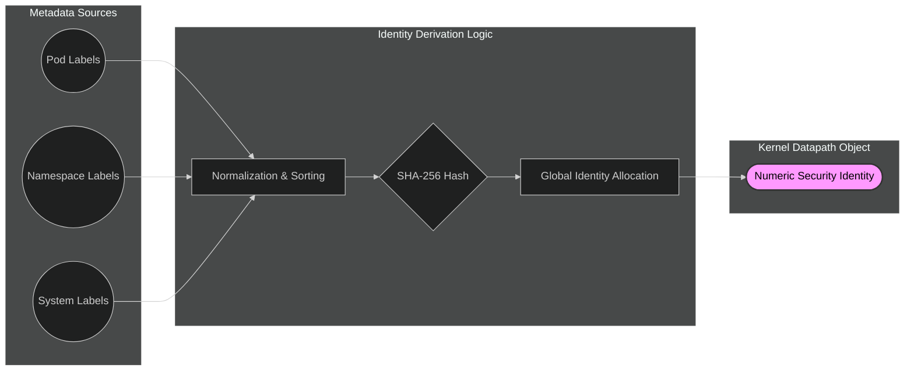

This figure illustrates how Cilium derives a stable security identity from Kubernetes metadata. Instead of relying on IP addresses, workload intent expressed through labels is converted into a numeric identity that is later consumed directly by the kernel datapath during packet processing.

Once allocated, this identity becomes the sole security primitive used by the datapath.

**Identity Resolution During Packet Processing**
At runtime, Cilium does not look up labels.
Instead:

- a packet enters the kernel
- the source endpoint is already known
- the endpoint-to-identity mapping already exists
- the identity is attached to the packet context
- policy evaluation begins immediately

Identity resolution is not a runtime guess. It is a precomputed invariant.

**Identity Lifecycle and Cluster-Wide Propagation**
Identities in Cilium are not node-local.
Cilium maintains a global identity space so that:

- the same identity value represents the same workload everywhere
- policies behave consistently across nodes
- cross-node traffic can be enforced deterministically

The lifecycle of an identity follows a strict reference-counted model:

- identity allocated when first used
- reference count increases as endpoints use it
- identity remains active while referenced
- garbage collected only when no longer used

Key properties:

- identities are reference counted
- unused identities are safely garbage collected
- identities are cached aggressively for fast datapath access

**Identity Churn and Its Effects**
Identities are more stable than IP addresses, but they are not immutable.

Identity churn occurs when:

- labels change
- namespaces change
- deployment strategies modify metadata

During identity changes:

- existing connections remain valid via connection tracking
- new connections are evaluated against the new identity
- default-deny semantics are preserved
- no silent trust expansion occurs

This explains why traffic may briefly behave differently during rollouts without violating security guarantees.

**Common Identity-Driven Misconfigurations**

_Overly Broad Labels_

- **Example:** `app: frontend` used across unrelated workloads.
- **Effect:**
  - identities collapse
  - policies unintentionally match more endpoints
  - access scope widens silently

_Inconsistent Labeling Schemes_

- **Example:** Different teams use `role:db` vs `type:db`.
- **Effect:**
  - identities fragment
  - policies appear correct
  - traffic is denied unexpectedly

_Label Removal During Rollouts_

- **Example:** Labels are temporarily removed during deployment.
- **Effect:**
  - identity changes
  - new connections fail
  - logs appear empty
  - security appears broken

**Reality:**

- the identity invariant was preserved
- the failure originated from an incorrect operator assumption

**Identity and Observability**
Every observable event in Cilium includes:

- source identity
- destination identity
- verdict
- reason

There is no observability without identity.
If identity cannot be explained, flows cannot be explained.

**Outcome of This Pillar**
After completing this pillar, the reader should be able to:

- stop reasoning in terms of IP addresses
- understand identity as a kernel-level invariant
- predict policy behavior during cluster churn
- debug security issues without guesswork

Identity is not configuration. Identity is execution truth.

### 4.2 Pillar 2: Datapath and Networking — How Packets Actually Move

**What This Pillar Establishes**
This pillar explains where Cilium executes and how packets move once traffic starts flowing. Kubernetes defines intent; Cilium executes behavior.

The goal is to replace configuration-level reasoning with packet-level execution reasoning so readers can predict outcomes, debug failures, and reason about performance without guessing.

If the datapath is misunderstood, policies appear random, observability feels incomplete, and performance tuning becomes unsafe.

**Why Kubernetes Is Not in the Runtime Path**
Kubernetes operates as a control plane. It declares desired state but does not process packets.
After objects are created:

- no Kubernetes API logic runs on packet arrival
- no YAML is consulted at runtime
- no Service object participates in forwarding

Actual traffic behavior is determined below Kubernetes, inside the Linux kernel.

**Execution Boundary (Critical Concept)**
Once traffic reaches the node:
**Everything from this point forward is decided by:**

- kernel hook placement
- eBPF programs
- datapath state
- map lookups

Understanding this boundary is essential.

**Cilium’s Datapath Philosophy**
Cilium treats networking as a deterministic execution pipeline.
Key principles:

- packets are the unit of truth
- execution paths are fixed and bounded
- complexity lives in data (maps), not branching logic
- decisions are made once and cached

This design keeps behavior predictable at scale.

**Where Cilium Attaches in the Kernel**
Cilium programs the kernel at specific hook points.
Primary attachment points:

- **XDP** (earliest possible hook)
- **tc ingress / egress** (traffic control layer)

Each hook exists for a reason and serves a distinct role.

_XDP vs tc — Execution Roles_
Cilium uses XDP selectively and tc for full semantics.

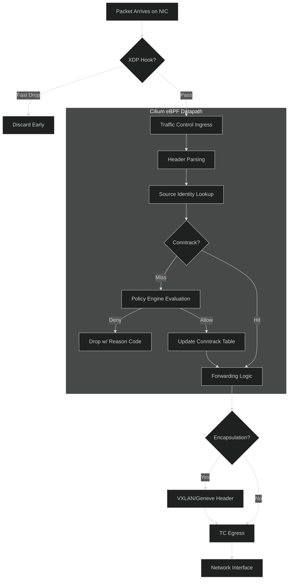

This figure shows the canonical packet flow through the Cilium datapath. Once a verdict is reached, it is final.

**Packet Entry and Context Setup**
When a packet enters at tc:

- packet metadata is parsed
- source endpoint is identified
- identity is already known
- execution context is initialized

No control-plane lookup occurs here.

**Service Translation Happens Before Policy**
A common misconception is that policy applies to Service IPs.
In reality:

- service translation happens first
- backend endpoint is selected
- policy is evaluated against the real backend identity

This explains why:

- a Service resolves
- but traffic is still denied

The datapath enforces truth, not abstraction.

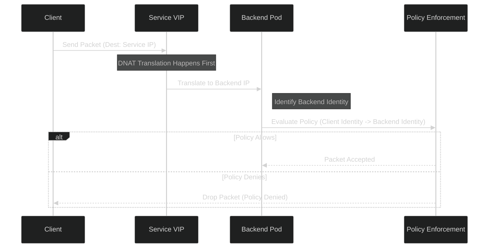

Policies never see virtual addresses. They see identities.

**Connection Tracking and Short-Circuiting**
Cilium avoids reevaluating every packet.
For established connections:

- verdict is cached
- backend selection is skipped
- policy checks are bypassed
- packets follow the **fast path**

This keeps steady-state cost low and predictable.

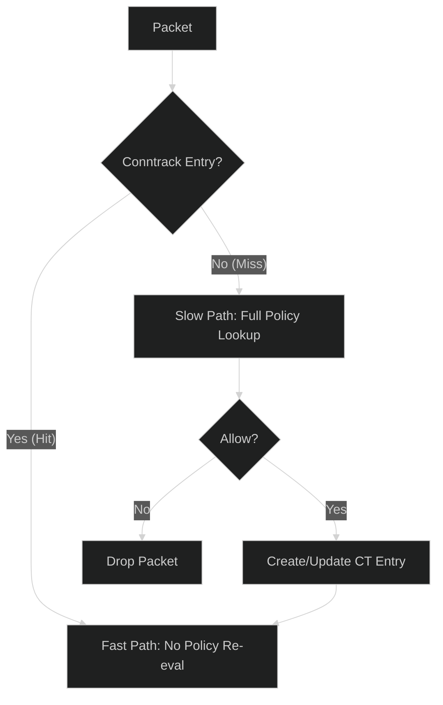

Performance issues often arise when traffic cannot stay on the fast path.

**Observability Hooks in the Datapath**
Observability is embedded at decision boundaries, not added later.
Signals are emitted when:

- backend selection occurs
- policy allows or denies
- packets are dropped
- encryption boundaries are crossed

These signals reflect exact runtime behavior.

**Why Logs Are Often Empty**
Many failures occur:

- before applications see traffic
- before sockets exist
- before userspace logs can trigger

If a packet is dropped in tc:

- the application never knows
- logs remain empty
- retries appear as timeouts

This is expected behavior in a kernel-first system.

**Common Datapath Misinterpretations**

_“Policy Looks Correct but Traffic Fails”_

- **Reality:**
  - policy evaluated against backend identity
  - not service abstraction

_“Nothing Appears in Logs”_

- **Reality:**
  - packet dropped before application layer

_“Performance Degraded After Scaling”_

- **Reality:**
  - increased slow-path frequency
  - conntrack churn
  - backend instability

**Relationship to Other Pillars**
This pillar feeds directly into:

- **Pillar 3 (Policy Enforcement):** Policy executes inside this datapath
- **Pillar 5 (Observability):** Signals are emitted here
- **Pillar 6 (Performance):** Cost is determined by this execution path

Without understanding the datapath, higher-level reasoning collapses.

**Outcome of This Pillar**
After completing this pillar, the reader should be able to:

- trace packet execution end-to-end
- identify where decisions are made
- understand why failures occur silently
- reason about performance using execution paths

The datapath is not an implementation detail. It is the system.

### 4.3 Pillar 3: Policy Enforcement — Zero-Trust Decisions in the Datapath

**What This Pillar Establishes**
This pillar explains where, when, and how traffic is allowed or denied in Cilium.
Cilium does not treat policy as a configuration artifact. It treats policy as a runtime execution constraint enforced per packet, directly inside the kernel datapath.

The goal of this pillar is to replace rule-based thinking with decision-path reasoning so operators understand why traffic is allowed or dropped, not just what rules exist.

If policy execution is misunderstood, security appears inconsistent and debugging becomes guesswork.

**Why Traditional Network Policy Models Fail**
Conventional Kubernetes network policy thinking assumes:

- rules are evaluated against IPs
- enforcement happens at a logical boundary
- policy behavior can be inferred from YAML

These assumptions do not hold in Cilium.

In Cilium:

- IP addresses are not security primitives
- policy is enforced at packet processing time
- YAML never participates in runtime execution

Policy enforcement is a kernel execution problem, not a configuration problem.

**Zero-Trust as an Execution Model**
Cilium implements identity-based zero-trust networking.
Zero-trust in Cilium means:

- no implicit trust between workloads
- every connection is explicitly evaluated
- allow decisions must be proven
- missing rules fail closed

This is not a high-level philosophy. It is enforced mechanically in the datapath.

**Policy Definition vs Policy Execution**
Policy objects exist only in the control plane.
At runtime:

- labels are already resolved
- identities are already assigned
- policies are already compiled
- maps already contain allow rules

The datapath never reads YAML. It performs constant-time lookups against precomputed policy state.

```mermaid
%%{init: {'theme': 'dark'}}%%
graph TD
    subgraph Control[Control Plane]
        YAML[NetworkPolicy YAML] --> CiliumAgent
        CiliumAgent --> MapUpdates
    end

    subgraph Data[Datapath Execution]
        MapUpdates -.-> Map[(Policy BPF Map)]
        Packet --> Lookup[Map Lookup]
        Map --> Lookup
        Lookup --> Decision{Allow/Deny}
    end

    style Control fill:#333,stroke:#666,stroke-dasharray: 5 5
    style Data fill:#222,stroke:#fff
```

Once traffic reaches the kernel, policy behavior is fixed and deterministic.

**Ingress and Egress Are Enforced Independently**
Cilium evaluates policy in two directions:

- **egress:** traffic leaving a workload
- **ingress:** traffic entering a workload

A connection is permitted only if **both directions** allow it.
This prevents accidental trust expansion when only one side is restricted.

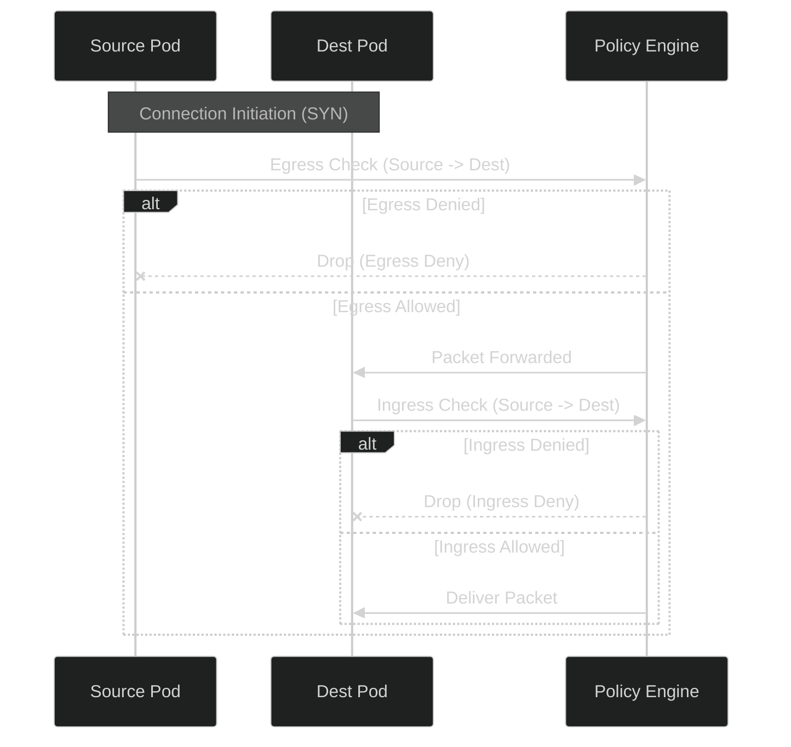

Both checks must pass. There is no implicit symmetry.

**Default-Deny Semantics**
Once a workload is selected by any policy:

- all traffic is denied by default
- only explicitly allowed flows are permitted

This ensures:

- missing rules fail closed
- new workloads do not inherit trust
- security posture degrades safely

Unexpected drops are usually missing intent, not bugs.

**Runtime Policy Evaluation Order**
Policy evaluation follows a strict, invariant order.

```mermaid
%%{init: {'theme': 'dark'}}%%
graph TD
    Start[Packet Context] --> L3[L3 Policy (IP/CIDR)]
    L3 -- Allow --> L4[L4 Policy (Port/Proto)]
    L3 -- Deny --> Drop[Drop Packet]
    L4 -- Allow --> L7{L7 Rules Exist?}
    L4 -- Deny --> Drop
    L7 -- Yes --> Proxy[L7 Proxy Redirect]
    L7 -- No --> Allow[Allow System]
    Proxy --> L7Check[L7 Policy (HTTP/DNS)]
    L7Check -- Allow --> Allow
    L7Check -- Deny --> Drop
```

This order never changes across features or configurations.
Understanding this sequence is critical for debugging.

**Stateful Enforcement with Connection Tracking**
Policy enforcement is stateful.
For new connections:

- full policy evaluation occurs
- verdict is recorded
  For established connections:
- verdict is reused
- policy is not reevaluated
- fast path is taken

This balances correctness with performance.

**Interaction with Service Load Balancing**
Policy enforcement happens **after** backend selection.
This means:

- policies apply to the selected backend
- not to the Service IP
- backend identity determines authorization

This explains a common confusion:

- Services resolve correctly
- traffic is still denied
  Policy is working as designed.

**Layer 7 Policy and Conditional Redirection**
When application-level inspection is required:

- traffic is conditionally redirected
- protocol parsing occurs
- enforcement happens before reinjection

Only traffic that explicitly requires L7 inspection leaves the kernel fast path.
All other traffic remains kernel-resident.

**Identity Stability and Policy Consistency**
Policies bind to identities, not individual pods.
During:

- rolling updates
- scaling events
- node failures
  Policy behavior remains stable as long as labels remain consistent.
  This is why labeling strategy matters more than rule count.

**Common Policy-Driven Failure Modes**

_Overly Generic Labels_

- **Effect:**
  - identities collapse
  - policies unintentionally widen scope

_Asymmetric Policy Coverage_

- Ingress rules exist, egress rules do not.
- **Effect:**
  - connections initiate
  - responses are dropped
  - failures appear intermittent

_Identity Churn During Deployments_

- Labels change mid-rollout.
- **Effect:**
  - new connections denied
  - old connections survive
  - behavior appears inconsistent

**Reality:**

- execution invariants are preserved

**Observability of Policy Decisions**
Every policy decision produces structured signals:

- allow or deny verdict
- drop reason
- source and destination identities
- direction and protocol

This allows operators to debug policy behavior from execution truth, not assumptions.

**Relationship to Other Pillars**
This pillar depends on:

- **Pillar 1 (Identity):** Policy has no meaning without identity
- **Pillar 2 (Datapath):** Enforcement happens inside the datapath

It feeds directly into:

- **Pillar 5 (Observability)**
- **Pillar 6 (Performance)**

Policy is not isolated. It is part of the shared execution pipeline.

**Outcome of This Pillar**
After completing this pillar, the reader should be able to:

- reason about allow and deny decisions without IPs
- predict behavior during deployments
- diagnose drops using identity context
- design policies that fail safely

Policy in Cilium is not a rule system. It is a deterministic execution mechanism.

### 4.4 Pillar 4: Layer 7 Visibility Without Sidecars

**Understanding Application Intent Inside the Datapath**

**What This Pillar Establishes**
This pillar explains how Cilium understands application-level intent without inserting sidecars, proxies, or agents.
Traditional Kubernetes observability and security tools require:

- sidecars
- userspace proxies
- application instrumentation

Cilium does not.
Instead, it selectively elevates packets from the kernel datapath to Layer 7 inspection only when required, and only for traffic explicitly governed by L7 policies.

The goal of this pillar is to show that:

- Layer 7 visibility is not always-on
- it is policy-driven and conditional
- and it does not replace the kernel datapath — it augments it

If this pillar is misunderstood, users assume Cilium behaves like a service mesh. It does not.

**Why Sidecar-Based L7 Models Break Down**
Sidecar architectures introduce fundamental problems:

- every request takes extra network hops
- traffic is copied into userspace unconditionally
- failure domains multiply
- performance becomes application-dependent
- debugging spans multiple abstraction layers

Most importantly: sidecars intercept traffic even when no L7 decision is needed.
This makes L7 visibility expensive by default.

Cilium inverts this model.

**Cilium’s L7 Design Philosophy**
Cilium treats Layer 7 inspection as:

- exceptional, not default
- policy-triggered, not unconditional
- surgically scoped, not global

Key principles:

- kernel datapath remains authoritative
- packets stay in-kernel unless inspection is explicitly required
- L7 logic never replaces L3/L4 enforcement
- visibility is added without altering application topology

**When L7 Inspection Is Triggered**
Layer 7 inspection is activated only if:

- a policy explicitly requires it
- protocol is supported and identifiable
- packet matches L7 policy scope

Otherwise:

- traffic remains entirely in the kernel fast path

This preserves performance and predictability.

```mermaid
%%{init: {'theme': 'dark'}}%%
flowchart TD
    Traffic[Traffic Flow] --> L4Pol{L7 Rule Present?}
    L4Pol -- No --> Kernel[Kernel Fast Path (High Perf)]
    L4Pol -- Yes --> User[Userspace Proxy (Envoy/DNS)]

    subgraph KernelSpace [Kernel Space]
        Kernel
    end

    subgraph UserSpace [User Space]
        User
    end

    User --> Verdict{L7 Verdict}
    Verdict -- Allow --> Reinject[Re-inject to Kernel]
    Verdict -- Deny --> Drop[Drop]
    Reinject --> Kernel
```

Layer 7 inspection is not a replacement path. It is a temporary detour.

**L7 Enforcement Does Not Bypass Policy**
A critical invariant:
**Layer 7 inspection happens only after Layer 3/4 policy allows the flow.**

This ensures:

- policy intent is preserved
- application inspection does not widen access
- L7 cannot override L4 denial

If L4 denies traffic, L7 is never invoked.

**What Cilium Actually Inspects at Layer 7**
Cilium does not parse arbitrary application logic.
It extracts:

- protocol metadata
- request method or verb
- headers or paths (when supported)
- request context tied to identity

It does not:

- modify application payloads
- act as a generic proxy
- maintain application state

The purpose is decision context, not application rewriting.

**Supported Protocol Scope**
Layer 7 visibility applies only to:

- well-defined protocols
- with deterministic parsing rules

Unsupported or encrypted protocols:

- remain L3/L4 only
- are not intercepted
- continue through kernel fast path

This avoids unreliable inspection.

**Performance Boundaries of L7 Inspection**
Layer 7 inspection introduces cost.
Cilium contains this cost by:

- limiting redirection scope
- avoiding per-packet inspection
- caching verdicts where possible
- reinjecting traffic efficiently

Only traffic that must be inspected pays the price.

```mermaid
%%{init: {'theme': 'dark'}}%%
graph LR
    subgraph LowCost [Low Cost Zone]
        P1[L3 Checks]
        P2[L4 Checks]
        P3[Conntrack]
    end

    subgraph HighCost [High Cost Zone (Optional)]
        P4[L7 Parsing]
        P5[L7 Pattern Matching]
    end

    P3 --> D{Policy Requires L7?}
    D -- No --> E[Forward]
    D -- Yes --> P4
    P4 --> P5
    P5 --> E

    style LowCost fill:#003300,stroke:#0f0
    style HighCost fill:#330000,stroke:#f00
```

This keeps tail latency predictable.

**L7 Visibility and Observability**
L7 signals are correlated, not standalone.
Each L7 event is enriched with:

- source identity
- destination identity
- policy context
- verdict
- request metadata

This allows operators to answer:

- which workload made this request
- why it was allowed or denied
- which rule applied

Without packet capture.

**Common Misunderstandings**

_“Cilium Is a Service Mesh”_

- **False.**
  - no sidecars
  - no traffic hijacking
  - no mandatory proxies
  - Cilium is datapath-first, not proxy-first.

_“L7 Is Always On”_

- **False.**
  - L7 is activated only by policy
  - most traffic never leaves kernel space

_“Encrypted Traffic Can’t Be Observed”_

- **Partially false.**
  - payloads are encrypted
  - behavior and intent are still observable
  - metadata remains visible
  - Encryption hides data, not execution.

**Relationship to Other Pillars**
This pillar depends on:

- **Pillar 1 (Identity):** L7 decisions are identity-aware
- **Pillar 3 (Policy):** L7 is an extension, not a replacement

It feeds into:

- **Pillar 5 (Observability)**
- **Pillar 6 (Performance)**

Layer 7 is a controlled amplification of earlier primitives.

**Outcome of This Pillar**
After completing this pillar, the reader should be able to:

- understand when L7 inspection occurs
- explain why most traffic never leaves the kernel
- reason about L7 cost and scope
- avoid sidecar-based mental models

Layer 7 visibility in Cilium is not about control. It is about precise intent awareness without architectural tax.

### 4.5 Pillar 5: Observability and Flow Semantics

**Making Datapath Decisions Visible**

**What This Pillar Establishes**
This pillar explains how Cilium exposes the truth of what the datapath actually did, not what operators assume happened.
Traditional observability in Kubernetes focuses on:

- application logs
- metrics after failures
- reconstructed timelines

Cilium observability operates at decision time, inside the kernel datapath, where traffic is allowed, denied, redirected, or dropped.

The goal of this pillar is to ensure operators can reason about behavior using execution truth, not symptoms.
If observability is misunderstood, debugging becomes narrative-driven instead of evidence-driven.

**Why Networking Observability Is Uniquely Hard**
Most networking failures surface far from their cause.
Typical symptoms:

- application timeouts
- intermittent failures
- uneven load distribution
- partial service reachability

Actual causes often occur:

- before sockets exist
- before applications see traffic
- inside kernel execution paths

Traditional tools cannot observe these points.
Cilium observability exists to close this gap.

**Observability as a Datapath Feature**
Cilium does not bolt observability onto the system. It builds observability into the datapath itself.
Key principles:

- signals are emitted at the same execution points as decisions
- metadata is identical to what enforcement used
- no post-hoc reconstruction
- no reliance on application cooperation

Observability reflects what happened, not what was inferred later.

**What Cilium Observes**
Cilium observes decisions, not raw packets.
Observed events include:

- service backend selection
- policy allow or deny verdicts
- packet drops and reasons
- forwarding and redirection
- encryption boundaries

Each event is tied directly to an execution branch in the datapath.

**Flow Semantics: Why Packets Are Not Enough**
Cilium does not expose raw packet streams.
It exposes **flows**.

A flow represents:

- a logical communication attempt
- aggregated across packets
- enriched with identity and policy context

This allows operators to reason about intent and outcome without drowning in packet noise.

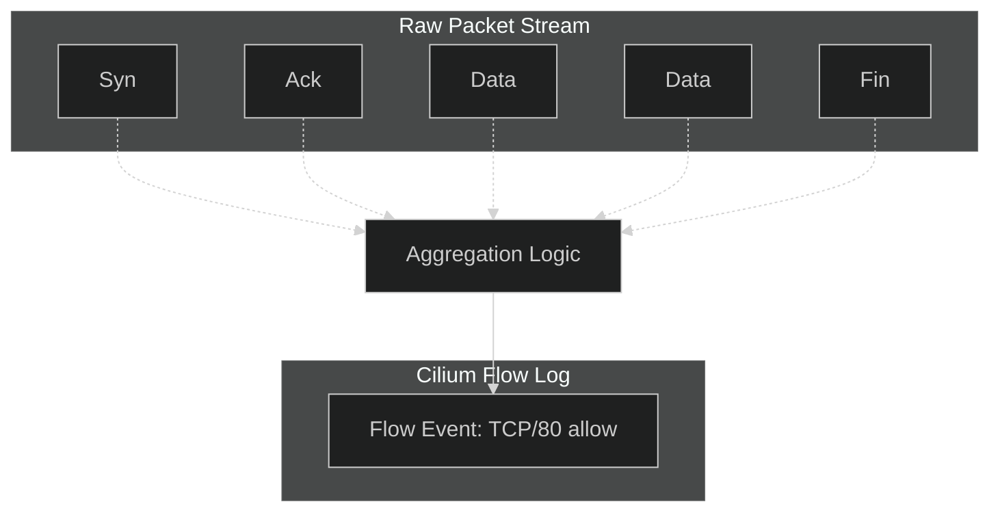

Flows preserve causality while suppressing noise.

**Flow Identity Model**
Each flow is annotated with:

- source identity
- destination identity
- traffic direction
- protocol and port
- verdict (allowed or dropped)
- reason code

This metadata is derived directly from datapath execution, not control-plane state.

**Drop Semantics and Reason Codes**
When Cilium drops traffic, it records why.
Drop reasons are explicit execution outcomes, such as:

- policy denied
- identity unknown
- no service backend available
- invalid packet state
- encryption failure

These reasons map one-to-one with datapath decision branches.
There is no generic “network error”.

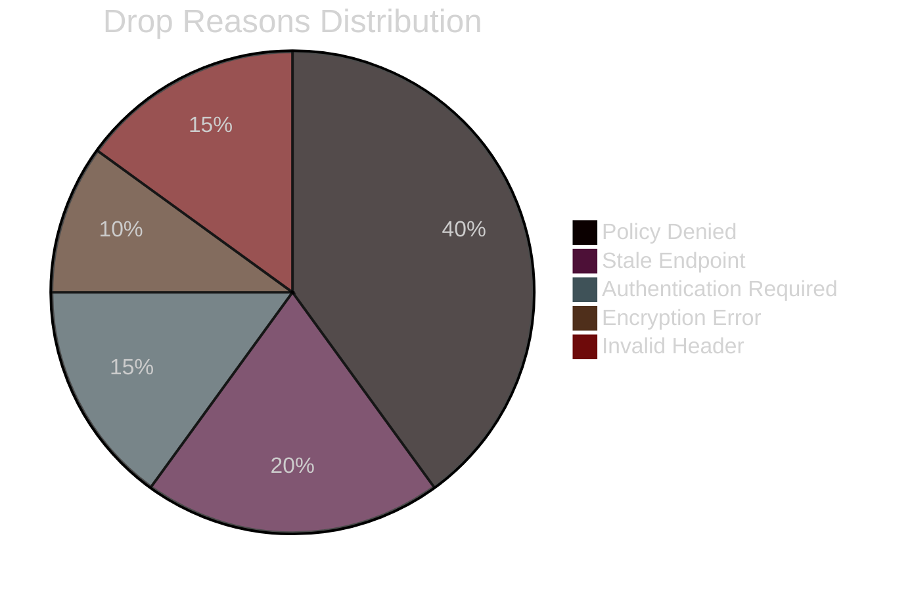

This makes drops explainable instead of mysterious.

**Observability Without Packet Capture**
Packet capture:

- copies payloads
- introduces overhead
- lacks semantic context
- raises security concerns

Cilium avoids this by emitting:

- decision metadata
- identity context
- policy information

This provides higher diagnostic value with lower operational risk.

**Real-Time Visibility, Not Postmortems**
Cilium observability operates in real time.
Operators can:

- observe traffic as it flows
- validate policy changes immediately
- detect failures as they occur

There is no need to replay incidents to understand what happened.

**Policy Decision Visibility**
Every policy decision is observable.
For each evaluated flow, Cilium can surface:

- which rule matched
- whether the verdict was cached
- which identities were involved
- which direction was enforced

Security behavior becomes transparent, not implicit.

**Service and Load-Balancing Visibility**
Cilium exposes:

- which backend was selected
- whether Maglev hashing was used
- whether conntrack influenced routing
- whether traffic followed fast or slow path

This allows operators to diagnose:

- uneven traffic distribution
- backend saturation
- routing instability

without guessing.

**Observability and Encryption**
Even when traffic is encrypted:

- payloads are hidden
- behavior is still visible
- identities and decisions remain observable

Encryption hides data, not execution.
This prevents secure clusters from becoming opaque.

**Signal Volume and Performance Discipline**
Observability is designed to be:

- selective
- structured
- bounded

Cilium avoids:

- per-packet logging
- redundant signals
- uncontrolled event storms

Signals are emitted only at meaningful decision boundaries.

**Debugging from the Correct Layer**
Instead of asking:
_“Why is my application failing?”_

Operators can ask:

- was the packet dropped?
- where was it dropped?
- which identity caused the decision?
- which rule or map entry applied?

Debugging shifts from trial-and-error to execution reasoning.

**Failure Patterns Made Visible**
Certain patterns become obvious when viewed as flows:

- asymmetric drops → missing egress policy
- repeated identical drops → misconfiguration
- frequent backend changes → service churn

These patterns are invisible in traditional logs.

**Observability as a Design Constraint**
Cilium treats observability as a requirement, not an afterthought.
Every new datapath decision must:

- be observable
- emit a reason
- expose identity context

This keeps the system debuggable as complexity grows.

**Relationship to Other Pillars**
This pillar depends on:

- **Pillar 1 (Identity):** No identity, no meaningful observability
- **Pillar 2 (Datapath):** Signals come from execution paths
- **Pillar 3 (Policy):** Verdicts are policy outcomes

It feeds directly into:

- **Pillar 6 (Performance)**
- **Pillar 8 (Failure Modes)**

Observability connects intent to outcome.

**Outcome of This Pillar**
After completing this pillar, the reader should be able to:

- trace datapath decisions without packet capture
- explain drops using reason codes
- correlate behavior with policy and identity
- debug networking issues using execution truth

Observability in Cilium is not monitoring. It is a direct window into kernel-level decision making.

### 4.6 Pillar 6: Performance and eBPF Efficiency

**Understanding the Real Cost of Datapath Decisions**

**What This Pillar Establishes**
This pillar explains why Cilium performs the way it does, not by quoting benchmarks, but by exposing the execution cost model of the datapath.
Performance issues in production rarely appear as obvious throughput drops. They surface as:

- tail latency spikes
- uneven CPU utilization
- unpredictable behavior during churn

Cilium’s performance characteristics are a direct result of kernel execution constraints, eBPF verifier rules, and datapath design decisions.

If performance is misunderstood, operators disable features blindly and destabilize the system.

**Performance Is an Execution Property**
Cilium executes logic directly in the Linux kernel using eBPF.
Unlike userspace programs:

- execution must be bounded
- memory access must be explicit
- instruction paths must be verifiable

Every packet follows a finite, deterministic instruction path.
Performance is therefore governed by:

- instruction count per packet
- number of map lookups
- fast-path vs slow-path frequency
- cache locality

Understanding performance means understanding what executes per packet.

**The eBPF Cost Model**
eBPF programs are compiled into kernel instructions and verified for safety.
Two constraints dominate performance:

1. **Instruction Count**
   - each conditional branch adds cost
   - deep nesting is discouraged

2. **Verifier Predictability**
   - loops must be bounded
   - execution paths must be analyzable

Cilium minimizes branching and pushes complexity into data structures.

**Maps as the Primary Abstraction**
Cilium relies heavily on eBPF maps.
Maps are used for:

- identity resolution
- policy enforcement
- service backend lookup
- connection tracking
- observability counters

Each map lookup has a fixed, predictable cost.
Cilium prefers: **multiple constant-time lookups over complex conditional logic**.
This keeps per-packet cost stable as clusters grow.

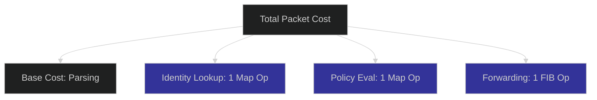

**Fast Path vs Slow Path Execution**
Not all packets are equal.
Cilium distinguishes between:

**Fast Path**

- established connections
- cached policy verdicts
- stable backend selection

**Slow Path**

- new connections
- identity changes
- policy updates
- first packets of flows

The system is optimized so:

- slow path is rare
- fast path dominates steady state

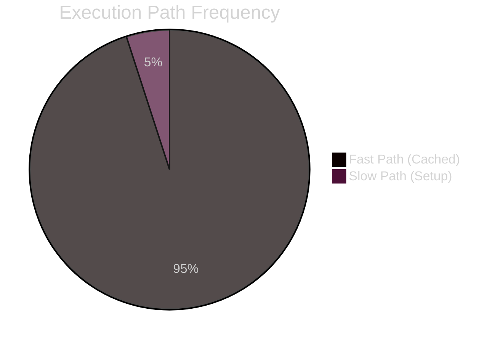

Most performance regressions come from slow-path amplification, not baseline inefficiency.

**Connection Tracking as a Performance Primitive**
Connection tracking is not just correctness logic.
It is a performance accelerator.
Once a verdict is cached:

- repeated policy evaluation is skipped
- backend selection is reused
- routing becomes constant-cost

Performance issues arise when:

- connections churn rapidly
- identities change frequently
- traffic patterns prevent cache reuse

**Policy Complexity and Performance**
Policy complexity affects performance indirectly.
Per-packet cost remains bounded.
However:

- large identity sets increase map sizes
- broad selectors increase cache churn
- frequent policy updates invalidate state

This explains why:

- performance degrades during deployments
- steady-state traffic remains fast

**Load Balancing and Cost Stability**
Service load balancing cost is:

- constant-time
- independent of number of services
- independent of number of backends

Once a backend is selected:

- conntrack bypasses re-selection
- routing becomes cheaper

Performance problems usually stem from:

- frequent backend changes
- unstable hashing inputs
- traffic patterns with many short-lived flows

**Encryption and CPU Cost**
Encryption introduces unavoidable CPU overhead.
Cilium contains this cost by:

- encrypting only node-to-node traffic
- executing encryption in kernel space
- avoiding userspace context switches

Encryption cost scales with **traffic volume**, not with **cluster size**.
Encryption-related performance issues typically indicate:

- CPU saturation
- lack of hardware acceleration
- MTU misconfiguration

**Cache Locality and NUMA Effects**
At scale, memory behavior matters.
Cilium benefits from:

- stable execution paths
- repeated map access
- limited working set size

On multi-socket systems:

- NUMA effects may appear
- remote memory access increases latency

This is why Cilium avoids centralized datapath components.

**Understanding Tail Latency**
Most real complaints are about tail latency.
Tail latency increases when:

- packets fall off fast path
- cache misses occur
- slow-path execution spikes

Cilium bounds tail latency by:

- limiting instruction depth
- avoiding unbounded loops
- preventing rule explosion

**Why Disabling Features Often Backfires**
Disabling features blindly:

- increases slow-path frequency
- destabilizes conntrack behavior
- removes observability needed for tuning

Performance tuning in Cilium is about **controlling execution paths**, not reducing feature count.

**Relationship to Other Pillars**
This pillar depends on:

- **Pillar 2 (Datapath)**
- **Pillar 3 (Policy)**
- **Pillar 5 (Observability)**

It feeds directly into:

- **Pillar 7 (Scalability)**
- **Pillar 8 (Failure Modes)**

Performance is a cross-cutting concern.

**Outcome of This Pillar**
After completing this pillar, the reader should be able to:

- reason about cost per packet
- distinguish slow-path from steady-state cost
- diagnose performance regressions during churn
- avoid unsafe optimizations

Performance in Cilium is not about speed. It is about predictability under load.

### 4.7 Pillar 7: Scalability and Multi-Cluster Behavior

**How Cilium Preserves Identity, Policy, and Performance as Systems Grow**

**What This Pillar Establishes**
This pillar explains what changes when Cilium scales — not just in size, but in topology.
Cilium is designed so that:

- adding more workloads
- adding more nodes
- adding more clusters

does not change the core execution model.
Instead of introducing new abstractions at scale, Cilium extends the same datapath, identity, and policy primitives across larger scopes.

If scalability is misunderstood, operators assume new layers are required. In Cilium, scale is handled by composition, not reinvention.

**Why Scale Breaks Traditional Networking Models**
Traditional Kubernetes networking assumes:

- a single cluster
- a single trust domain
- centrally coordinated state
- IP-based addressing

As systems grow, these assumptions fail.
At scale:

- Pod CIDRs collide
- Services overlap
- Policies become ambiguous
- Central load balancers become bottlenecks
- Gateways turn into failure domains

Most systems “solve” this by adding:

- NAT layers
- service meshes
- centralized gateways

Cilium does not.

**Cilium’s Scalability Philosophy**
Cilium scales by preserving three invariants:

1. **Identity remains the security primitive**
2. **The datapath remains direct and distributed**
3. **Decisions remain node-local at execution time**

No global packet brokers. No mandatory gateways. No centralized policy engines.

**Scaling Within a Single Cluster**
Inside one cluster, scaling primarily affects:

- number of endpoints
- identity cardinality
- policy map size
- conntrack state

What does not change:

- instruction path length
- per-packet decision logic
- execution order

This is why Cilium’s datapath cost does not grow with cluster size.

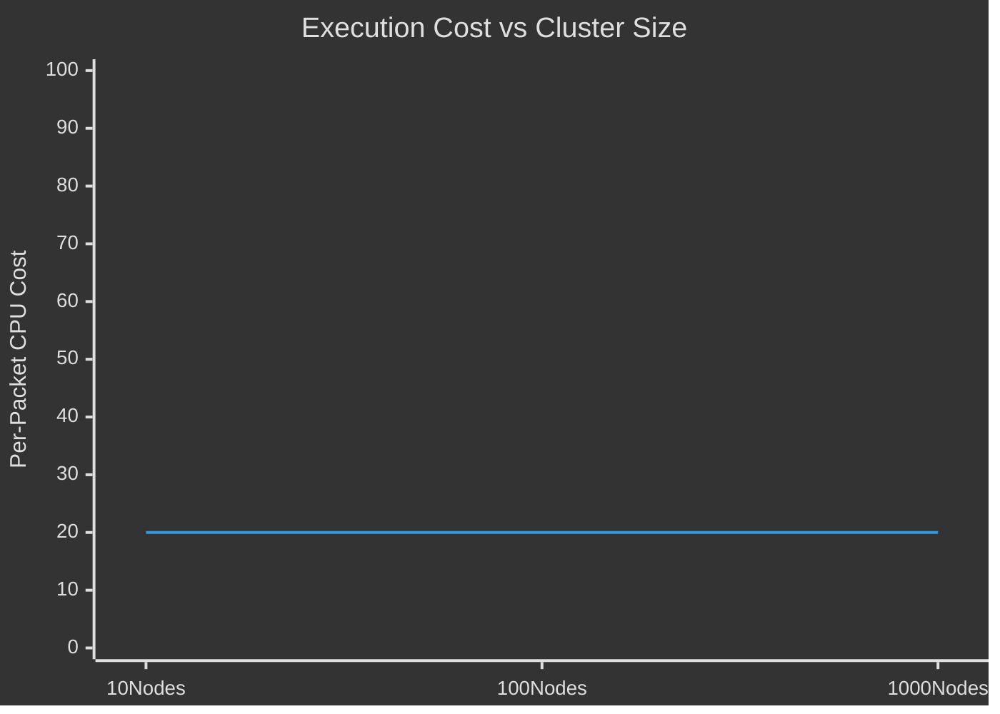

Scale increases data volume, not execution complexity.

**Identity Stability at Scale**
Identity stability is the cornerstone of scalability.
At scale:

- many pods share identities
- identities are reused aggressively
- policies target identities, not endpoints

This prevents:

- rule explosion
- per-pod policy evaluation
- linear growth in enforcement logic

Identity aggregation is what keeps policy scalable.

**Policy Distribution Without Centralization**
Policy compilation happens once and is distributed.
At runtime:

- each node enforces policy independently
- no cross-node coordination is required
- no control-plane round-trips occur

This eliminates:

- bottlenecks
- synchronization delays
- global locks

Failures remain local, not systemic.

**From Single-Cluster to Multi-Cluster**
Multi-cluster is not a different mode of operation. It is an extension of the same primitives.
The problem multi-cluster introduces:

- multiple control planes
- overlapping address spaces
- independent failure domains

Cilium addresses this by extending identity, not IPs.

**Cluster Mesh: Extending the Identity Space**
Cilium uses Cluster Mesh to synchronize only what is necessary.
What is shared:

- security identities
- service backend information (for global services)
- minimal endpoint metadata

What is not shared:

- Kubernetes objects
- pod lifecycle events
- control-plane state

Clusters remain independent, but participate in a shared identity universe.

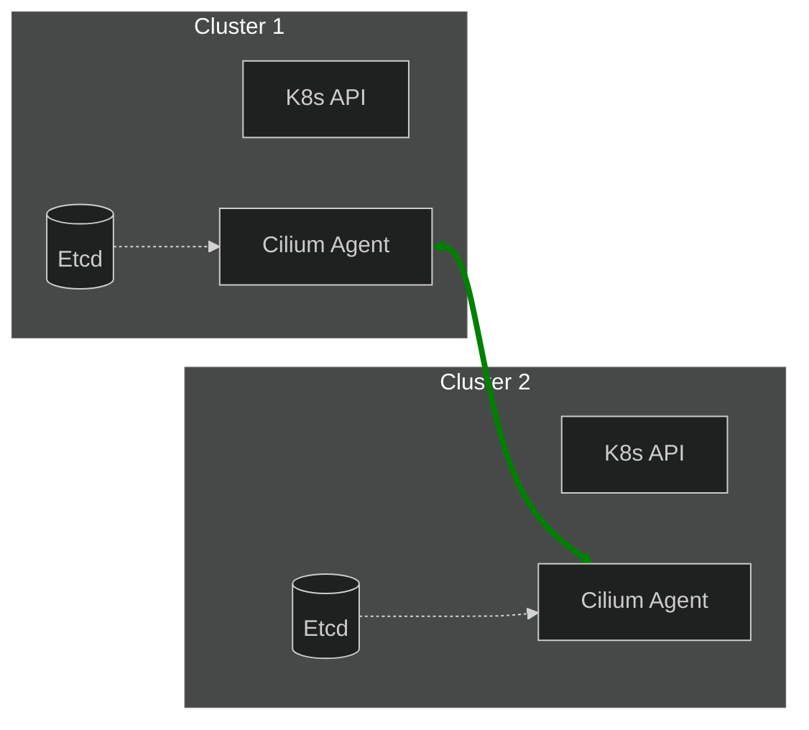

There is no merged control plane.

**Global Identity Consistency**
When Cluster Mesh is enabled:

- the same label set yields the same identity across clusters
- policies written once apply everywhere
- workload movement does not require policy duplication

This enables statements like:
_“frontend can talk to backend”_ to remain true regardless of cluster boundaries.

**Cross-Cluster Service Behavior**
Cilium distinguishes between:

- cluster-local services
- global services

For global services:

- backend information is merged
- load balancing happens locally
- routing decides whether backend is local or remote

There is no global load balancer.
Each node decides independently using shared state.

**Datapath Behavior Across Clusters**
From the datapath’s perspective:

- cross-cluster traffic is just traffic

Differences appear only in:

- endpoint resolution
- encapsulation boundaries
- encryption scope

Policy, identity, and observability remain unchanged.

**Trust Boundaries and Explicit Assumptions**
Multi-cluster introduces implicit trust decisions.
Cilium makes these explicit:

- clusters trust each other’s identity assignments
- encryption protects data in transit, not intent
- compromised clusters can affect others

These are design trade-offs, not hidden behavior.

**Failure Modes at Scale**
This pillar explicitly documents failure realities:

- temporary identity propagation delays
- backend staleness during cluster disconnects
- brief routing blackholes during churn
- delayed policy convergence

These are bounded, observable, and explainable.
Understanding them prevents misdiagnosis.

**Why This Pillar Comes Late**
Multi-cluster behavior only makes sense if:

- identity is understood
- policy execution is clear
- observability is trusted

Otherwise:

- cross-cluster security appears broken
- routing seems unpredictable
- failures are blamed on “the mesh”

This pillar reinforces earlier concepts at larger scope.

**Outcome of This Pillar**
After completing this pillar, the reader should be able to:

- reason about scale without reverting to IP thinking
- understand how identities remain consistent across clusters
- predict policy behavior in multi-cluster setups
- diagnose cross-cluster failures correctly

Scalability in Cilium is not a special feature. It is the natural extension of its execution model.

### 4.8 Pillar 8: Failure Modes and Operational Debugging

**Tracing Failures Through Execution, Not Symptoms**

**What This Pillar Establishes**
This pillar is the closure of the entire 8 Pillars framework.
All previous pillars explain how Cilium:

- derives identity
- processes packets
- enforces policy
- exposes observability
- maintains performance
- scales across clusters

This pillar answers the final, practical question:
**When something breaks in production, how do I find the exact reason without guessing?**

Cilium failures are rarely visible at the application layer. They occur inside the kernel datapath, often before applications, logs, or metrics are involved.
This pillar establishes an execution-first debugging model that maps symptoms to precise failure points.

**Why Cilium Failures Feel Invisible**
Most operators debug in this order:

1. Check application logs
2. Restart pods
3. Modify YAML
4. Retry

This fails in Cilium because many failures happen before any of these layers exist.
Where failures actually occur:

- before sockets are created
- before traffic reaches the application
- inside tc or XDP hooks
- during identity, policy, or routing decisions

Silence is not a bug. Silence is a property of kernel-level enforcement.

**The Mental Shift Required for Debugging**
Traditional question:
_“Which configuration is wrong?”_

Cilium question:
_“At which execution stage did the packet stop?”_

Once this is known, the root cause becomes obvious.

**The Unified Execution Pipeline**
Every packet processed by Cilium follows the same execution path. Failures can occur only at these stages.

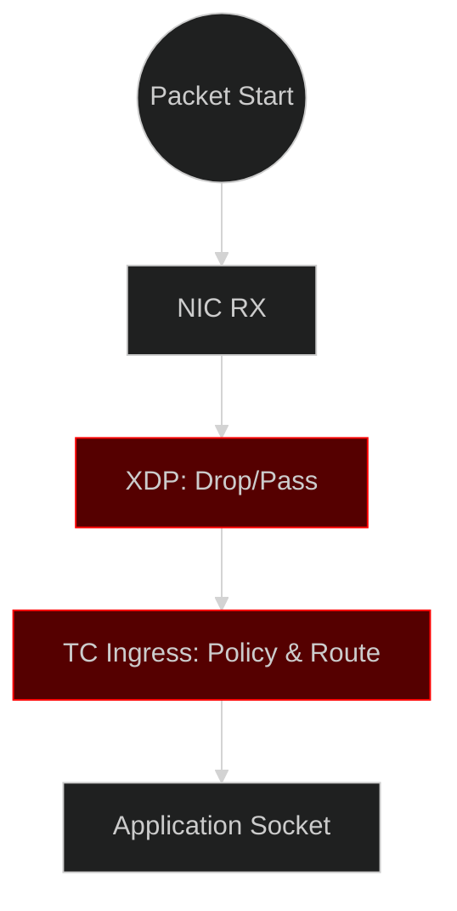

Every real failure maps to exactly one box above. Debugging is now finite.

**Failure Class 1: Identity-Related Failures**
_What the Operator Sees_

- traffic denied unexpectedly
- policies appear correct
- no application logs

_What Actually Happened_

- identity not resolved yet
- identity changed during rollout
- labels did not match policy intent

```mermaid
%%{init: {'theme': 'dark'}}%%
flowchart TD
    Config[Config: Allow 'frontend']
    Runtime[Runtime: 'frontend' has ID 100]
    Packet[Packet Source: ID 200 (unknown)]
    Policy[Policy Check]

    Config -.-> Runtime
    Runtime --> Policy
    Packet --> Policy
    Policy -- Mismatch --> Drop[Drop: Identity 200 Denied]

    style Drop fill:#550000,stroke:#f00
```

Policy did not break. Identity semantics were misunderstood.

**Failure Class 2: Service and Load-Balancing Failures**
_What the Operator Sees_

- Service DNS resolves
- some pods reachable, others not
- retries sometimes succeed

_What Actually Happened_

- backend set outdated
- conntrack pinned old backend
- backend removed during churn

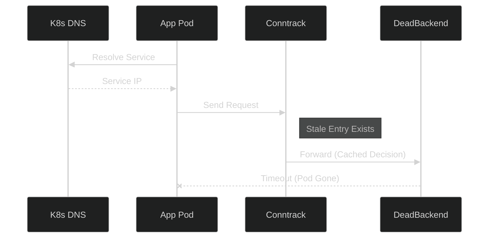

Kubernetes abstraction succeeded. Datapath execution failed.

**Failure Class 3: Policy Asymmetry Failures**
_What the Operator Sees_

- first request succeeds
- response fails
- behavior appears random

_What Actually Happened_

- ingress allowed
- egress denied
- bidirectional enforcement incomplete

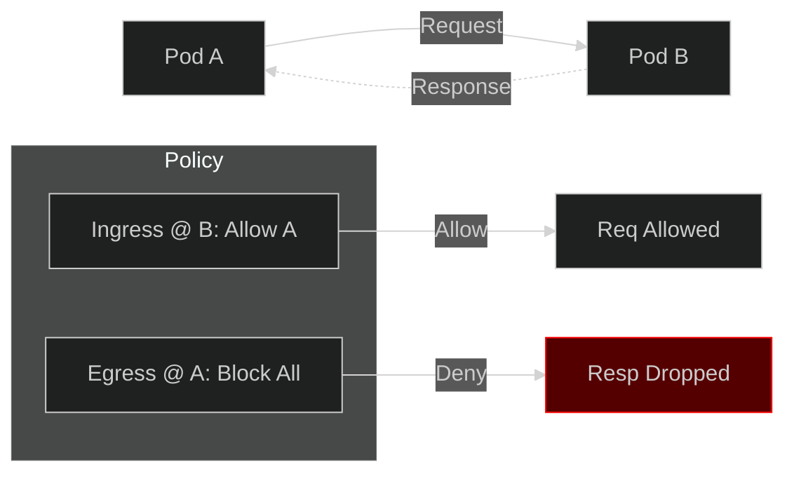

Policy behaved correctly. The operator mental model was incomplete.

**Failure Class 4: Conntrack and Churn Failures**
_What the Operator Sees_

- failures during deployment
- issues disappear after retries
- tail latency spikes

_What Actually Happened_

- identity or backend changed
- conntrack invalidated
- slow path executed repeatedly

```mermaid
%%{init: {'theme': 'dark'}}%%
xychart-beta
    title "Latency Spikes During Churn"
    x-axis [T0, T1 (Deploy), T2 (Recalculate), T3 (Steady)]
    y-axis "Latency (ms)" 0 --> 50
    line [5, 45, 30, 5]
```

This is not randomness. This is expected behavior under churn.

**Failure Class 5: Encryption and MTU Failures**
_What the Operator Sees_

- same-node traffic works
- cross-node traffic fails
- no policy drops visible

_What Actually Happened_

- packet grew after encryption
- exceeded MTU
- dropped before application

```mermaid
%%{init: {'theme': 'dark'}}%%
flowchart TD
    App[App Payload: 1400 bytes] --> Encap[WireGuard Encap]
    Encap --> Check{Check MTU}
    Check -- > 1400? --> Drop[Drop: Fragment Needed]
    Check -- < 1400? --> Send[Send to Network]

    style Drop fill:#550000,stroke:#f00
```

Encryption worked. Network assumptions did not.

**Debugging with Observability (The Correct Way)**
Cilium observability exposes:

- where the packet was processed last
- which decision was taken
- why that decision occurred

```mermaid
%%{init: {'theme': 'dark'}}%%
graph TD
    Obs[Observability Event] --> Dec[Decision: Drop]
    Dec --> Reason[Reason: Policy Denied]
    Reason --> ID[Source ID: 400]
    ID --> Map[Policy Map Lookup]
    Map --> Fix[Fix Policy]
```

No packet capture. No YAML guessing. No restarts.

**Why Logs Are a Dead End**
Application logs can only report:

- what the application observed

They cannot report:

- packets dropped before socket creation
- kernel-level decisions
- policy verdicts

In Cilium, logs are downstream effects, not root causes.

**The Operator Debugging Playbook**
Correct reasoning order:

1. Did the packet enter the datapath?
2. Which execution stage handled it last?
3. What identity was involved?
4. What decision was made?
5. Why was that decision valid?

Only then:

- adjust policy
- tune performance
- modify configuration

**Why This Is the Final Pillar**
This pillar depends on:

- Identity (who)
- Datapath (where)
- Policy (why)
- Observability (how we know)
- Performance (how fast)
- Scalability (how churn amplifies issues)

Without the previous pillars, failures look chaotic. With them, failures become mechanical and explainable.

**Final Outcome of the 8 Pillars Framework**
After all pillars, the reader should:

- stop guessing
- stop debugging at the wrong layer
- reason directly from execution truth

Cilium does not hide complexity. It teaches operators how to think at the right layer.

**Closing Statement**
The 8 Pillars framework is not documentation about features. It is documentation about how the system behaves when it matters.
Once learned, failures stop being mysterious. They become traceable, bounded, and solvable.

---

## 5. Documentation Design and Explanation Approach

This section defines how the Pillar Pages will be written, not which features they describe.

The core objective of this documentation is to build correct mental models for readers operating Cilium in real systems. Cilium’s complexity does not come from the number of features it provides. It emerges from kernel-level execution paths where multiple concerns intersect invisibly.

This documentation approach is explicitly designed to make that invisible execution layer:

- observable
- explainable
- predictable

The result is documentation that teaches readers how to reason, not what to memorize.

### 5.1 Explaining Cilium Through Packet-Flow Reasoning

All explanations in this project are grounded in packet flow, not configuration syntax.

Most existing documentation follows this direction:
**Configuration → Feature → Behavior**

This project intentionally inverts that model.

```mermaid
%%{init: {'theme': 'dark'}}%%
graph TD
    subgraph Traditional [Old Model]
        T1[Configuration] --> T2[Feature Check] --> T3[Behavior (Implicit)]
    end

    subgraph Proposed [New Model]
        P1[Packet Arrival] --> P2[Execution Path] --> P3[Configuration Validation]
    end

    style Traditional stroke-dasharray: 5 5
    style Proposed stroke-width:4px
```

Each explanation begins with a single foundational question:
**What happens to the packet?**

From that point onward, the documentation consistently answers:

- where the packet enters the node
- which kernel hook processes it
- what decision is made at that hook
- how that decision affects the next stage
- where the packet exits or is dropped

Features are never explained in isolation. They are explained as moments in a packet’s lifecycle.

**Feature Explanation by Execution, Not Syntax**
For example, instead of explaining a network policy as a YAML object, the documentation explains:

- how a packet is classified
- how identity is attached
- how a policy map is consulted
- how a verdict is enforced in the datapath

This allows readers to predict behavior without memorizing fields or flags.

### 5.2 Consistency and Structural Discipline Across All Pillars

Large documentation sets fail when they become inconsistent.
This project enforces strict structural discipline so that every pillar is read the same way, reasoned about the same way, and debugged the same way.

**Consistent Concept Ordering**
Every pillar follows the same internal explanation sequence:

```mermaid
%%{init: {'theme': 'dark'}}%%
graph LR
    P[Pillar] --> A[Confusion]
    A --> B[Concept]
    B --> C[Execution]
    C --> D[Boundary]
    D --> E[Failure]
    E --> F[Observability]
```

Once a reader understands how to read one pillar, they can apply the same reasoning pattern to all others.

**Stable Vocabulary and Terminology**
Key terms are defined once and reused consistently.
Examples include:

- identity
- endpoint
- datapath
- enforcement
- hook
- verdict
- propagation

The documentation intentionally avoids synonyms, even when they appear stylistically nicer.
Consistency is prioritized over variation because mental models depend on repetition, not novelty.

**Explicit Scope Boundaries**
Every explanation clearly states:

- which layer is being discussed
- which layers are intentionally excluded
- which assumptions are being made

```mermaid
%%{init: {'theme': 'dark'}}%%
graph TD
    K8s[Kubernetes: Defines Intent]
    Cilium[Cilium: Enforces Rules]
    Kernel[Linux Kernel: Moves Packets]

    K8s -- "Intent" --> Cilium
    Cilium -- "eBPF Bytecode" --> Kernel

    style Kernel fill:#330000,stroke:#f00
```

This prevents a common failure mode where readers attribute kernel behavior to Kubernetes objects, or vice versa.

### 5.3 Stepwise Decomposition of Kernel and Networking Behavior

Kernel execution is often dismissed as “too complex”.
This project treats kernel behavior as explainable engineering, not magic.

**Stepwise Decomposition Model**
Every kernel-related explanation is decomposed into explicit steps.
Instead of saying:
_“Cilium enforces policy”_

The documentation explains:

- which hook is triggered
- what data is available at that point
- what lookup or computation occurs
- what verdict is returned
- how execution continues

```mermaid
%%{init: {'theme': 'dark'}}%%
graph TD
    Step1[1. Hook Triggered] --> Step2[2. Context Loaded]
    Step2 --> Step3[3. Map Lookup]
    Step3 --> Step4[4. Verdict Calculated]
    Step4 --> Step5[5. Packet Modified/Dropped]
```

Each step answers:

- why it exists
- what would break if it behaved differently

**Control Plane vs Data Plane Separation**
The documentation strictly separates:

- **control-plane intent:** what the system is configured to do
- **data-plane execution:** what actually happens to packets

```mermaid
%%{init: {'theme': 'dark'}}%%
flowchart TD
    subgraph CP [Control Plane]
        API[K8s API]
        Agent[Cilium Agent]
    end

    subgraph DP [Data Plane (Kernel)]
        Map[(BPF Maps)]
        Prog[[eBPF Progs]]
    end

    Agent -- "Async Update" --> Map
    Agent -- "Load" --> Prog
    Prog -.-> Map
```

Readers are shown explicitly:

- when Kubernetes stops influencing behavior
- when Cilium takes over
- when decisions become purely packet-driven

This prevents debugging the wrong layer.

**Progressive Depth Without Abstraction Skipping**
Explanations are layered, not flattened.
Each topic progresses through increasing depth:

1. **Conceptual:** What is the intent?
2. **Logical:** How does it work?
3. **Physical:** Where does it run?

Readers can stop at any level without losing correctness.
This avoids:

- shallow explanations that hide behavior
- deep explanations that assume kernel expertise

**Documentation Flow Discipline**
To avoid fragmentation, this project enforces strict flow rules:

- no section introduces a concept that is not explained later
- no pillar depends on undocumented assumptions
- no diagram exists without a narrative explanation

Diagrams are used only when they add reasoning value, never as decoration.
Each diagram maps to a specific step in the explanation.

**Outcome of This Documentation Approach**
By applying this design consistently:

- readers learn to reason, not memorize
- operators gain predictive understanding
- debugging becomes hypothesis-driven
- advanced features feel safe instead of risky

This approach transforms Cilium documentation from a reference manual into a system explanation guide.

**Final Note**
This documentation does not aim to reduce complexity. It aims to make complexity navigable.
Once readers understand how Cilium thinks, the system stops being intimidating and starts being predictable.

### 5.4 Visual Documentation Strategy

Pillar pages are driven by packet execution, not feature descriptions. Every concept is explained using repeating visual primitives.

**CORE VISUAL PRIMITIVES (REUSED EVERYWHERE)**

- **A. Packet Lifecycle Backbone (ALL PILLARS):** One packet, one path, one verdict.
- **B. Control Plane vs Datapath Boundary:** Used in: Policy · Encryption · Observability · Debugging
- **C. Decision Point (WHY IT BROKE):** Debugging ≠ magic. Debugging = decision tree.

**PILLAR-WISE VISUALS (NO NEW STYLES)**

- **Pillar 1 – Identity:** IP vs Identity, Identity Creation
- **Pillar 2 – Datapath & Networking:** Tags: fast path, slow path, cached path
- **Pillar 3 – Policy Enforcement:** Correct Model, Anti-Pattern (REAL WORLD)
- **Pillar 4 – L7 Visibility (No Sidecar):** Only when required.
- **Pillar 5 – Observability:** Packets → Flows, Drop Reasons
- **Pillar 6 – Performance:** Tail latency spikes here
- **Pillar 7 – Multi-Cluster:** Identity Mesh, Trust Boundary
- **Pillar 8 – Failure & Debugging:** Debugging Ladder, Wrong vs Right

**PUBLICATION NOTE**
All figures referenced in this proposal will be created as execution-accurate SVG diagrams, matching the minimal, execution-first visual style shown above, and submitted alongside the documentation in the Cilium repository.

---

## 6. Expected Outcomes and Impact

This project does not add new features to Cilium. Its impact is measured by how operators reason about Cilium at runtime.
The outcomes below describe observable shifts in understanding, debugging, and production confidence.

### 6.1 Runtime Understanding Shift

**Before (Common State)**

- Operators guess behavior from YAML.
- "It works but I don't know why."

**After (Post-Pillars)**

- Operators understand:
  - where packets enter
  - where decisions happen
  - why a packet is forwarded or dropped
- Cilium stops feeling like a black box.

### 6.2 Debugging Effectiveness

**Old Debugging Pattern**

- Change config → Retry → Hope

**New Debugging Pattern**

- Observe decision → Identify stage → Fix root cause

**Result:**

- fewer trial-and-error changes
- fewer restarts masking problems
- faster, deterministic debugging

### 6.3 Production Confidence

**Mental model changes from:** _"Cilium is magic"_ **to** _"Cilium is a kernel program."_

Operators can:

- enable advanced features confidently
- predict behavior during rollouts
- trust observability during incidents

This directly improves production adoption and stability.

### 6.4 Summary of Impact

- **8 Pillars documented** as execution paths.
- **System-level reasoning** replaces feature-level memorization.
- **Debugging becomes mechanical** rather than intuitive.

---

## 7. Implementation Plan and Timeline

This section outlines how the project will be executed in a structured, reviewable, and maintainer-friendly manner. The focus is on correctness, iteration, and upstream alignment, not on producing large volumes of documentation quickly.

The work is planned so that:

- each pillar builds on previously explained concepts
- feedback is incorporated continuously
- documentation quality improves incrementally

### 7.1 Execution Philosophy

The project follows three guiding principles:

1. **Execution Before Explanation:** Documentation is written only after the actual datapath execution is understood and validated. This avoids speculative or misleading explanations.
2. **Failure-Driven Structure:** Each pillar is motivated by real failure cases and operator confusion. Explanations trace these failures back to concrete kernel-level decision points.
3. **Maintainer-Friendly Delivery:** Work is delivered in small, reviewable documentation units aligned with existing Cilium documentation practices, making feedback and merging straightforward.

### 7.2 Documentation Development Workflow

Each pillar follows the same internal workflow to ensure consistency.
This workflow ensures that explanations are execution-accurate and operator-relevant.

### 7.3 Pillar-Wise Execution Plan

Each pillar is treated as a standalone documentation artifact while remaining explicitly connected to others.

### 7.4 12-Week Timeline and Milestones

The timeline is designed to allow deep technical reasoning and iterative improvement, rather than rushed writing.

**Phase-Wise Breakdown**

- **Weeks 1-4:** Core Pillars (Identity, Datapath, Policy)
- **Weeks 5-8:** Advanced Pillars (L7, Observability, Performance)
- **Weeks 9-12:** Scale, Debugging, and Final Polish

### 7.5 Weekly View (Condensed)

- **Week 1:** Pillar 1 (Identity) + Review
- **Week 2:** Pillar 2 (Datapath) + Review
- **Week 3:** Pillar 3 (Policy) + Review
- **Week 4:** Integration & Feedback Buffer
- **Week 5:** Pillar 4 (L7 Visibility) + Review
- **Week 6:** Pillar 5 (Observability) + Review
- **Week 7:** Pillar 6 (Performance) + Review
- **Week 8:** Mid-term Evaluation & Buffer
- **Week 9:** Pillar 7 (Scalability) + Review
- **Week 10:** Pillar 8 (Failure Modes) + Review
- **Week 11:** Cross-Pillar Review & Unification
- **Week 12:** Final Submission & Sign-off

### 7.6 Deliverables

By the end of the program, the project will deliver:

- Execution-accurate pillar documentation
- SVG-based diagrams committed alongside docs
- Reviewable, merge-ready documentation pull requests
- Cross-linked explanations aligned with Cilium architecture

### 7.7 Review and Feedback Strategy

Feedback is incorporated continuously through:

- early draft reviews
- mentor feedback on execution accuracy
- maintainer comments during PR review

This ensures the final documentation reflects how Cilium actually behaves, not just how it is intended to behave.

**Final Note on Execution**
This plan prioritizes:

- correctness over speed
- execution understanding over feature listing
- long-term documentation value over short-term completeness

The result is documentation that operators can trust during real production incidents.

---

## 8. About Me

### 8.1 Introduction and Technical Background

I am a Computer Science undergraduate with a strong interest in understanding how systems behave beneath their abstractions. Over time, my focus has shifted from surface-level usage of tools to reasoning about execution paths, failure modes, and system boundaries, particularly in open-source and production environments.

I learn systems best by tracing what actually happens at runtime: how a request, packet, or process moves through layers, where decisions are made, and why failures occur. This mindset naturally pushed me toward infrastructure-level software and open-source projects, where correctness, recovery behavior, and long-term maintainability matter more than quick results.

My interest lies especially in systems that:

- fail in non-obvious ways
- require careful reasoning rather than configuration trial-and-error
- demand accurate mental models to debug and operate confidently

Projects like Cilium, Kubernetes, and Linux-based platforms operate in this space and closely match how I think about systems.

### 8.2 How I Reason About Systems

Projects like Cilium, Kubernetes, and Linux-based platforms operate close to execution boundaries, where behavior emerges from real runtime decisions rather than configuration alone. This closely matches how I think about systems.

I approach technical problems using a **behavior-first reasoning model**, instead of a feature-first or configuration-first approach.

```mermaid
%%{init: {'theme': 'dark'}}%%
graph LR
    Input[Input] --> Process[Black Box] --> Output[Output]
    Input2[Input] --> Step1[Step 1] --> Step2[Step 2] --> Output2[Output]

    style Process fill:#333,stroke-dasharray: 5 5
    style Step1 fill:#003300
    style Step2 fill:#003300
```

This approach avoids speculative fixes and makes debugging predictable. It also translates naturally into documentation, where explaining why behavior occurs is more valuable than describing what configuration exists.

### 8.3 Relevant Project Experience – SHINRA LABS

**Project:** SHINRA LABS – Data Operations & Annotation Platform
**Live Deployment:** SHINRA LABS
**Source Code:** Shinra-Code

SHINRA LABS is a production-oriented data annotation and workflow platform designed to make large-scale dataset preparation observable, controllable, and explainable.

Although the domain differs from cloud-native networking, the system-level problems are closely aligned:

- coordinating multiple execution stages
- enforcing role boundaries
- exposing system state clearly
- avoiding black-box automation

My work involved:

- system architecture and workflow design
- role-based access control and task routing
- quality gates and approval flows
- explaining execution behavior to non-expert users

The core design goal was ensuring users could understand why the system behaved a certain way, not just interact with outcomes.

```mermaid
%%{init: {'theme': 'dark'}}%%
graph TD
    User --> Role{Role Check}
    Role -- Basic --> View[View Task]
    Role -- Admin --> Edit[Edit Workflow]

    View --> Log[Audit Log]
    Edit --> Log
```

This experience reinforced my belief that clear mental models reduce operational confusion, which directly aligns with the Cilium 8 Pillars documentation goal.

### 8.4 Open Source Contributions (Merged Work)

I have contributed to multiple open-source projects with a focus on correctness, clarity, and behavior under failure. All contributions listed below are merged upstream.

**CHAOSS – wg-data-science**
**Merged Pull Request:** [PR #169 – Clarify common misinterpretations in contributor sustainability guide](https://github.com/chaoss/wg-data-science/pull/169)
**Scope:** Documentation clarity
**Contribution:**

- Added explanations for common misinterpretations of contributor sustainability metrics
- Improved practical examples without changing metrics or structure
  **Outcome:** Helped readers reason about short-term fluctuations more accurately without introducing new metrics or assumptions.

**BeagleBoard – bb.org-overlays**
**Merged Pull Requests:**

- [PR #238– Fix MCP2515 overlay filename in header example](https://github.com/beagleboard/bb.org-overlays/pull/238)
- [PR #239– Clarify how to obtain config-pin.c before use](https://github.com/beagleboard/bb.org-overlays/pull/239)
  **Scope:** Documentation correctness
  **Contribution:**
- Fixed mismatches between documentation examples and actual build outputs
- Clarified tool availability assumptions to prevent user confusion
  **Outcome:** Reduced friction for users working with device tree overlays by aligning documentation with real build behavior.

**Sugar Labs – sugar**
**Merged Pull Request:** [PR #1030– Handle datastore restart after DBus disconnect](https://github.com/sugarlabs/sugar/pull/1030)
**Scope:** Runtime failure recovery
**Contribution:**

- Fixed stale D-Bus proxy usage after datastore restarts
- Implemented controlled, single-retry recovery
- Avoided UI changes or unintended behavior changes

```mermaid
%%{init: {'theme': 'dark'}}%%
sequenceDiagram
    participant App
    participant DBus
    participant Datastore

    App->>DBus: Request Data
    DBus--xDatastore: Connection Lost
    DBus-->>App: Error Signal
    App->>App: Wait 500ms
    App->>DBus: Retry Connection
    DBus->>Datastore: Reconnect Success
```

This contribution reflects how I handle failures:

- understand what breaks
- fix only what is necessary
- avoid expanding scope unnecessarily

### 8.5 Why I Am a Good Fit for This Project

I believe I am a strong fit for this mentorship because my way of thinking closely matches the goals of the project.

- I prioritize understanding actual execution behavior before writing documentation
- I treat documentation as a system explanation problem, not a writing task
- I am comfortable working in small, reviewable units aligned with maintainer expectations
- I focus on explaining why behavior occurs, which is often missing in complex system documentation

The Cilium 8 Pillars framework aligns naturally with how I already reason about systems: execution-first, behavior-driven, and failure-aware.

Thank you for considering my application. I would be glad to contribute documentation that reflects how Cilium actually behaves at runtime, so operators can reason confidently, debug deterministically, and trust the system in real production conditions.
